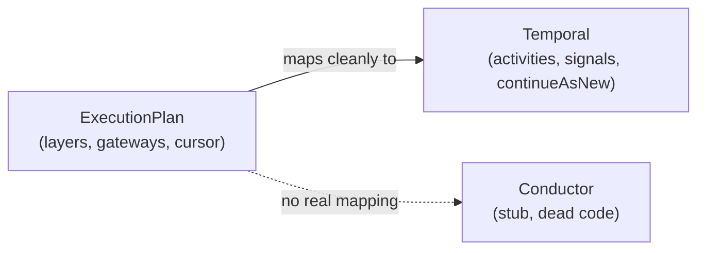
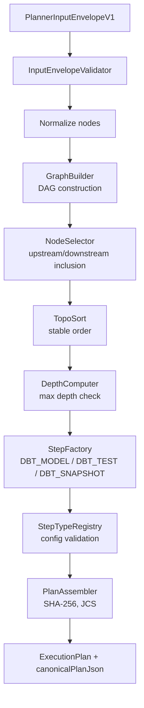
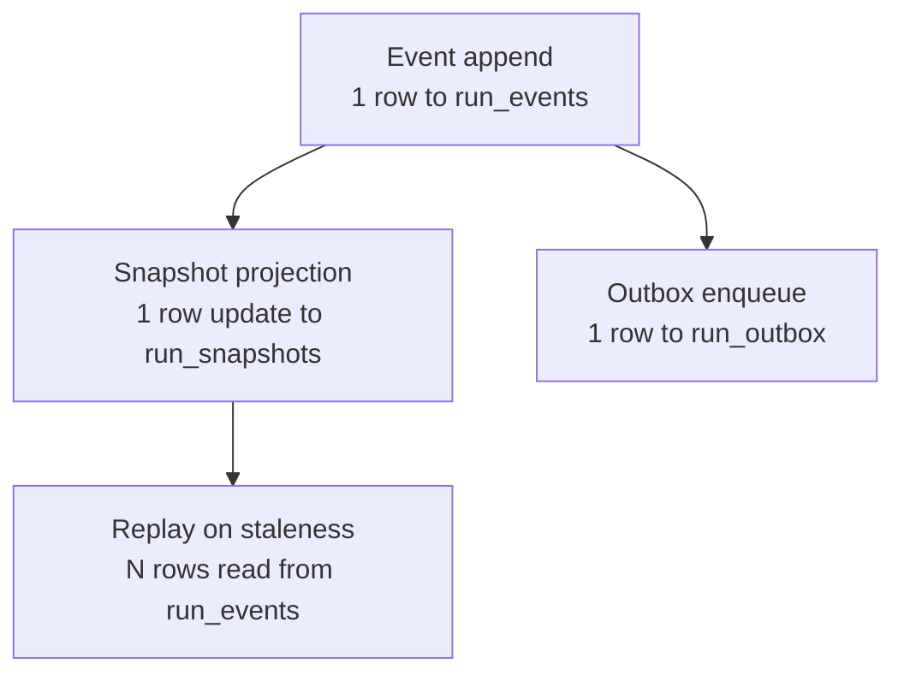
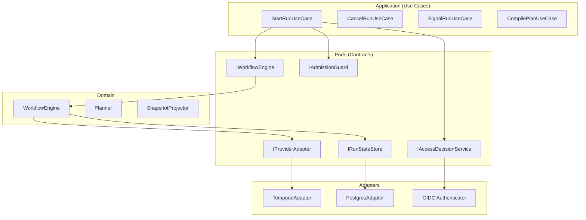
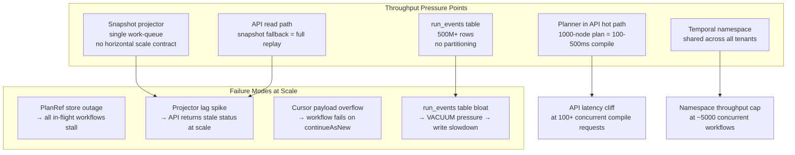
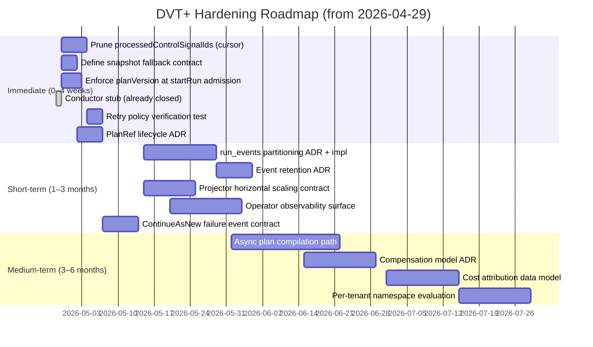

# DVT+ Principal Architect Deep Review — April 2026

**Plan-driven. Outcome-agnostic.**

**Reviewer:** Principal / Staff Software Architect — Temporal orchestration, Clean Architecture,
multi-tenant data platforms, dbt+Snowflake, CQRS/Event-Sourcing

**Method:** Source-code-first. Every finding below is traceable to actual implementation, not
documentation claims.

**Baseline:** G1–G10 closed as of 2026-03-15. API auth hardening, projector worker, lineage worker,
outbox DLQ, PlanRef-plus-cursor Temporal workflow, and continue-as-new payload budget are all
shipped. This review evaluates current durability, not past aspiration.

---

## Governing Sources

- `AGENTS.md`
- `docs/planning/status/governance-document-rule-inventory.md`
- `docs/guides/ai-work-protocol.md`
- `docs/architecture/reference-architecture.md`
- `docs/planning/execution-model/dvt-execution-model.md`
- ADR-0003 (execution model sovereignty)
- ADR-0004 (event sourcing strategy)
- ADR-0005 (contract formalization)
- ADR-0012 (plan integrity ownership)
- ADR-0014 (run-driven adapter model)
- ADR-0031 (adapter tenant isolation)
- ADR-0033 (outbox worker sharding and fencing)
- ADR-0038 (delivery-buffer retention and purge policy)
- Source: `packages/@dvt/{engine,planner,contracts,adapter-temporal,adapter-postgres,run-domain}`
- Source: `apps/{api,temporal-worker,outbox-worker,projector-worker,lineage-worker}`

---

## 1. Conceptual Soundness

### Core Principle Under Validation

> "The UI does not execute. The engine decides on its domain. The planner does not persist state."

**Verdict: The structural separation holds. Three specific seams are fragile under load or failure
conditions. Two invariants are enforced by convention, not by contract.**

---

### What Is Solid

**Planner purity is real.**

`Planner.ts` is a pure domain service. Input: `PlannerInputEnvelopeV1`. Output:
`{ plan, executionPolicy, canonicalPlanCoreJson }`. No database. No outbox. No adapter call. The
`BuildPlanCommand` has no `tenantId` — the planner is unaware of tenancy. This is correct.

The pipeline (`InputEnvelopeValidator → GraphBuilder → NodeSelector → TopoSort → StepFactory →
PlanAssembler`) is deterministic. The SHA-256 identity `planId = sha256(JCS(planCore))` is
reproducible across runtimes. This is an engineering-grade invariant, not a claim.

**Engine / Planner boundary is structurally enforced.**

`WorkflowEngine` never holds an `ExecutionPlan` reference. It receives a `PlanRef` (URI + sha256 +
planId) and passes it opaquely to the adapter. The adapter fetches and verifies plan bytes. Per
ADR-0012, the plan-bytes trust boundary lives in the adapter layer, not the engine. This is correct
and auditable.

**Event sourcing write path is correct.**

`bootstrapRunTx` and `appendAndEnqueueTx` are the only write paths. Both are transactional:
event append + outbox enqueue + snapshot projection happen in a single Postgres transaction. The
`runSeq` monotonic sequence is the ordering authority (ADR-0004). `applyRunEvent` in
`@dvt/run-domain` is a pure function — same events in → same snapshot out. Terminal state guards
(`COMPLETED`, `FAILED`, `CANCELLED`) are enforced.

**Tenant isolation is enforced at the adapter boundary.**

All `IRunStateStoreRead` and `IRunStateStoreWrite` methods require `tenantId`. Branded primitives
(`TenantId`, `RunId`) reduce accidental cross-tenant wiring. ADR-0031 compliance is real. The
Temporal adapter uses `workflowId` scoped to tenant prefix.

**Temporal workflow model is sound for the current plan shape.**

The `RunPlanWorkflow` is fully deterministic Temporal V8 sandbox code. Layer-based fan-out,
gateway evaluation, `continueAsNew` with cursor, signal idempotency — all implemented, not
stubbed. The cursor carries exactly what the next continuation needs: `nextLayerIndex`,
`gatewayDecisions`, `skippedStepIds`, `processedControlSignalIds`, `continuedAsNewCount`.

---

### What Is Fragile

**Fragility 1 — PlanRef external fetch is a hidden workflow SPOF.**

Each `continueAsNew` re-fetches the execution plan from external storage (S3/MinIO/file).
This fetch happens inside a Temporal activity — correct practice. However:

- If the plan store is unavailable during a continuation, the activity fails.
- Temporal retries the activity, but the retry budget is finite.
- If the plan is deleted or expired (`PlanRef.expiresAt`) while the workflow is in-flight, the
  workflow fails permanently with no recovery path.
- There is currently no contract for "what happens when PlanRef expires during execution."

This is not a Temporal sandbox violation. It is a distributed consistency gap: the plan store
lifecycle is decoupled from the workflow lifecycle with no explicit linkage.

**Fragility 2 — Cursor state grows unboundedly under adversarial signal load.**

The `WorkflowExecutionCursor.processedControlSignalIds` is an append-only array. Every processed
`PAUSE`, `RESUME`, or `CANCEL` signal adds an entry. The array is serialized into the
`continueAsNew` payload and checked against `maxContinueAsNewPayloadBytes`.

For a long-running workflow with many pause/resume cycles (legitimate in production batch
orchestration), this array can push the cursor payload beyond the budget. The current response
is to fail the `continueAsNew` with a size error. There is no pruning strategy for processed
signal IDs (safe to prune — they are idempotency keys, not state).

**Fragility 3 — Snapshot staleness has no SLA and no operator visibility.**

The projector worker processes `snapshot_work_queue` to rebuild stale snapshots. The staleness
detection is correct. But:

- No maximum staleness SLA is defined or monitored.
- No metric or alert surface exists for queue depth or lag.
- The fallback to full event replay in the API (when snapshot is `null` or stale) is expensive
  for runs with thousands of events and is unbounded in cost.
- At 1000 concurrent runs, a projector worker that lags will produce an API latency cliff.

**Fragility 4 — Admission control "observe" mode permits unchecked load.**

`IAdmissionMode` has three values: `'off'`, `'observe'`, `'enforce'`. The `'observe'` mode
records backpressure signals but does not block requests. In a production deployment where
`DVT_ADMISSION_MODE=observe`, there is no ceiling on concurrent run admission. The telemetry
is emitted but no protection fires. This is a known mode but creates a false sense of safety.

---

### What Is Missing

**Missing 1 — No compensation model for partial plan execution.**

A plan with 200 steps that fails at step 150 leaves 150 committed Snowflake model executions and
50 uncommitted. There is no saga, no inverse activity, no compensation contract. The engine marks
the run `FAILED` and stops. Downstream Snowflake state is undefined. For data platform use cases
this is significant: partial DBT executions can produce inconsistent ref model states.

**Missing 2 — No cost attribution at any layer.**

The system collects no cost signals: no Snowflake warehouse credits consumed, no DBT execution
duration by step, no tenant-level cost allocation. `RunExecutionContextRef` has a
`runExecutionContextRef` field in `RunContext`, which could carry cost context, but no
implementation uses it for cost tracking.

**Missing 3 — No distributed tracing correlation.**

OpenLineage events are emitted via the lineage outbox. But there is no `traceId` / `spanId`
propagation from the API request through the engine through the Temporal activity back to the
lineage event. The lineage is functionally correct but observability is disconnected from APM.

**Missing 4 — No event table retention/partitioning strategy.**

`run_events` is a single flat table. At 1000 tenants × 1000 concurrent runs × 500 events per run,
that is 500M rows. PostgreSQL can sustain this, but only with table partitioning and a documented
retention policy. ADR-0038 defines delivery-buffer retention, but `run_events` has no equivalent.

---

## 2. Architectural Risk Map

| #   | Risk                                                               | Severity   | Likelihood      | Why                                                                                                                                                                             | Mitigation                                                                                                                 |
| --- | ------------------------------------------------------------------ | ---------- | --------------- | ------------------------------------------------------------------------------------------------------------------------------------------------------------------------------- | -------------------------------------------------------------------------------------------------------------------------- |
| R1  | PlanRef expires during in-flight `continueAsNew`                   | HIGH       | Medium          | `PlanRef.expiresAt` is defined in the contract; plan storage lifecycle is not linked to workflow lifecycle                                                                      | Enforce that plan store TTL > max expected workflow duration; add workflow-level expiry handler                            |
| R2  | `processedControlSignalIds` cursor growth exceeds payload budget   | HIGH       | Medium          | Append-only array; no pruning; budget is 64–500KB depending on config                                                                                                           | Prune processed signal IDs that are older than the continueAsNew window; add cursor size assertion in tests                |
| R3  | Snapshot projector lag creates API latency cliff                   | HIGH       | Medium          | No projector SLA or queue-depth alert; full event replay is O(n events)                                                                                                         | Define max staleness SLA; expose projector queue depth as a metric; cap replay cost with pagination                        |
| R4  | ~~Conductor adapter dead stub~~                                    | ~~MEDIUM~~ | ~~Low~~         | Resolved — stub removed, `provider` type restricted to `'temporal'`. Closed before review publication.                                                                          | n/a                                                                                                                        |
| R5  | `run_events` table has no partitioning strategy                    | HIGH       | High (at scale) | Flat table; unbounded growth; no TTL; no ADR equivalent of ADR-0038 for events                                                                                                  | Partition by tenant or month; define event retention ADR before 100M row threshold                                         |
| R6  | Admission control `observe` mode creates unchecked load            | MEDIUM     | Medium          | `DVT_ADMISSION_MODE=observe` is a production-valid config that silently allows everything                                                                                       | Remove `observe` as a production mode or require explicit acknowledgement of risk in deployment config                     |
| R7  | No compensation for partial plan execution                         | MEDIUM     | High            | Any failed run leaves Snowflake in undefined partial state                                                                                                                      | Define compensation contract in `IWorkflowEngine`; implement at least a "mark partial" event type                          |
| R8  | Gateway DSL validated at execution time, not compile time          | LOW        | Medium          | Parser is correct (restricted ID=literal grammar, no eval); but invalid expressions in a plan surface only when the gateway activity runs in Temporal, not at plan compile time | Move DSL parse+validate into `StepFactory` at `PlanAssembler` boundary; fail-fast at plan build                            |
| R9  | Single Temporal namespace for all tenants                          | MEDIUM     | Medium          | Temporal namespace-level throughput limits; cross-tenant workflow ID collision possible if prefix encoding has bugs                                                             | Evaluate per-tenant namespace isolation for large tenants                                                                  |
| R10 | DBT activities tightly coupled to temporal-worker                  | MEDIUM     | High            | `DVT_TEMPORAL_DBT_ENABLED` flag wires DBT into the worker; cannot run a non-DBT temporal worker without dead config                                                             | Separate DBT activity registration into a plugin or secondary worker                                                       |
| R11 | No distributed tracing correlation across services                 | LOW        | High            | Lineage events emitted; no `traceId` propagation from HTTP → engine → Temporal activity → lineage                                                                               | Add `traceId` to `RunContext`; propagate through all activity invocations                                                  |
| R12 | Planner runs synchronously in the API request                      | MEDIUM     | Medium          | For 1000+ node plans: topo sort + SHA-256 + plan assembly in API hot path adds latency                                                                                          | Move plan compilation to async job with result polling, or add plan size budget at admission                               |
| R13 | No multi-tenant cost attribution                                   | LOW        | High            | No Snowflake credit tracking; no per-run cost signal                                                                                                                            | Define cost attribution contract; instrument activities with duration + resource tags                                      |
| R14 | `IRunStateStore.getSnapshot` returns `null` when not yet projected | MEDIUM     | Medium          | Callers must fall back to event replay; not all callers do this; undefined behavior if skipped                                                                                  | Make fallback mandatory at the contract level; `getSnapshotOrReplay` as the only public API                                |
| R15 | `PlanOwnership.tenantId` not validated in `startRun` hot path      | HIGH       | Medium          | `StartRunApplicationService` validates plan integrity (sha256, planId) but not ownership against caller's `tenantId`; only fires if `runExecutionContextRef` is provided        | Add explicit `plan.metadata.ownership.tenantId === context.tenantId` check in `StartRunApplicationService` before dispatch |
| R16 | No per-tenant concurrent run limit                                 | MEDIUM     | Medium          | `IOutboxRateLimiter` is optional; no ceiling on concurrent runs per tenant; `observe` mode discards all backpressure rejections                                                 | Make rate limiter required at deployment; define per-tenant concurrent run ceiling in admission config                     |
| R17 | `planVersion` compatibility matrix not wired at admission          | LOW        | Low             | ADR-0036 defines the registry; runtime does exact-match only; retiring a plan version produces an opaque mismatch error, not `UNSUPPORTED_PLAN_VERSION`                         | Wire the version registry into `StoredPlanExecutabilityValidator`; emit typed error code                                   |

---

## 3. Engine Abstraction Critique

### Is `IWorkflowEngine` Minimal and Correct?

```
startRun(planRef, context)       → EngineRunRef
recoverRun(sourceRunId, planRef, context) → EngineRunRef
cancelRun(engineRunRef)          → void
getRunStatus(engineRunRef)       → CanonicalRunStatus
signal(engineRunRef, request)    → void
```

**Verdict: Minimal. Correct at the surface. Two decisions warrant challenge.**

`recoverRun` being a first-class engine method is architecturally correct — DVT+ owns lifecycle
transitions (ADR-0003). It creates a derived run with incremented `logicalAttemptId` and
`parentRunId`. This is distinct from Temporal's native retry (which would not create a new
`RunId`). The separation is principled.

`getRunStatus` reads from snapshot + event replay (ADR-0015). It does NOT call the provider
adapter. This is correct and auditable. The risk is downstream: snapshot staleness means this
method can return stale data without error.

### Is Temporal-First Wise?

Yes, for this scale and use case. Temporal handles:

- Long-running execution (hours/days for large DBT runs)
- Signal delivery with at-least-once guarantees
- `continueAsNew` for history management
- Activity retry with exponential backoff

The risk is that `ExecutionPlan` is Temporal-shaped:



The layer-based execution model, `continueAsNew` cursor, gateway signal IDs — these are
Temporal concepts materialized into the plan structure. Replacing Temporal would require
redesigning the execution model, not just swapping the adapter.

**Recommendation: Stop claiming Temporal is replaceable. It is the execution model.**

### Determinism Assumptions That Could Fail

1. **Plan fetch inside workflow**: Fetched as an activity — correct. But if the activity's
   response is not deterministic (e.g., plan bytes differ between calls due to storage mutation),
   replay will fail. The SHA-256 check on plan bytes is the guard. Verify it is enforced on
   every segment fetch, not just on first fetch.

2. **Gateway expression evaluation**: Gateway DSL expressions are evaluated inline in workflow
   code. If the evaluation library version changes between the original run and a replay, results
   could differ. This is a classic Temporal determinism hazard.

3. **`Date.now()` in activity results**: Activities can use `Date.now()`. If activity results
   are replayed with different timestamps (legitimate in Temporal replay), any workflow code that
   branches on activity timestamps will be non-deterministic. Verify no workflow code branches on
   `persistedAt` from event envelopes returned by activities.

---

## 4. Execution Planning Layer Analysis

### DAG Analyzer

The planner pipeline is well-structured and deterministic:



**Is this over-engineered?** No. Each stage has a clear single responsibility. The pipeline is
testable in isolation. The registry pattern (`StepTypeRegistry`) is the correct extensibility
seam.

**Is it under-specified?** Yes, in one area: **retry/backoff policy ownership**.

The plan carries `retryPolicy` per step (`{ maxAttempts, backoffCoefficient, initialInterval,
maximumInterval }`). This is correct — the retry contract is defined at plan-build time and is
immutable during execution. But the retry policy is passed as a hint to Temporal's activity retry
config. If Temporal's retry semantics diverge from the policy spec (e.g., Temporal's exponential
backoff formula differs from what the planner specifies), the behavior is undefined. There is no
test that verifies the materialized Temporal activity retry config matches the plan spec.

**Is there hidden Snowflake/DBT coupling?**

Yes. `DbtStepTypeConfig` is the only implemented step type config. The `GenericGraphSourceV1`
is formally generic, but the planner's step factory has no non-DBT implementation. The
`TransformationExecutor` type includes `'postgres'` alongside `'dbt'`, but no Postgres step
factory exists.

**Cost estimator realism:** The cost estimator is not implemented. `RunExecutionContextRef` is
a placeholder for future cost context. No severity — it should not be listed as a feature.

**Plan versioning strategy:**

`planVersion` is declared in metadata. The `planVersionRegistry` and compatibility matrix
(ADR-0036) exist. But there is no enforcement gate: a plan with `planVersion: 'v2'` can be
submitted to an engine that only knows `'v1'`. The compatibility check is documented but not
wired into the admission path.

---

## 5. State and Metadata Layer Review

### Artifact Immutability

**Realistic.** Plans are content-addressed. Events have `runSeq` authority. Snapshots are
projections. The write path (`bootstrapRunTx`, `appendAndEnqueueTx`) is correct.

### Write Amplification Risk



For a 1000-step plan:

- `StepStarted` × 1000 + `StepCompleted` × 1000 = 2000 event rows
- 2000 snapshot updates (per-event projection)
- 2000 outbox records
- Full replay = 2000 row read + sequential `applyRunEvent` applications

At 100 concurrent runs: 200,000 event inserts per run cycle. PostgreSQL can handle this
**with index hygiene and connection pooling**. Without partitioning, vacuum pressure on
`run_events` will become the bottleneck before row count does.

### Event Sourcing vs. Mutable State Tradeoffs

The choice of event sourcing is correct for this domain: audit trail, replay capability,
idempotency. The risk is that the `WorkflowSnapshot` is being used as a read model AND as a
correctness gate (terminal state enforcement in `applyRunEvent`). If the snapshot drifts from
the event log (e.g., due to a projector bug), the system has no self-healing mechanism beyond
full replay.

The `rebuildSnapshot` method on `IRunStateStoreWrite` is the recovery path. It should be
exposed as an admin operation — and it is (admin route). But triggering it is manual.

---

## 6. SOLID / Hexagonal / CQRS Compliance



**Single Responsibility:** Upheld. Each use case has one responsibility. `WorkflowEngine` does
not build plans. `Planner` does not start runs. `TemporalAdapter` does not read snapshots.

**Open/Closed:** Partially. The `StepTypeRegistry` is an extensibility seam. But the API's
`ProviderAdapterFactory` is tightly coupled to Temporal. Adding a second provider requires
modifying `createTemporalProviderAdapterFactory` and the factory dispatch logic.

**Liskov Substitution:** `IProviderAdapter` is correctly defined. `TemporalAdapter` satisfies
it. The Conductor stub has been removed and `provider` restricted to `'temporal'` — LSP violation
resolved.

**Interface Segregation:** `IRunStateStore = IRunStateStoreWrite & IRunStateStoreRead &
IRunStateStoreMaintenance` — correctly segregated. Callers depend only on the sub-interface
they need.

**Dependency Inversion:** Upheld throughout. The engine depends on `IProviderAdapter` (port),
not `TemporalAdapter` (implementation). The API depends on `IWorkflowEngine` (port), not
`WorkflowEngine` (core class).

**CQRS compliance:**

- **Command side:** `bootstrapRunTx`, `appendAndEnqueueTx`, `startRun`, `cancelRun`, `signal`
- **Query side:** `getRunStatus`, `listRuns`, `listEvents`, `getSnapshot`
- **Gap:** `getRunStatus` on `IWorkflowEngine` reads through the engine but internally delegates
  to the state store. The engine has no separate read model. This is a thin CQRS, not a
  projection-backed read model. Acceptable at current scale; will hurt under read-heavy load.

**Hexagonal compliance:** The boundary between the application layer and the infrastructure
layer is clean. Ports are defined in `@dvt/contracts` and `@dvt/engine`. Adapters implement
them. The API app does not import adapter packages directly — it wires through DI.

---

## 7. What Is Overbuilt

**Multi-engine abstraction at the type level.**

~~Resolved~~ — Conductor stub removed and `provider` restricted to `'temporal'` before review
publication. The overbuilt concern no longer applies.

**Lineage outbox complexity for current throughput.**

The lineage pipeline (`LineageOutboxObserver → PostgresLineageOutboxStore → lineage_outbox table → LineageWorkerRuntime → HttpOpenLineageSink → DLQ`) is 5 components for what is currently a fanout to a single HTTP sink. The architecture is correct for multi-sink lineage at scale. At current throughput it is complexity ahead of need. The DLQ in particular requires operational runbook maturity that does not yet exist.

**Observability layering in the planner.**

`PlannerOptions` includes `timeout`, `shouldAbort`, `onAbort` hooks. These are reasonable for large plans, but the planner runs synchronously in the API request path. The hook system adds configuration surface for a problem (long-running planner) that should be solved by moving compilation off the hot path.

**`PlanOwnership` metadata on `ExecutionPlan`.**

`PlanOwnership` (`tenantId`, `projectId`, `environmentId`) is appended post-hash to the plan metadata. It does not affect `planId`. But it is also not validated during execution — the engine does not verify that the `PlanOwnership` on the plan matches the `RunContext.tenantId`. This is a potential authorization bypass. Either validate it or remove it and rely exclusively on `RunContext`.

---

## 8. What Is Underbuilt

**Underbuilt 1 — Event table retention and partitioning.**

`run_events` is a flat PostgreSQL table. There is no partitioning strategy, no `VACUUM` tuning,
no archival policy, no equivalent of ADR-0038 for the event log. This is the highest-priority
operational debt item at current scale trajectory.

**Underbuilt 2 — `planVersion` compatibility enforcement at admission.**

ADR-0036 defines the plan version registry and compatibility matrix. The registry is not enforced
at the `startRun` admission boundary. A `planVersion: 'v1'` plan can be submitted to an engine
that has dropped `v1` support without error. The compatibility check must be wired into
`StartRunUseCase` before version evolution becomes real.

**Underbuilt 3 — Compensation model for partial plan execution.**

There is no compensation contract. `IWorkflowEngine` has no `compensateRun` or equivalent. For
data platform workflows where Snowflake models are modified by each step, partial execution
produces undefined intermediate state. This is not a theoretical risk — it is the normal failure
mode for large DBT runs.

**Underbuilt 4 — Retry policy verification at the adapter boundary.**

The plan carries `retryPolicy` per step. The Temporal adapter materializes this into
`ActivityOptions.retry`. There is no test that verifies the materialized Temporal retry config
matches the plan spec. If the mapping has a bug (e.g., off-by-one on `maxAttempts`), the
discrepancy is invisible.

**Underbuilt 5 — Operator-level multi-tenant observability.**

There is no admin surface that shows cross-tenant run health, projector lag per tenant, outbox
queue depth per tenant, or admission pressure by tenant. The system is observable per-run but
not observable at the operator level.

**Underbuilt 6 — Processed signal ID pruning in cursor.**

`processedControlSignalIds` in `WorkflowExecutionCursor` is append-only. Signal IDs processed
before the last `continueAsNew` are idempotency data only — they cannot recur after the workflow
has moved past the layer where they were processed. Pruning them is safe and necessary for
long-running workflows with many signals.

**Underbuilt 7 — PlanRef lifecycle contract.**

What happens when a `PlanRef` expires (`expiresAt` is defined in the type) while the workflow
is in-flight? There is no documented behavior, no fallback, no workflow-level expiry handler.
The workflow will fail with a plan-fetch error at the next `continueAsNew`. This must be defined
before `expiresAt` is used in production.

---

## 9. Scalability Outlook (3-Year Horizon)

### Assumptions

- 1000+ tenants
- 5000 concurrent runs
- Plans with 1000+ nodes (dbt projects at enterprise scale)
- Heavy lineage dashboards with cross-run queries
- 50+ engineers maintaining the system

### Architecture Under Scale



**Bottleneck 1 — `run_events` table growth (Critical at 6–18 months)**

Without partitioning, PostgreSQL's autovacuum will struggle to keep up with dead tuple
accumulation from high-frequency event appends. At 5000 concurrent runs × 500 events per run,
this is 2.5M events per run batch. Table scans for tenant-scoped queries become expensive.

**Bottleneck 2 — Planner in API request path (Moderate at 12–24 months)**

1000-node DAG: topo sort is O(V+E), SHA-256 of plan JSON is O(n bytes). At 100 concurrent
compile requests, the API will queue. The fix (async compile + polling) requires a new contract
and a new worker or task queue.

**Bottleneck 3 — Projector single-worker scaling (Moderate at 12–24 months)**

`ProjectorWorkerRuntime` processes `snapshot_work_queue`. Horizontal scaling requires fencing
(the work-claim token pattern exists). But there is no documented horizontal scaling contract
for the projector. At 1000 tenants with active projector lag, a single projector worker will
fall behind.

**Bottleneck 4 — Temporal namespace throughput (High at 24–36 months)**

Temporal Cloud namespaces have throughput quotas (actions-per-second). At 5000 concurrent
workflows each doing multiple signal + activity round trips, a single namespace will hit the
quota ceiling. Per-tenant namespace isolation is the mitigation, but it multiplies operational
complexity.

**Data Growth Pressure:**

| Table            | Row estimate (3 years) | Risk                                 |
| ---------------- | ---------------------- | ------------------------------------ |
| `run_events`     | 5B+ rows               | Vacuum pressure, slow scans          |
| `run_snapshots`  | 500M+ rows             | Manageable with BRIN index           |
| `run_outbox`     | 100M+ rows             | Mitigated by purge policy (ADR-0038) |
| `lineage_outbox` | 500M+ rows             | No equivalent purge ADR              |

---

## 10. Architectural Scorecard

| Dimension                     | Score | Justification                                                                                                                                                                                                         |
| ----------------------------- | ----- | --------------------------------------------------------------------------------------------------------------------------------------------------------------------------------------------------------------------- |
| **Conceptual clarity**        | 8/10  | Planner/Engine/State separation is real. Fragilities are known and localized. The fictional Conductor path lowers the score.                                                                                          |
| **Separation of concerns**    | 7/10  | Engine, planner, and adapters are correctly separated. DBT coupling in temporal-worker, planner in API hot path, and `PlanOwnership` validation gap are real SoC violations.                                          |
| **Replaceability of engine**  | 4/10  | `IWorkflowEngine` is minimal and correct. But `ExecutionPlan` is Temporal-shaped (layers, cursor, continueAsNew). Replacing Temporal would require redesigning the plan model. Claiming replaceability is misleading. |
| **Determinism**               | 8/10  | V8 sandbox is correctly used. External plan fetches are activities. Gateway evaluation has a replay-determinism risk if the evaluator library changes.                                                                |
| **Extensibility**             | 6/10  | `StepTypeRegistry` is the right seam. `IProviderAdapter` is clean. But adding a second provider, a non-DBT step type, or a non-Postgres state store requires non-trivial work with no documented path.                |
| **Operational realism**       | 5/10  | Admission control has a gap mode. No event table retention. No projector SLA. No operator-level observability. The workers are correct but their operational contracts are incomplete.                                |
| **Long-term maintainability** | 7/10  | ADR discipline is strong. Contract formalization is real. The gaps (cursor growth, PlanRef expiry, retry policy verification, planVersion enforcement) are bounded and fixable without architectural changes.         |

---

## 11. Strategic Recommendations

### 3 Structural Changes

**S1 — Partition `run_events` and define a retention ADR.**

This is not optional at scale. Create `run_events_<YYYYMM>` range partitions or use declarative
partitioning by `tenant_id` hash. Write an ADR that defines event retention policy (minimum 90
days for active runs, configurable archival after `COMPLETED`/`FAILED`). This work must start
before the table reaches 50M rows. **Estimated: 2 weeks.**

**S2 — Move plan compilation off the API hot path.**

Create a `CompilePlanJob` async pattern: API submits input → receives a `compilationRef` (UUID)
→ polls or webhooks for result. This decouples API latency from planner computation and allows
the planner to be horizontally scaled as a worker. The existing `CompilePlanUseCase` is the right
seam; only the execution model changes. **Estimated: 3 weeks.**

**S3 — Define and implement the PlanRef lifecycle contract.**

Add a `PlanRefLifecyclePolicy` that specifies: (a) minimum plan TTL relative to expected max
workflow duration; (b) what the workflow does when plan fetch fails due to expiry (fail with
`PLAN_EXPIRED` event, not an unclassified activity failure); (c) whether plans are pinned on
workflow start. This is a contract change (ADR required) and a Temporal activity change.
**Estimated: 1 week for ADR, 1 week for implementation.**

---

### 3 Clarifications Needed

**C1 — Who owns the snapshot fallback path?**

When `getSnapshot()` returns `null`, the system must fall back to full event replay. Is this
the responsibility of `PostgresStateStoreAdapter`, `WorkflowEngineCoreService`, or the API use
case? Currently it is handled in `WorkflowEngineCoreService`, but the contract (`IRunStateStore`)
does not mandate it. Callers who use `IRunStateStore` directly (not through the engine) may skip
the fallback. Define this in the contract, not in the engine.

**C2 — Is `planVersion` compatibility enforced at `startRun` admission?**

ADR-0036 defines the compatibility matrix. The `StartRunUseCase` does not check it. Clarify
whether this is a pending gate or a deliberate deferral, and if deferred, document the risk in
the risk register.

**C3 — What is the expected behavior when `continueAsNew` payload exceeds budget?**

The current behavior is a workflow failure. The expected behavior should be documented: is the
workflow expected to drain and fail gracefully? Emit a `RunFailed` event with a specific code?
This must be a contract decision, not an implementation accident.

---

### 3 Things to Freeze Immediately

**F1 — `IRunStateStore` interface.**

It is the single most load-bearing contract in the system. Every adapter, every test, every
migration is indexed against it. Changes cascade everywhere. Freeze it. Any change requires
ARC-2 and a migration path for all implementations.

**F2 — `ExecutionPlan` schema (`schemaVersion: 'v1.2'`).**

Plans are content-addressed. A schema change invalidates all cached plans. The planner version
and schema version are declared in plan metadata. Freeze the schema until a versioned migration
path (ADR-0036) is fully implemented and enforced at admission.

**F3 — The `EngineRunRef` Temporal shape.**

`{ provider: 'temporal', tenantId, namespace, workflowId, runId }` is the Temporal workflow
identity. Everything that looks up, signals, or cancels a run uses this. Changing the shape
requires migrating all stored `EngineRunRef` values in `run_metadata`. Freeze it.

---

### 3 Things to Delay

**D1 — Multi-engine abstraction beyond Temporal.**

~~Resolved before review publication~~ — Conductor stub removed, `provider` type restricted.
Do not invest in making the plan model more engine-agnostic until there is a concrete second
engine requirement.
The abstraction cost is already being paid with zero benefit.

**D2 — Cost attribution implementation.**

Define the cost attribution data model first (what signals, what granularity, what schema).
Instrument activities to emit raw duration + resource data. Build the attribution layer only
after the data model is validated against a real billing requirement. Building the attribution
pipeline before the model is defined produces throwaway work.

**D3 — Lineage multi-sink fan-out.**

The current lineage pipeline (`lineage_outbox → lineage_dead_letter → HttpOpenLineageSink`) is
correct for one sink. Multi-sink fan-out (multiple OpenLineage endpoints, S3, Kafka) should be
delayed until there is an operator requirement. Extending the current pipeline to multi-sink
before the operational runbook for the single-sink path is mature is premature.

---

## Action Plan

### Priority Matrix

```mermaid
quadrantChart
    title DVT+ Action Priority (Impact vs Effort)
    x-axis Low Effort --> High Effort
    y-axis Low Impact --> High Impact
    quadrant-1 Do First
    quadrant-2 Plan and Schedule
    quadrant-3 Defer
    quadrant-4 Quick Wins

    Prune processedControlSignalIds: [0.15, 0.85]
    Enforce planVersion at admission: [0.25, 0.75]
    Define PlanRef lifecycle contract: [0.30, 0.80]
    Snapshot fallback owned by contract: [0.20, 0.65]
    Conductor stub (closed): [0.10, 0.20]
    run_events partitioning ADR: [0.55, 0.90]
    Async plan compilation: [0.65, 0.80]
    Operator observability dashboard: [0.60, 0.70]
    Retry policy verification test: [0.20, 0.55]
    Event table retention ADR: [0.40, 0.75]
    Cost attribution data model: [0.70, 0.50]
    Multi-sink lineage fan-out: [0.75, 0.35]
    Per-tenant Temporal namespace: [0.85, 0.60]
```

### Execution Sequence



### Task Register

| ID  | Task                                                                                                   | Priority | Effort | Owner Layer            | Blocks                                                               |
| --- | ------------------------------------------------------------------------------------------------------ | -------- | ------ | ---------------------- | -------------------------------------------------------------------- |
| T1  | Prune `processedControlSignalIds` before `continueAsNew`                                               | P0       | 0.5d   | adapter-temporal       | R2                                                                   |
| T2  | Define snapshot fallback as `IRunStateStore` contract obligation                                       | P0       | 0.5d   | contracts              | R14                                                                  |
| T3  | Emit `UNSUPPORTED_PLAN_VERSION` error when `planVersion` not in registry                               | P1       | 1d     | engine                 | R17                                                                  |
| T4  | ~~Delete `ConductorAdapterStub`, restrict `provider` type~~                                            | ~~P0~~   | —      | —                      | Closed — done before review                                          |
| T5  | Write `PlanRef` lifecycle ADR (expiry behavior during execution)                                       | P1       | 1d     | docs                   | R1                                                                   |
| T6  | Implement `PlanRef` expiry handler in workflow                                                         | P1       | 2d     | adapter-temporal       | T5                                                                   |
| T7  | ~~Add retry policy verification test~~                                                                 | —        | —      | —                      | Closed — test exists and covers this (workflow-retry-policy.test.ts) |
| T7b | Validate gateway DSL expression at `StepFactory` / `PlanAssembler` (move from runtime to compile time) | P1       | 0.5d   | planner                | R8                                                                   |
| T7c | Add `plan.metadata.ownership.tenantId === context.tenantId` check in `StartRunApplicationService`      | P0       | 0.5d   | engine                 | R15                                                                  |
| T7d | Make `IOutboxRateLimiter` required in admission; define per-tenant concurrent run ceiling              | P1       | 1d     | engine, api            | R16                                                                  |
| T8  | Write `run_events` partitioning ADR                                                                    | P1       | 1d     | docs                   | R5                                                                   |
| T9  | Implement `run_events` range/tenant partitioning                                                       | P1       | 5d     | adapter-postgres       | T8                                                                   |
| T10 | Write event retention ADR (complement to ADR-0038)                                                     | P1       | 1d     | docs                   | R5                                                                   |
| T11 | Define `ContinueAsNew` payload overflow as `RunFailed(CURSOR_OVERFLOW)`                                | P1       | 1d     | contracts, engine      | C3                                                                   |
| T12 | Define projector horizontal scaling contract                                                           | P2       | 2d     | docs, adapter-postgres | R3                                                                   |
| T13 | Add operator observability: projector lag, outbox depth, admission pressure                            | P2       | 5d     | api, workers           | R (underbuilt 5)                                                     |
| T14 | Move plan compilation off API hot path (async job)                                                     | P2       | 10d    | api, planner           | R12                                                                  |
| T15 | Define compensation contract in `IWorkflowEngine`                                                      | P2       | 3d     | contracts, engine      | R7                                                                   |
| T16 | Define cost attribution data model ADR                                                                 | P3       | 3d     | docs                   | R13                                                                  |
| T17 | Evaluate per-tenant Temporal namespace isolation                                                       | P3       | 5d     | adapter-temporal       | R9                                                                   |

---

## Appendix: Code Traceability

| Finding                                 | File / Location                                                                                     |
| --------------------------------------- | --------------------------------------------------------------------------------------------------- |
| PlanRef fetch per continueAsNew         | `packages/@dvt/adapter-temporal/src/workflows/runPlanWorkflow.lifecycle.ts`                         |
| processedControlSignalIds growth        | `packages/@dvt/adapter-temporal/src/workflows/runPlanWorkflow.types.ts` — `WorkflowExecutionCursor` |
| Snapshot fallback in engine             | `packages/@dvt/engine/src/core/WorkflowEngineCoreService.ts`                                        |
| `observe` admission mode                | `apps/api/src/application/ports/IAdmissionMode.ts`                                                  |
| ~~ConductorAdapterStub~~                | Removed — no longer present                                                                         |
| PlanOwnership not validated at startRun | `apps/api/src/application/services/startRunUseCase.ts`                                              |
| Retry policy materialization            | `packages/@dvt/adapter-temporal/src/TemporalAdapter.ts`                                             |
| planVersion declared, not enforced      | `packages/@dvt/contracts/src/contracts/planner/ExecutionPlan.v1.ts`                                 |
| Lineage pipeline                        | `apps/lineage-worker/src/runtime/LineageWorkerRuntime.ts`                                           |
| Projector worker                        | `apps/projector-worker/src/runtime/ProjectorWorkerRuntime.ts`                                       |
| Gateway DSL evaluation                  | `packages/@dvt/adapter-temporal/src/workflows/runPlanWorkflow.layers.ts`                            |
