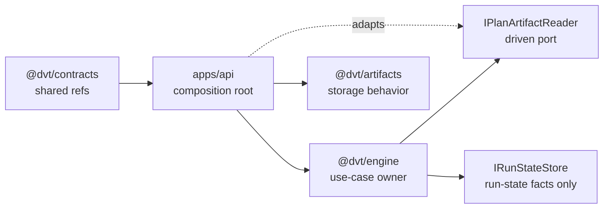
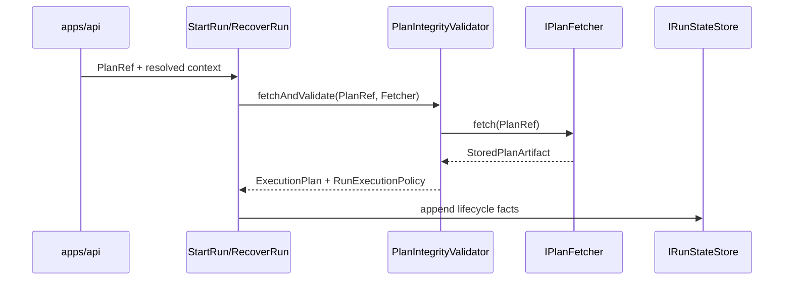

# WE-HX-1 Fowler Architecture Review

## Fowler Architecture Analysis

`WE-HX-1` improves the engine by turning an implicit data-access smell into an
explicit port. Before the slice, plan artifact reading was physically near
`IRunStateStore`, which made the state-store boundary look responsible for plan
bytes. That violated the package's own architecture language: state-store owns
run facts; plan artifact storage belongs outside engine; engine owns the
pre-dispatch integrity use case.

The branch now follows a more mature hexagonal shape:

- shared references stay in `@dvt/contracts`;
- engine-owned use-case needs stay in `@dvt/engine/src/ports`;
- artifact-backed implementations remain composition-root concerns;
- API validation reuses the same stored artifact shape instead of redeclaring
  the DTO.

This is a Fowler-style "separate the things that change for different reasons"
move. State persistence changes when lifecycle storage changes. Plan artifact
reading changes when plan storage or integrity admission changes. Those are not
the same reason to change.

## Mature-System Comparison

| Concern           | Current branch posture                                     | Mature-system expectation                                     |
| ----------------- | ---------------------------------------------------------- | ------------------------------------------------------------- |
| Port ownership    | Engine declares `IPlanFetcher` as a narrow outbound port   | Use-case owner declares the port; infrastructure adapts to it |
| DTO reuse         | API reuses `StoredPlanArtifact` from engine                | One semantic shape per boundary concept                       |
| State-store focus | `IRunStateStore` no longer exports plan artifact contracts | Persistence ports stay cohesive and lifecycle-specific        |
| Documentation     | Component guide plus local stories plus review mailbox     | Public API, invariants, transitions, consumers, and scenarios |
| Fitness function  | Guard validates ownership, docs, docblocks, and DTO reuse  | Architecture tests protect semantics, not only file thinness  |

## Improved Patterns

- **Hexagonal port ownership:** `IPlanArtifactReader` is a driven port defined
  by the engine use case and wired externally.
- **Shared kernel restraint:** only serializable refs remain shared; behavior
  ports do not move to `@dvt/contracts`.
- **Semantic encapsulation:** touched modules state their owned concern before
  imports.
- **Documentation as contract:** the component guide and user stories are
  validated by the architecture test.

## Antipatterns And Fixes

| Antipattern                               | Risk                                             | Fix applied                                               |
| ----------------------------------------- | ------------------------------------------------ | --------------------------------------------------------- |
| Broad interface bucket                    | `IRunStateStore` looked responsible for plan I/O | Move plan reader contracts into `IPlanArtifactReader.ts`  |
| Equivalent DTO redeclaration              | API and engine could drift silently              | API imports `StoredPlanArtifact` from `@dvt/engine`       |
| Text-only architecture proof              | Formatting could masquerade as architecture      | Guard now validates stories, review, docblocks, and reuse |
| Additive docs without scenario acceptance | Readers see structure but not expected behavior  | Add local user stories and negative scenarios             |

## Components To Group

The branch confirms these grouping rules:

- `ports/IPlanArtifactReader.ts`: engine-owned plan artifact reader and
  integrity validator abstractions.
- `ports/IRunStateStore.ts`: run-state persistence and lifecycle payloads only.
- `security/planIntegrity.ts`: plan byte and metadata verification.
- `apps/api/src/application/ports/storedPlan.ts`: API-specific validation port
  method, reusing the engine artifact shape.
- `docs/architecture/components/engine/architecture/workflow-engine-boundary-ownership-*`:
  local component API, invariants, scenarios, and diagrams.

## Repetitions And Drift

Detected drift:

- `StoredPlanArtifact` existed as an equivalent API-local interface.
- The component guide lacked a direct user-story surface.
- Application/security modules touched by the slice did not all state their
  owned concern at module start.

Fixed drift:

- API now imports `StoredPlanArtifact` from the engine boundary.
- The component guide links the local user stories.
- The architecture guard fails on missing review/story/docblock coverage.

Residual watch item:

- Some architecture guards in the wider engine still inspect source text. That
  is acceptable for this file-boundary invariant, but future `WE-HX-2..6`
  should prefer AST or package-export checks when validating behavior.

## Opportunities

- Split public engine exports into public, internal, and test entrypoints before
  new consumers depend on implementation services.
- Add a reusable architecture-test helper for "owned-concern docblock present",
  "local component doc has required sections", and "no equivalent DTO
  redeclarations".
- Promote the same local story pattern to `WE-HX-2` so facade narrowing starts
  with scenarios instead of service extraction.

## Patterns Applied

## Future Lessons

- Do not group ports by historical migration convenience. Group by owned reason
  to change.
- Treat API-local DTOs with the same suspicion as duplicated domain classes:
  if the shape names the same boundary concept, one owner should publish it.
- Architecture docs need scenario acceptance, not only static diagrams.
- DBT or any future plugin should remain an implementation of plugin seams, not
  a naming anchor for the engine kernel.

## ADR Decision

No new ADR is required for this slice. The decision is already governed by
ADR-0003, ADR-0004, ADR-0012, ADR-0014, ADR-0034, ADR-0042, and ADR-0043. The
branch applies those decisions; it does not introduce a new architectural rule.
