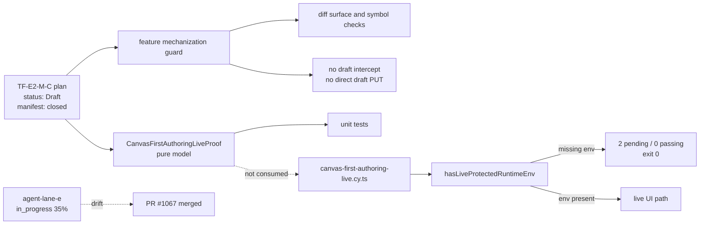
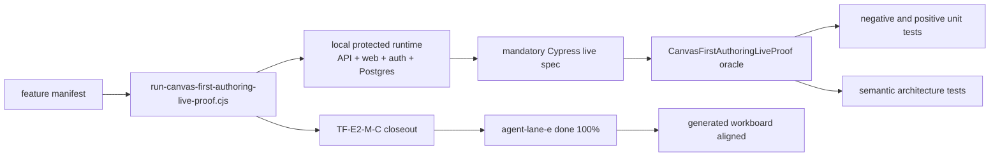

# TF-E2-M-C Fowler Hard QA Review

## Purpose

Record the hard QA performed after `feat(web): Add first canvas authoring live
proof (#1067)` and convert the findings into a closed fix plan. The original
finding sections capture the pre-fix state observed during review; the final
verdict section records the current accepted state after the corrective slice.
The review focuses on whether the merged change is product-proof, doc-aligned,
mechanically executable, and consistent with Fowler-style walking skeleton,
DDD, SOLID, hexagonal boundaries, command-query rail governance, and local repo
invariants.

## Governing Sources

- `AGENTS.md`
- `docs/planning/status/governance-document-rule-inventory.md`
- `docs/guides/ai-work-protocol.md`
- `docs/architecture/fowler-opportunity-planning-governance.md`
- `docs/architecture/command-query-rail-governance.md`
- `docs/planning/reviews/review-naming-policy.md`
- `docs/planning/state/agent-lane-e.yaml`
- `docs/planning/proposals/mandatory/frontend-and-ux/tf-e2-m-c-first-canvas-first-node-live-proof-implementation-plan-20260501.md`
- `docs/architecture/components/web/graph/canvas-first-authoring-live-proof-component.md`
- `docs/architecture/components/web/graph/canvas-startup-and-draft-recovery-user-stories.md`

## Scope

Reviewed commit:

- `2bb02b1b64da502ac87630dff4dc6bb8a998d69f`
  `feat(web): Add first canvas authoring live proof (#1067)`

Reviewed implementation surfaces:

- `apps/web/src/app/views/canvas/canvasFirstAuthoringLiveProof.ts`
- `apps/web/src/app/views/canvas/canvasFirstAuthoringLiveProof.test.ts`
- `apps/web/src/app/views/canvas/canvasStartupAndDraftRecovery.architecture.test.ts`
- `apps/web/src/app/views/canvas/canvasNodeMapper.ts`
- `apps/web/src/app/components/canvas/DbtNodeComponent.tsx`
- `apps/web/src/app/components/canvas/DbtNodeComponent.module.css`
- `apps/web/src/app/components/canvas/DbtNodeComponent.architecture.test.ts`
- `apps/web/cypress/support/canvasFirstAuthoring.ts`
- `apps/web/cypress/e2e/canvas/canvas-first-authoring-live.cy.ts`
- `scripts/check-feature-mechanization.cjs`
- `scripts/check-feature-mechanization.test.cjs`
- TF-E2-M-C planning, component, story, lane, generated-doc, and package-script docs

### Markdown Artifact Path Suggestion

- `docs/planning/reviews/architecture-and-governance/20260501-tf-e2-m-c-fowler-hard-qa-review.md`

## Original Executive Judgment Before Corrective Slice

The reviewed change improved the architecture direction, but it was not yet at
mature system closure before the corrective slice.

Positive signals:

- A named `CanvasFirstAuthoringLiveProof` model was introduced.
- The route now has a visible semantic drag handle instead of whole-card drag
  ownership.
- Repository-level feature mechanization now checks allowed surfaces,
  forbidden surfaces, newly added exported symbols, Cypress draft intercepts,
  and direct draft `PUT` seeding.
- Unit and architecture tests exist for the new proof model and drag-handle
  selector.

Blocking signals observed before correction:

- The live Cypress proof could return green with zero tests passing and two tests
  pending when live protected runtime env is absent.
- The merged code had no first-authoring live-proof runner equivalent to
  `scripts/run-selected-closure-live-proof.cjs`.
- The canonical lane still said TF-E2-M-C was `in_progress`, `35%`, and that code
  implementation remains open.
- Component and implementation docs claimed target/proposed/draft state after
  implementation exists.
- The proof model was not consumed by the live Cypress spec or route code despite
  docs claiming a shared semantic proof boundary.
- Several negative scenarios promised by the component guide were not covered by
  direct tests.

The net result was a classic Fowler warning sign: a walking-skeleton claim
existed in documentation, but the executable path could still be skipped.
Mature systems do not let optional environment posture satisfy product proof.

## Alignment

- Doc vs code: drift existed in plan/component status, live workspace suffix,
  lane state, and drag-handle selector docs.
- Promise vs implementation: the branch promised a live protected proof, but
  the executable Cypress path could skip every proof test.
- Tests vs claims: unit tests and architecture tests passed, but they did not
  prove mandatory live-route execution.
- Current truth vs planned truth: code was merged while canonical planning still
  described implementation as open.
- Documentation update status: new QA review exists; the corrective docs remain
  part of the fix plan.
- Evidence and risk-doc status: no ARC trigger was introduced by this review
  document; the eventual fix must re-check ARC if it touches governed packages.

## Architecture Assessment

- SRP: the proof model is directionally clean, but Cypress, route diagnostics,
  and the proof model are not yet one semantic boundary.
- DDD: C&Q rails and domain object names exist, but blocked reasons are not
  fully closed because the model allows arbitrary strings.
- Hexagonal: draft read/write and layout persistence stay behind existing
  ports; the missing live runner weakens the external boundary proof.
- CQRS: commands and queries are named before implementation, but completion
  must prove them through the live protected route.
- Complexity: local model complexity is acceptable; the risk is in governance
  drift and optional e2e execution.
- Modularity: first-authoring proof surfaces should remain grouped as a
  route-local component if the fix adds a runner and Cypress oracle adapter.

## Test Assessment

- Negative paths present: read-only draft access, unsettled canvas save, first
  node mismatch, restored node missing, and handcrafted invariant violation.
- Negative paths missing: duplicate first canvas, unsupported canvas kind,
  node-save unsettled, restored canvas missing, restored layout missing, and
  full unsafe draft posture coverage.
- Regression status: targeted Vitest suites pass; live Cypress can false-green.
- Determinism: Cypress run scope is run-unique and stable inside a spec, but
  the mandatory runner is absent.
- Local suite vs global confidence: local unit confidence is decent; global
  product confidence is blocked by the optional Cypress environment.
- Harness need: a dedicated first-authoring live proof runner is required.
- Test grouping: keep unit proof tests, architecture fitness tests, and live
  Cypress proof separated, with the manifest tying all three to the feature.

## Quality Gates

- Commands executed:
  - `pnpm docs:feature-mechanization:tf-e2-m-c`
  - `pnpm test:docs:feature-mechanization`
  - `pnpm --filter @dvt/web test -- canvasFirstAuthoringLiveProof.test.ts canvasStartupAndDraftRecovery.architecture.test.ts DbtNodeComponent.architecture.test.ts`
  - `pnpm --dir apps/web build:e2e`
  - `pnpm --dir apps/web exec start-server-and-test "pnpm preview:e2e" http://127.0.0.1:4173 "pnpm exec cypress run --config-file cypress.config.ts --spec cypress/e2e/canvas/canvas-first-authoring-live.cy.ts"`
- What passed: docs mechanization, mechanization unit tests, targeted web
  tests, and e2e build.
- What failed: the single-file markdownlint pass initially caught trailing
  blank lines; it passed after correction.
- What could not be verified as complete: the live product proof, because the
  Cypress spec exited green with zero passing tests and two pending tests.

## Mermaid Diagram

## Original-State Diagram Before Corrective Slice



## Target-State Diagram



## Validation Evidence

Executed commands:

```powershell
pnpm docs:feature-mechanization:tf-e2-m-c
```

Result: passed. The manifest is syntactically valid and implementation-mode
surface checks pass.

```powershell
pnpm test:docs:feature-mechanization
```

Result: passed, 16/16 tests.

```powershell
pnpm --filter @dvt/web test -- canvasFirstAuthoringLiveProof.test.ts canvasStartupAndDraftRecovery.architecture.test.ts DbtNodeComponent.architecture.test.ts
```

Result: passed, 3 files and 23/23 tests.

```powershell
pnpm --dir apps/web build:e2e
pnpm --dir apps/web exec start-server-and-test "pnpm preview:e2e" http://127.0.0.1:4173 "pnpm exec cypress run --config-file cypress.config.ts --spec cypress/e2e/canvas/canvas-first-authoring-live.cy.ts"
```

Result: build passed, Cypress command exited 0, but the proof had 0 passing
tests and 2 pending tests because the live protected runtime env was absent.
This is the main false-green finding.

## Findings

The findings below are the original findings before the corrective slice. They
are retained as review evidence; the current accepted state is recorded in the
final verdict.

### F-01: False-green Cypress live proof

Severity: P0.

Evidence:

- `canvas-first-authoring-live.cy.ts` skips both variants when
  `hasLiveProtectedRuntimeEnv()` is false.
- The local Cypress run reported `0 passing`, `0 failing`, `2 pending`, and
  exit code 0.
- `apps/web/package.json` has `test:e2e:selected-closure:live`, but no
  equivalent first-authoring live proof script.
- `.github/workflows/test.yml` runs `pnpm test:web` for web scope, not this
  live first-authoring proof.

Impact:

- The feature could be marked green without proving the product path.
- The walking skeleton was optional instead of mandatory.
- The completion gate then verified the existence of a spec, not that the
  spec executed a live protected route.

Required fix:

- Add `scripts/run-canvas-first-authoring-live-proof.cjs`, modeled on
  `scripts/run-selected-closure-live-proof.cjs`.
- Add `apps/web` and root package scripts for the first-authoring live proof.
- Change the Cypress spec so the live runner fails fast when required protected
  runtime env is missing.
- Update the feature manifest completion gate to require the new runner, not
  the generic optional Cypress command.

### F-02: Planning state drift after merge

Severity: P0.

Evidence:

- `docs/planning/state/agent-lane-e.yaml` still has TF-E2-M-C as
  `status: in_progress`, `progress_pct: 35`.
- Its `status_reason` says code implementation remains open, while PR #1067
  has already merged implementation code.
- Generated views `open-task-route.md` and `execution-workboard.md` mirror the
  stale state.

Impact:

- The canonical repo source of truth disagrees with the actual merged state.
- Workers can pick the wrong next task or reimplement already merged code.

Required fix:

- Move TF-E2-M-C to a review/blocked state until F-01 is closed.
- After the live runner passes, mark TF-E2-M-C done at 100%, add PR/commit,
  runner, closeout, and validation evidence refs, then regenerate workboard
  views.

### F-03: Missing protocol closeout

Severity: P1.

Evidence:

- No TF-E2-M-C closeout exists under `docs/planning/closeouts/`.
- `docs/guides/ai-work-protocol.md` requires mandatory closeout evidence at
  task completion.

Impact:

- There is no durable closeout with governing sources, real work, validations,
  no-debt evidence, and no-stub evidence.

Required fix:

- Create the closeout only after the live proof runner is mandatory and passes.
- The closeout must name the false-green gap and the exact fix that closed it.

### F-04: Plan and component status drift

Severity: P1.

Evidence:

- The implementation plan frontmatter remained `status: Draft`.
- The component guide frontmatter remained `status: Proposed`.
- The component guide said it defined the target design, while the code was
  already merged.
- The live workspace strategy said the suffix was deterministic
  `tf-e2-m-c-first-authoring`, while the implementation appends a run-unique
  value through `firstAuthoringRunId`.

Impact:

- Docs describe intent and implementation as if they are still future state.
- Future workers may remove the run-unique suffix because the plan says the
  suffix is deterministic.

Required fix:

- Update the plan and component guide to describe current behavior.
- Record the run-unique workspace strategy explicitly.
- Keep the status as review/blocked until F-01 passes; then move to accepted or
  implemented.

### F-05: Semantic proof model is not a shared proof boundary

Severity: P1.

Evidence:

- `CanvasFirstAuthoringLiveProof` is imported by its unit test and architecture
  source-read test only.
- The live Cypress spec does not use the proof model as an oracle.
- The route/controller does not consume the proof model for diagnostics.
- The component guide says Cypress, unit tests, architecture tests, and docs
  validate the same feature boundary.

Impact:

- The proof model can drift from the user journey while tests stay green.
- The system has parallel assertions instead of one semantic proof object.

Required fix:

- Either formally classify the model as a test-only oracle, or wire it into the
  Cypress assertion helper.
- Preferred mature-system fix: add a Cypress support adapter that builds a
  `CanvasFirstAuthoringLiveProofInput` from observed UI/API state and asserts
  `restored` through the pure proof model.

### F-06: Architecture test is too string-based

Severity: P1.

Evidence:

- `canvasStartupAndDraftRecovery.architecture.test.ts` checks strings such as
  exported names, `Cypress.env('firstAuthoringRunId'`, and absence of
  `cy.intercept(`.
- It does not prove the completion gate contains a mandatory live runner.
- It does not detect that Cypress can satisfy the feature with pending tests.
- It does not detect lane/workboard or plan/component status drift.

Impact:

- The test is a useful smoke guard, but not a semantic architecture fitness
  function.

Required fix:

- Add a TF-E2-M-C architecture test that validates:
  - the plan status, component status, and lane state are coherent;
  - the completion gate includes a first-authoring live runner;
  - the live Cypress spec cannot be the sole proof if it can skip all tests;
  - the proof oracle is consumed by the live assertion path or docs explicitly
    classify it as test-only.

### F-07: Negative proof coverage is incomplete

Severity: P1.

Evidence:

- The proof test covers `read_only`, unsettled canvas save, node mismatch,
  restored node missing, and handcrafted invariant violation.
- The component guide also promises duplicate first-canvas rejection,
  unsupported canvas kind, node save not settled, restored canvas missing,
  restored layout missing, and unsafe draft postures.

Impact:

- The model's closed-state claim is stronger than the executable test coverage.

Required fix:

- Add negative tests for:
  - `draft_canvas_mismatch`;
  - `unsupported_canvas_kind`;
  - `node_save_not_settled`;
  - `restored_canvas_missing`;
  - `restored_layout_missing`;
  - duplicate first-canvas attempt at command level;
  - unsupported draft-access postures covered by the existing posture model.

### F-08: Blocked reasons are not closed

Severity: P1.

Evidence:

- The blocked proof reason union ends with `| string`.
- Draft access reason is also modeled as an arbitrary string.
- The component guide claims a closed discriminated state.

Impact:

- New unplanned blocked reasons can enter the model without changing tests,
  docs, or the command-query rail.

Required fix:

- Introduce `CanvasFirstAuthoringBlockedReason` as a closed union.
- Represent external draft posture as a named reason such as
  `draft_access_blocked` with a separate `draftAccessReason` field.
- Add architecture coverage that rejects `reason: string` on this proof model.

### F-09: Drag-handle documentation drift

Severity: P2.

Evidence:

- The code now uses `.canvas-node-drag-handle`.
- These docs still mention `.canvas-node-drag-surface`:
  - `docs/architecture/components/web/graph/canvas-startup-and-draft-recovery-component.md`
  - `docs/architecture/components/web/graph/graph-frontend-architecture.md`
  - `docs/architecture/components/web/graph/canvas-startup-and-draft-recovery-user-stories.md`
  - historical closeout `20260428-canvas-draft-replacement-and-drag-closeout.md`

Impact:

- Current component docs no longer align with the active selector.

Required fix:

- Update current architecture docs and user stories to
  `.canvas-node-drag-handle`.
- Leave historical closeout text unchanged only if the closeout is explicitly
  historical; otherwise add a supersession note pointing to TF-E2-M-C.

### F-10: Cross-feature manifest edit lacks local rationale

Severity: P2.

Evidence:

- TF-E2-M-C changed the TF-E2-M-B implementation plan forbidden surface from
  `apps/web/src/app/views/canvas/** JWT decoding` to
  `apps/web/src/app/services/api/** JWT decoding`.

Impact:

- The edit may be correct, but it changes another feature's closure contract in
  a different feature branch.

Required fix:

- Add a short rationale in the TF-E2-M-C review/closeout explaining why the
  TF-E2-M-B forbidden surface was narrowed and why this is not a rule
  downgrade.

## Fowler, DDD, SOLID, And Hexagonal Assessment

### Improved Patterns

- The proof model is a better domain service than ad hoc Cypress assertions.
- Drag behavior now has a semantic UI affordance instead of accidental
  whole-card ownership.
- The mechanization guard is a useful repository-level fitness function.
- Command/query rails are named before implementation and tied to DDD owners.

### Remaining Antipatterns

- Optional acceptance proof: a skipped spec satisfies the product path.
- Documentation as claim: plan/component docs claim stronger integration than
  the code currently proves.
- Parallel truth: proof model, Cypress, and route diagnostics are not one
  semantic rail.
- Stringly closed state: `reason: string` weakens the closed model.
- Stale board state: generated planning views disagree with implementation.

### Component Grouping Opportunities

If this feature grows, group the first-authoring proof surfaces under a local
component boundary:

- `canvasFirstAuthoringLiveProof.ts`: pure proof state and invariants.
- `canvasFirstAuthoringLiveProof.test.ts`: positive and negative proof model.
- `canvasFirstAuthoringLiveProof.architecture.test.ts`: semantic fitness.
- `canvasFirstAuthoring.ts`: Cypress live support adapter.
- `run-canvas-first-authoring-live-proof.cjs`: local protected runtime runner.

Do not move these into backend or contract packages. The feature remains a
route-local web walking skeleton over existing protected draft ports.

## Unblock Roadmap

### Wave 0 - Truth and proof baseline

Tasks: `TF-E2-M-C-QA-1`, `TF-E2-M-C-QA-2`.

Target:

- the live proof cannot pass with zero executed Cypress tests;
- planning state stops claiming both merged code and unimplemented code;
- current-state docs describe the actual run-unique workspace strategy.

### Wave 1 - Semantic proof closure

Tasks: `TF-E2-M-C-QA-3`, `TF-E2-M-C-QA-4`.

Target:

- blocked reasons are closed;
- missing negative scenarios are covered;
- the proof model is used by the live assertion path or explicitly classified
  as a test-only oracle.

### Wave 2 - Documentation and closeout closure

Tasks: `TF-E2-M-C-QA-5`, `TF-E2-M-C-QA-6`.

Target:

- component docs, story docs, lane state, generated workboard, and closeout
  agree;
- final validation includes the new live runner and `pnpm verify:prepush`.

## Action Artifact

### Task Checklist

- [x] `TF-E2-M-C-QA-1` Add mandatory first-authoring live proof runner
- [x] `TF-E2-M-C-QA-2` Add semantic architecture guard for false-green Cypress
- [x] `TF-E2-M-C-QA-3` Close blocked reasons and missing negative tests
- [x] `TF-E2-M-C-QA-4` Wire or reclassify the first-authoring proof oracle
- [x] `TF-E2-M-C-QA-5` Repair docs, lane state, workboard, and closeout
- [x] `TF-E2-M-C-QA-6` Re-run full validation and record evidence

### Task Details

#### `TF-E2-M-C-QA-1` Add mandatory first-authoring live proof runner

- Objective: Make the first-authoring Cypress proof impossible to satisfy with
  pending tests.
- Scope: `scripts/`, `apps/web/package.json`, root `package.json`, Cypress
  support env, and TF-E2-M-C manifest completion gate.
- Recommended owner: Frontend / QA.
- Dependencies: existing selected-closure live runner pattern.
- Documentation impact: implementation plan and component guide must name the
  new runner.
- Evidence / risk-doc impact: no ARC trigger unless governed packages are
  touched.
- Comment with rationale: Product proof must boot the real boundary and fail if
  the required protected runtime env is missing.
- Definition of Done:
  - first-authoring live runner exists;
  - the runner proves both `transformation` and `dbt`;
  - Cypress cannot exit green with zero passing proof tests.

#### `TF-E2-M-C-QA-2` Add semantic architecture guard for false-green Cypress

- Objective: Prevent future branches from closing TF-E2-M-C with a skip-only
  e2e proof.
- Scope: `canvasStartupAndDraftRecovery.architecture.test.ts` or a new local
  first-authoring architecture test.
- Recommended owner: Frontend / Architecture.
- Dependencies: `TF-E2-M-C-QA-1`.
- Documentation impact: component guide architecture-guard section updated.
- Evidence / risk-doc impact: none.
- Comment with rationale: String checks are useful but do not prove that the
  acceptance lane is mandatory.
- Definition of Done:
  - architecture test rejects generic optional Cypress completion for this
    feature;
  - architecture test requires the dedicated live runner in the manifest;
  - architecture test rejects skip-only live proof closure.

#### `TF-E2-M-C-QA-3` Close blocked reasons and missing negative tests

- Objective: Make the proof model's closed-state claim executable.
- Scope: `canvasFirstAuthoringLiveProof.ts` and its unit test.
- Recommended owner: Frontend / Domain.
- Dependencies: none.
- Documentation impact: component guide negative coverage updated.
- Evidence / risk-doc impact: none.
- Comment with rationale: A closed domain proof cannot expose `reason: string`
  and still be treated as exhaustive.
- Definition of Done:
  - blocked reason type is a closed union;
  - unsupported or external draft posture detail is separated from the closed
    reason;
  - all promised negative paths have direct tests.

#### `TF-E2-M-C-QA-4` Wire or reclassify the first-authoring proof oracle

- Objective: Remove the drift between the proof model and the live user flow.
- Scope: Cypress support helper, proof model docs, and architecture guard.
- Recommended owner: Frontend / QA.
- Dependencies: `TF-E2-M-C-QA-3`.
- Documentation impact: consumers section updated.
- Evidence / risk-doc impact: none.
- Comment with rationale: The proof object should either be the shared oracle
  or be honestly documented as test-only.
- Definition of Done:
  - Cypress assertion path imports or invokes the proof oracle, or docs and
    tests explicitly classify it as a test-only oracle;
  - architecture guard enforces the selected decision;
  - no parallel ungoverned proof semantics remain.

#### `TF-E2-M-C-QA-5` Repair docs, lane state, workboard, and closeout

- Objective: Make repo truth match the merged implementation and remaining
  blockers.
- Scope: TF-E2-M-C implementation plan, component guide, user stories, current
  graph docs, lane YAML, generated workboard, and closeout.
- Recommended owner: Frontend / Docs.
- Dependencies: `TF-E2-M-C-QA-1` through `TF-E2-M-C-QA-4`.
- Documentation impact: direct.
- Evidence / risk-doc impact: closeout must capture the fixed false-green
  evidence.
- Comment with rationale: A mature repo cannot leave planning state and docs in
  a different phase than the code.
- Definition of Done:
  - `.canvas-node-drag-handle` is canonical in current docs;
  - TF-E2-M-C lane state and generated workboard are aligned;
  - closeout records validation, no-debt, and no-stub evidence.

#### `TF-E2-M-C-QA-6` Re-run full validation and record evidence

- Objective: Close the corrective slice with real validation evidence.
- Scope: touched docs, web package, Cypress live runner, and repo prepush gate.
- Recommended owner: Slice owner.
- Dependencies: all earlier QA tasks.
- Documentation impact: closeout validation section updated.
- Evidence / risk-doc impact: evidence doc only if a later fix touches ARC
  paths.
- Comment with rationale: The task is not cleanly closed until the executable
  gates have run and the evidence is durable.
- Definition of Done:
  - targeted unit and architecture tests pass;
  - first-authoring live Cypress runner passes with executed tests;
  - docs generation/checks pass;
  - `pnpm verify:prepush` passes.

## Fix Plan

### Phase 1: Make the false-green impossible

Red tests:

- Add an architecture test that fails while the TF-E2-M-C completion gate lacks
  `pnpm --filter @dvt/web test:e2e:first-authoring:live`.
- Add an architecture test that fails if the live Cypress spec can skip all
  tests when the required runner flag is enabled.

Patch:

- Create `scripts/run-canvas-first-authoring-live-proof.cjs` using the same
  protected-runtime boot pattern as `scripts/run-selected-closure-live-proof.cjs`.
- Add `apps/web` script `test:e2e:first-authoring:live`.
- Add root script `test:web:e2e:first-authoring:live`.
- Make the runner provide API base URL, bearer token, tenant, project,
  environment, and a run-unique `firstAuthoringRunId`.
- Make the Cypress spec fail fast when the runner-required env flag is present
  and live env is absent.

Green tests:

- `pnpm --filter @dvt/web test:e2e:first-authoring:live`
- `pnpm test:web:e2e:first-authoring:live`

### Phase 2: Close the proof model

Red tests:

- Add proof-model tests for every promised negative scenario.
- Add an architecture test that rejects `reason: string` in
  `CanvasFirstAuthoringLiveProof`.

Patch:

- Add `CanvasFirstAuthoringBlockedReason`.
- Replace arbitrary proof reasons with closed reasons.
- Preserve external draft posture detail in a separate field when needed.

Green tests:

- `pnpm --filter @dvt/web test -- canvasFirstAuthoringLiveProof.test.ts`
- `pnpm --filter @dvt/web test -- canvasStartupAndDraftRecovery.architecture.test.ts`

### Phase 3: Make the semantic proof boundary real

Red tests:

- Add an architecture test that fails until Cypress support imports the proof
  model or docs explicitly classify it as test-only.

Patch:

- Preferred: add a Cypress support assertion that builds
  `CanvasFirstAuthoringLiveProofInput` after create, node add, drag, reload,
  and restore, then asserts `restored`.
- If runtime bundling makes direct import impractical, create a small shared
  test-oracle adapter under the web app test surface and document it as
  Cypress-owned.

Green tests:

- `pnpm --filter @dvt/web test -- canvasFirstAuthoringLiveProof.test.ts`
- `pnpm --filter @dvt/web test:e2e:first-authoring:live`

### Phase 4: Repair documentation and planning state

Red tests:

- Run docs/workboard checks before edits and capture the current drift.

Patch:

- Update TF-E2-M-C implementation plan status and live workspace strategy.
- Update the component guide status, consumers, invariants, and Cypress runner.
- Replace current docs references to `.canvas-node-drag-surface` with
  `.canvas-node-drag-handle`.
- Update `agent-lane-e.yaml` to reflect review/blocked status until F-01 is
  closed; after green live proof, set done/100 and evidence refs.
- Regenerate workboard and generated status docs.
- Create TF-E2-M-C closeout after the live proof passes.

Green tests:

- `pnpm docs:sync`
- `pnpm docs:workboard:generate`
- `pnpm docs:status:generate`
- `pnpm docs:feature-mechanization:tf-e2-m-c`
- `pnpm docs:feature-mechanization:implementation`

### Phase 5: Final quality gate

Required final commands:

- `pnpm test:docs:feature-mechanization`
- `pnpm --filter @dvt/web test -- canvasFirstAuthoringLiveProof.test.ts canvasStartupAndDraftRecovery.architecture.test.ts DbtNodeComponent.architecture.test.ts`
- `pnpm --filter @dvt/web test:e2e:first-authoring:live`
- `pnpm verify:prepush`

## Definition Of Done For The Fix

- The first-authoring live proof cannot pass with zero executed Cypress tests.
- The live proof runner boots the protected runtime and proves both
  `transformation` and `dbt` variants.
- Every symbol added by the fix is declared in the TF-E2-M-C manifest with C&Q,
  DDD, Fowler, architecture, Cypress, and unit-test coverage.
- The proof model has closed blocked reasons and exhaustive negative tests.
- The docs, component guide, implementation plan, lane state, workboard, and
  closeout agree on the feature state.
- No draft endpoint intercept or direct draft `PUT` appears before the UI flow.
- No hooks, quality rules, lint rules, tests, or docs gates are disabled or
  relaxed.

## Final Verdict

Accepted on 2026-05-02.

The corrective slice is now mature-system complete for `TF-E2-M-C`: the live
Cypress proof is mandatory, the semantic proof model is closed and covered, the
architecture guard rejects false-green shortcuts, and planning/docs state is
aligned through
[TF-E2-M-C First Authoring Live Proof Closeout](../../closeouts/20260502-tf-e2-m-c-first-authoring-live-proof-closeout.md).

Validation evidence recorded during closure:

- `pnpm docs:gov:manifest:check`
- `pnpm docs:governance:document-unit-map:check`
- `pnpm docs:governance:file-component-index:check`
- `pnpm docs:governance:file-fingerprint-baseline:check`
- `pnpm docs:feature-mechanization:tf-e2-m-c`
- `pnpm docs:feature-mechanization:implementation`
- `pnpm test:docs:feature-mechanization`
- `pnpm --filter @dvt/web test -- canvasFirstAuthoringLiveProof.test.ts`
- `pnpm --filter @dvt/web test -- canvasStartupAndDraftRecovery.architecture.test.ts`
- `pnpm --filter @dvt/web test -- DbtNodeComponent.architecture.test.ts`
- `pnpm --filter @dvt/web test -- canvasHostCycleState.test.ts canvasCreateCanvasDocumentCommand.test.ts`
- `pnpm --filter @dvt/web test -- useCanvasController.core.test.tsx useCanvasController.persistence.test.tsx`
- `pnpm --filter @dvt/web test -- useCanvasNodeChangeHandlers.test.tsx useCanvasViewportGraphModel.test.tsx CanvasViewport.test.tsx canvasInteractionStore.test.ts`
- `pnpm --filter dvt-api test -- app.test.ts`
- `pnpm --filter @dvt/web test:e2e:first-authoring:live`
- `pnpm --filter @dvt/web typecheck`
- `pnpm verify:prepush`
