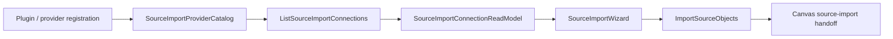

# Source Import Provider Extensibility Debt Review

## Summary

The current web workspace port models source-import connections with a closed
warehouse vendor union:

```ts
type: 'snowflake' | 'bigquery' | 'redshift' | 'postgres';
```

This is existing architectural debt. It is not only a TypeScript extensibility
problem. It means the generic workspace presentation port owns provider
classification, so every new source provider forces a code edit in the
workspace contract instead of flowing through a provider catalog or plugin-owned
capability.

## Current Code Evidence

| Surface                                                                | Current issue                                                         |
| ---------------------------------------------------------------------- | --------------------------------------------------------------------- |
| `apps/web/src/app/ports/workspace.ts`                                  | `WarehouseConnection.type` is a closed vendor literal union.          |
| `apps/web/src/app/components/sourceImportWizard/ConnectionStep.tsx`    | UI renders the raw provider type instead of a provider display model. |
| `apps/web/src/app/services/workspace/workspaceService.mock.ts`         | Mock source-import data is coupled to hard-coded warehouse vendors.   |
| `apps/web/src/app/services/workspace/workspaceService.imports.test.ts` | Tests prove source import behavior, but not provider extensibility.   |

## Fowler Classification

| Scenario                                                                        | Opportunity          | Fowler pattern                            | DDD owner                              | Command/query rail                             | Debt                                                                                    |
| ------------------------------------------------------------------------------- | -------------------- | ----------------------------------------- | -------------------------------------- | ---------------------------------------------- | --------------------------------------------------------------------------------------- |
| Add a new import provider such as `duckdb`, `databricks`, `sql`, `s3`, or `api` | Primitive obsession  | Replace Type Code with object/value model | `SourceImportProviderRef` value object | `ListSourceImportConnections` query            | Provider identity is encoded as string literals in a broad port.                        |
| Render provider-specific connection capabilities                                | Boundary drift       | Presentation Model                        | `SourceImportConnectionReadModel`      | `ListSourceImportConnections` query            | UI reads vendor type instead of provider capability metadata.                           |
| Import objects from a provider                                                  | Duplicate semantics  | Service Layer plus Gateway                | `SourceImportRequest` command object   | `ImportSourceObjects` command                  | The import workflow is warehouse-shaped even though future providers are plugin-shaped. |
| Test provider expansion                                                         | Test-only confidence | Semantic architecture test                | `SourceImportProviderCatalog` policy   | `CheckSourceImportProviderExtensibility` query | Current tests pass for listed vendors but do not prove open provider admission.         |

## Command And Query Debt

The source-import behavior should be cataloged before implementation. The
minimum rails are:

| Rail                                     | Type    | Owning bounded context  | DDD object / read model                           | Application port                                                               | Negative tests                                                                       |
| ---------------------------------------- | ------- | ----------------------- | ------------------------------------------------- | ------------------------------------------------------------------------------ | ------------------------------------------------------------------------------------ |
| `ListSourceImportConnections`            | query   | Workspace source import | `SourceImportConnectionReadModel`                 | `IWorkspacePort.listSourceImportConnections()` or successor source-import port | unsupported provider, missing capability metadata, unauthorized workspace scope      |
| `ListSourceImportObjects`                | query   | Workspace source import | `SourceImportObjectReadModel`                     | `IWorkspacePort.listSourceImportObjects()` or successor source-import port     | unknown connection, denied connection, provider unavailable                          |
| `ImportSourceObjects`                    | command | Workspace source import | `SourceImportRequest` command object              | `IWorkspacePort.importSourceObjects()` or successor source-import port         | empty object set, unsupported object kind, duplicate import, read-only draft posture |
| `CheckSourceImportProviderExtensibility` | query   | Architecture governance | `SourceImportProviderCatalog` architecture policy | architecture test                                                              | hard-coded provider union, UI vendor branching, mock-only provider semantics         |

## Target DDD Shape

The next implementation should replace vendor literals with provider metadata:

```ts
export type SourceImportProviderRef = {
  pluginId: string;
  providerId: string;
  displayName: string;
  kind: 'warehouse' | 'lakehouse' | 'database' | 'object-store' | 'api';
};

export type SourceImportConnectionReadModel = {
  id: string;
  name: string;
  provider: SourceImportProviderRef;
  database?: string;
  capabilities: {
    canListObjects: boolean;
    canImportColumns: boolean;
    canGenerateFreshness: boolean;
    canGenerateTests: boolean;
  };
};
```

Provider-specific behavior should hang from `provider` and `capabilities`, not
from string comparisons in the wizard or workspace port.

## Target Flow



## Fix Strategy

Recommended next cut: introduce an extensible provider read model while keeping
the external user flow unchanged.

1. Add or update the source-import command/query catalog in the owning
   component documentation.
2. Replace `WarehouseConnection.type` with `SourceImportProviderRef`.
3. Rename source-import types away from `Warehouse*` where they are not
   genuinely warehouse-only.
4. Update `SourceImportWizard` to render `provider.displayName` and gate options
   through `capabilities`.
5. Add an architecture test that fails if `workspace.ts` reintroduces a closed
   vendor union for provider identity.
6. Add negative tests for unknown provider metadata and unsupported
   capabilities.

## Out Of Scope For The Debt Note

- No backend endpoint is added here.
- No plugin registry implementation is added here.
- No Cypress workflow is changed here.
- No compatibility alias should be added when the debt is fixed.

## Acceptance Criteria For Closing The Debt

- The workspace source-import contract does not list concrete provider vendors
  as a closed union.
- New providers can be represented by data without changing the generic
  workspace port type.
- UI behavior uses provider display metadata and capability flags.
- Mock and API adapter semantics are documented under the same command/query
  rails.
- Architecture tests block provider literal drift from returning.
- Unit tests include at least one non-warehouse provider fixture.
