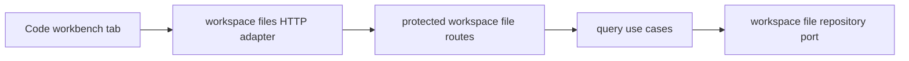

# DVT Deep Architectural Review

## Scope

This review records the global Fowler reading used for the Code workbench
workspace-files slice. It is intentionally concise; implementation detail lives
in the component docs and mandatory proposal.

Governing sources:

- [Command And Query Rail Governance](../../../../architecture/command-query-rail-governance.md)
- [Fowler Opportunity Planning Governance](../../../../architecture/fowler-opportunity-planning-governance.md)
- [Code Workbench Workspace Files Component](../../../../architecture/components/web/code-workbench-workspace-files-component.md)
- [Protected Runtime Route Group Component](../../../../../apps/api/docs/protected-runtime-route-group-component.md)

## Fowler Findings

| Signal                  | Finding                                                                                   | Decision                                                                                     |
| ----------------------- | ----------------------------------------------------------------------------------------- | -------------------------------------------------------------------------------------------- |
| Boundary drift          | Code route depended on local/mock file semantics while the API had no governed read rail. | Add `ListWorkspaceFiles` and `GetWorkspaceFileContent` query rails.                          |
| Hidden authority        | Web route could present workspace files without protected API authority.                  | Route all live reads through protected API authorization and scope.                          |
| Responsibility overload | `registerProtectedRuntimeRoutes.ts` was absorbing component-local construction.           | Keep it as route-group orchestrator; move workspace-file composition to its own route group. |
| Duplicate semantics     | Workspace-file rail names, tests, and surfaces were repeated as literals.                 | Centralize workspace-file rail metadata in the catalog module.                               |
| Test-only confidence    | Unit coverage alone did not prove the Code tab user flow.                                 | Add Cypress coverage for file tree, preview, empty state, and scoped query params.           |

## Mature-System Comparison

Mature systems keep product intent in application-level commands and queries,
then attach HTTP and UI adapters around those rails. The selected design follows
that model: web uses a scoped API adapter, API routes implement named query
rails, and the repository adapter remains behind an application port.

## Component Grouping

## Current Risks

- The local filesystem repository is acceptable for this slice only as the
  configured protected-runtime workspace root adapter.
- File browsing remains read-only; write behavior is out of scope until a
  command rail is planned.
- The global route registration file must stay below 200 lines and delegate
  route-group construction.

## Closeout Checks

- C&Q rails exist before implementation.
- DDD owners are named: `WorkspaceFileTree`, `WorkspaceFileContent`,
  `WorkspacePath`, and `WorkspaceFileReadPolicy`.
- Architecture guard prevents the global route registrator from owning
  workspace-file repository/use-case construction.
- Cypress covers the visible Code tab behavior.
