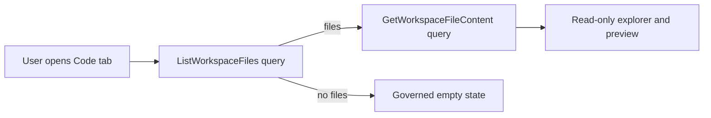

# Internal Alpha Evolution Route

## Purpose

This review captures the product-facing route from internal alpha to a usable
Code workbench slice without turning planning into implementation authority.

## Route Principles

- Product behavior must be usable through the UI, not only represented in docs.
- New behavior must have a command/query rail before implementation.
- The happy path and fail-closed paths must be covered by tests.
- Files over 200 lines should be split by owned concern unless generated.

## Current Alpha Slice

| Capability            | Current posture                                | Next proof                                         |
| --------------------- | ---------------------------------------------- | -------------------------------------------------- |
| Code tab file tree    | Implemented through `ListWorkspaceFiles`.      | Cypress confirms visible tree and scoped API call. |
| Code tab preview      | Implemented through `GetWorkspaceFileContent`. | Cypress confirms first-file preview.               |
| Empty workspace state | Implemented as governed empty state.           | Cypress confirms no-file response.                 |
| File writes           | Out of scope.                                  | Requires a planned command rail.                   |

## Product Risks

- A confusing empty/error state can make a working system look disconnected.
- Local filesystem roots are operationally useful but must not become product
  authority.
- Large route/catalog files degrade AI and human review; split by route group,
  rail family, or owned concern.

## Diagram

## Open Opportunities

- Plan a file-write command rail before enabling editing.
- Improve empty/error copy so users know whether the workspace has no files,
  lacks permission, or the backend is unavailable.
- Add a small architecture guard for authored file length if the 200-line rule
  becomes repository-wide instead of branch-local.
