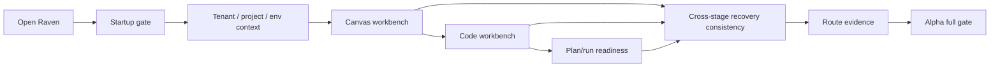
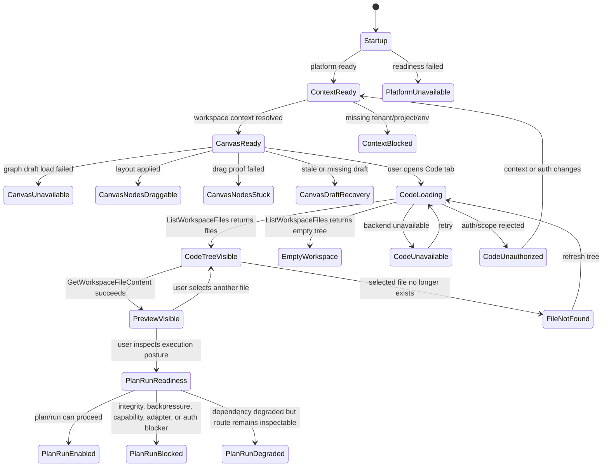

# Internal Alpha Product Route Review

## Purpose

This review defines the internal alpha product route from first application load
to a usable read-only workbench. The Code workbench workspace-files work is a
child slice of this route, not the route itself.

Authoritative implementation planning remains in the mandatory proposal and the
command/query rail catalog:

- [Internal alpha product route plan](../../proposals/mandatory/frontend-and-ux/internal-alpha-product-route-plan-20260505.md)
- [Internal alpha architecture view review](./20260505-internal-alpha-architecture-view-review.md)
- [Code workbench workspace files query rail plan](../../proposals/mandatory/frontend-and-ux/code-workbench-workspace-files-query-rail-plan-20260504.md)
- [Deep architectural review](./20260504-dvt-deep-architectural-review.md)
- [Command/query rail governance](../../../architecture/command-query-rail-governance.md)

This document records route intent, route gates, child slices, evidence gaps,
and product risks. The architecture view records boundary, rail, state,
evidence, and risk posture. Neither document creates implementation authority by
itself.
Route execution authority now starts at `F-27` and the internal alpha product
route plan, not at the workspace-files child-slice plan.

The governing critique for this revision is that the previous alpha review used
route language while only proving the Code workbench workspace-files slice. This
version preserves the slice proof but moves it under a route-level model.

The 2026-05-05 source-grounded critique pass adds one more constraint: route
gaps must point at the actual code or planning surface that owns them. A gap is
not actionable if it only says "needs tests" or "needs a rail" without naming
the canonical rail catalog, component owner, lane owner, or missing proposal.

## Review Authority

| Concern                | Authority                                     | This review may do         | This review must not do         |
| ---------------------- | --------------------------------------------- | -------------------------- | ------------------------------- |
| Alpha route            | This document                                 | Name route proof and gaps. | Declare code complete.          |
| Command/query behavior | C&Q rail catalog and mandatory proposal       | Point to the rails.        | Invent parallel behavior names. |
| Component design       | Component docs and architecture tests         | Call out ownership gaps.   | Override component APIs.        |
| Delivery execution     | Lane YAML and feature mechanization manifests | Identify follow-up work.   | Act as a work queue by itself.  |

## Route Definition

The internal alpha route is the smallest product path that lets an internal
user open Raven, enter a governed workspace, inspect the graph context, inspect
workspace files, and understand why execution is enabled, blocked, or degraded.

The diagram below is the navigation order. The [Alpha Full Gate](#alpha-full-gate)
table is the closure/status model. They must stay aligned when the route order
changes.

## Alpha Full Gate

| Route stage       | User proof                                              | Required rail or owner                                                      | Current status                                                     |
| ----------------- | ------------------------------------------------------- | --------------------------------------------------------------------------- | ------------------------------------------------------------------ |
| Startup gate      | User sees progress or a governed failure.               | App bootstrap and runtime readiness surfaces.                               | Gap: owner exists, route-level alpha proof is not named.           |
| Context selection | Tenant, project, and environment are explicit.          | Workspace context owner plus protected runtime scope builders.              | Partial: no alpha closure proof for detached/unknown context.      |
| Canvas            | Nodes are visible, movable, and recover after layout.   | Canvas graph component, `GetWorkspaceGraphDraft`, `SaveWorkspaceGraphDraft` | Partial: rails exist; UI drag/retry/recovery proof is incomplete.  |
| Code tab          | Files and first-file preview load when authorized.      | `ListWorkspaceFiles`, `GetWorkspaceFileContent`                             | Implemented for the child slice; alpha still needs route fixture.  |
| Recovery states   | Recovery copy is consistent across every stage.         | Cross-slice route recovery vocabulary plus source-of-truth UI model.        | Gap: no route-wide recovery-copy vocabulary or owner is named yet. |
| Execution posture | Plan/run controls explain why they are enabled/blocked. | Runtime/plan readiness rails plus route copy mapping.                       | Gap: blocker causes are named but not yet route-proven.            |

Alpha full is not closed until every route stage has a user-visible proof, a
governing rail or component owner, and a passing positive and negative test.
The gate is not decidable while `Gap` or `Partial` stages lack a concrete rail,
component owner, lane owner, and `traceability:adr0` proof.

## Child Slices

| Slice                          | Depends on         | Owning lanes            | Governing source                                                                          | Closure rule                                                                  |
| ------------------------------ | ------------------ | ----------------------- | ----------------------------------------------------------------------------------------- | ----------------------------------------------------------------------------- |
| Startup and platform readiness | None.              | Lane C + Lane E.        | App bootstrap, platform health, and runtime readiness docs.                               | Recoverable startup states plus `traceability:adr0`.                          |
| Workspace context              | Startup.           | Lane C + Lane E.        | Access decision scopes, protected runtime scope builders, and workspace ownership docs.   | No detached/unknown ambiguity plus `traceability:adr0`.                       |
| Canvas workbench               | Startup + context. | Lane E; Lane C consult. | Canvas component docs, graph-draft rails, and `TF-C4` protected graph-draft boundary.     | Draggable nodes, draft retry/recovery, and `traceability:adr0` proof.         |
| Code workbench workspace files | Startup + context. | Lane E; Lane C consult. | Mandatory workspace-files query rail plan.                                                | Rail, API, UI, Cypress, safety-negative tests, and `traceability:adr0` proof. |
| Plan/run readiness             | Startup + context. | Lane A + Lane C.        | Runtime and plan readiness rails, `ADR-0012`, backpressure/capability/admission surfaces. | Disabled-state reasons plus `traceability:adr0`.                              |

## Command And Query Rails

The route has implemented rails for the Code workbench workspace-file child
slice and the Canvas graph-draft boundary. Route-level follow-up work must add
or reference rails for startup, workspace context, recovery, and plan/run
readiness before implementation.

| Rail                      | Kind      | Bounded context                  | DDD object/read model                      | Application port                 | Adapter surface              | Product proof                                                                |
| ------------------------- | --------- | -------------------------------- | ------------------------------------------ | -------------------------------- | ---------------------------- | ---------------------------------------------------------------------------- |
| `GetWorkspaceGraphDraft`  | `query`   | Workspace graph drafting         | Workspace draft read model                 | `getWorkspaceGraphDraftUseCase`  | `GET /workspace/graph/draft` | Canvas can load authoritative draft state for the active scope.              |
| `SaveWorkspaceGraphDraft` | `command` | Workspace graph drafting         | Workspace draft aggregate                  | `saveWorkspaceGraphDraftUseCase` | `PUT /workspace/graph/draft` | Canvas draft writes go through the protected graph-draft boundary.           |
| `ListWorkspaceFiles`      | `query`   | Operational evidence read models | `WorkspaceFileTree`                        | `ListWorkspaceFilesUseCase`      | `GET /workspace/files`       | Code tab shows an authorized tree or governed empty state.                   |
| `GetWorkspaceFileContent` | `query`   | Operational evidence read models | `WorkspaceFileContent` and `WorkspacePath` | `GetWorkspaceFileContentUseCase` | `GET /workspace/files/:path` | Selecting a file shows scoped read-only content or governed not-found state. |

No workspace-file write behavior is part of this route. Editing files requires
a planned command rail before any UI affordance, route handler, adapter method,
or Cypress flow is added. This rule does not prohibit graph-draft writes; those
already route through `SaveWorkspaceGraphDraft`.

## Workspace Files Slice Evidence

| Capability                | Evidence source                                                                                                  | Landed in | Required proof                                           |
| ------------------------- | ---------------------------------------------------------------------------------------------------------------- | --------- | -------------------------------------------------------- |
| Code tab file tree        | `ListWorkspaceFilesUseCase`, `workspaceFilesRoutes.ts`, `workspaceFilesRouteGroup.ts`, web workspace service.    | #1105     | Cypress confirms visible tree and scoped API call.       |
| Code tab preview          | `GetWorkspaceFileContentUseCase`, `workspaceFilesRoutes.ts`, `LocalWorkspaceFileRepository`, web Code view.      | #1105     | Cypress confirms first-file preview.                     |
| Empty workspace state     | API route test plus Code view state.                                                                             | #1105     | UI distinguishes empty workspace from backend failure.   |
| Backend unavailable state | Web model and route error translation.                                                                           | #1105     | UI distinguishes unavailable from empty.                 |
| Unauthorized state        | `IAccessDecisionService`, `accessDecisionActions.ts`, and protected route authorization.                         | #1105     | Negative API route tests prove fail-closed behavior.     |
| File not found            | `GetWorkspaceFileContent`, `workspaceFilesRoutes.ts`, and `LocalWorkspaceFileRepository` negative path handling. | #1105     | API and UI report not-found without corrupting the tree. |

## Authorization Wiring

Workspace file reads must route through the protected runtime authorization path:

- Port: `IAccessDecisionService`.
- Action constant:
  `AUTHORIZATION_ACTION.workspaceFilesView` /
  `AUTHORIZATION_ACTION_NAME.workspaceFilesView` in
  `apps/api/src/application/ports/accessDecisionActions.ts`.
- Canonical rail vocabulary:
  `PROTECTED_RUNTIME_WORKSPACE_RAIL.workspaceFiles` in
  `apps/api/src/application/ports/protectedRuntimeRailVocabulary.ts`.
- Scope: tenant, project, and environment context for the active workspace,
  built through protected runtime scope builders.

Authorization proof must distinguish authentication/parsing failures from
authorization denials. Tests should assert the API envelope or denial enum, not
copy strings.

| Route phrase               | Canonical owner or enum                     | Closure requirement                                                                 |
| -------------------------- | ------------------------------------------- | ----------------------------------------------------------------------------------- |
| Missing token              | Authentication layer, not `DeniedReason`.   | Assert `401` / `missing_token` before authorization is invoked.                     |
| Missing tenant/project/env | Scope parsing in `workspaceFilesRoutes.ts`. | Assert specific missing-scope parse reason, not generic "missing scope".            |
| Tenant not granted         | `DeniedReason.TENANT_NOT_GRANTED`.          | Negative authorization test must fail closed with tenant-specific denial.           |
| Project not granted        | `DeniedReason.PROJECT_NOT_GRANTED`.         | Negative authorization test must fail closed with project-specific denial.          |
| Environment not granted    | `DeniedReason.ENVIRONMENT_NOT_GRANTED`.     | Negative authorization test must fail closed with environment-specific denial.      |
| Action not granted         | `DeniedReason.ACTION_NOT_GRANTED`.          | Negative authorization test must fail closed for `workspace:files:view`.            |
| Token assertion conflict   | `DeniedReason.TOKEN_ASSERTION_CONFLICT`.    | Tenant/project assertion mismatch must be tested separately from missing scope.     |
| Principal suspended        | `DeniedReason.PRINCIPAL_SUSPENDED`.         | Suspended principal is an alpha-blocking negative case until route copy handles it. |

A generic `401` or `403` is not enough proof. Tests must prove the protected
route reached the authorization decision point and failed closed.

## Plan/Run Readiness Blockers

The execution posture row is not closable until route copy distinguishes plan
integrity failure, backpressure admission, capability mismatch, adapter
unavailable/degraded mode, and authorization denied. Those causes must route
through runtime or plan readiness rails before UI implementation.

| Cause                        | Existing source or gap                                                                 | Required alpha closure path                                                             |
| ---------------------------- | -------------------------------------------------------------------------------------- | --------------------------------------------------------------------------------------- |
| Plan integrity failure       | `ADR-0012` and `PlanIntegrityValidator` / `IPlanIntegrityValidator`.                   | Surface a stable integrity rejection code in plan/run readiness copy.                   |
| Backpressure admission       | Delivery `StartRunAdmissionGuard` and Postgres backpressure reader surfaces.           | Bind route copy to accepted backpressure result codes before browser proof.             |
| Capability mismatch          | `RunExecutionPolicy.requiresCapabilities` contract and engine capability gate tests.   | Surface missing capability names through a readiness banner, not a generic disabled UI. |
| Adapter unavailable/degraded | Platform health and adapter/runtime degraded-state work; no route-specific rail named. | Add or reference a degraded-mode admission/readiness rail before UI implementation.     |
| Authorization denied         | `IAccessDecisionService.decide` and `DeniedReason`.                                    | Map denial enum to user copy through a source-owned model.                              |

## Filesystem Safety

`LocalWorkspaceFileRepository` is an adapter, not product authority. The route
must preserve these adapter safety requirements:

| Threat          | Current source truth                                                                                                               | Required alpha proof                                                                                                  |
| --------------- | ---------------------------------------------------------------------------------------------------------------------------------- | --------------------------------------------------------------------------------------------------------------------- |
| Path traversal  | `LocalWorkspaceFileRepository.resolveWorkspacePath()` rejects empty, absolute, `..`, backslash-normalized, and outside-root paths. | Negative API tests for `..`, encoded `..`, double-encoded traversal, NUL byte, Windows backslash, and absolute paths. |
| Oversize file   | `MAX_FILE_BYTES` is `1_000_000` in `LocalWorkspaceFileRepository`.                                                                 | Boundary test at 1,000,000 bytes and one byte over; promote to config or document as the accepted adapter invariant.  |
| Binary content  | Extension allowlist filters common binary files, but a binary payload with an allowed extension is not explicitly rejected.        | Pick one contract: reject non-UTF-8 content, or label it. Alpha cannot close while this remains implicit.             |
| Freshness drift | File content is read on request; no route-level cache invalidation policy is named.                                                | Document read-on-request freshness as the invariant, or add a cache invalidation model and tests.                     |

## Route State Model

This model is intentionally route-level. Code workbench has the deepest state
coverage today; startup, Canvas, recovery, and plan/run readiness remain
abbreviated until their child slices name equivalent scenario fixtures.

## Scenario Coverage

Canonical Cypress fixture status: no route-level fixture is named yet. Alpha full
cannot close until the route-level plan names or creates one for files, empty
workspace, unavailable backend, unauthorized access, and missing-file recovery.

| Scenario                             | User outcome                                                       | Required coverage                          |
| ------------------------------------ | ------------------------------------------------------------------ | ------------------------------------------ |
| First internal alpha load            | Route reaches a usable workspace or governed startup failure.      | Cypress route smoke plus readiness tests.  |
| Files exist                          | Tree and first-file preview are visible.                           | Cypress happy path plus API route tests.   |
| Workspace has no files               | Empty workspace copy is shown without implying backend failure.    | Cypress empty-state path.                  |
| Backend cannot load files            | Unavailable copy is shown without implying the workspace is empty. | UI model/unit test and route error path.   |
| Missing token/action/scope           | Request fails closed.                                              | Negative API route tests.                  |
| File path is missing after tree load | Preview reports not-found for that file.                           | API negative test and UI error model test. |
| Layout is applied                    | Canvas nodes remain draggable from the full node surface.          | Cypress canvas interaction path.           |
| Plan/run disabled                    | User sees the reason execution is blocked.                         | Route UI test and readiness rail test.     |

## Open Risks Riding Into Alpha

This table is not yet a full route-risk triage. Alpha full cannot close until
the risk register is reviewed against every route stage and every included or
excluded risk has a reason.

| Risk                                                                                                                                             | Route impact                                                            | Required handling                                                      |
| ------------------------------------------------------------------------------------------------------------------------------------------------ | ----------------------------------------------------------------------- | ---------------------------------------------------------------------- |
| [R-20260411-WEB-WORKSPACE-FILE-NOT-FOUND-CONTRACT-GAP](../../../risk-register/quality/R-20260411-WEB-WORKSPACE-FILE-NOT-FOUND-CONTRACT-GAP.yaml) | Code slice not-found behavior can drift from backend reason vocabulary. | Keep not-found proof tied to the query rail before alpha full closure. |

## Alpha Cadence Gap

The route gate defines what alpha means, but it does not yet define alpha
cadence. A route-level plan must state the internal tester audience, expected
duration, entry date, exit-decision owner, and allowed extension conditions.
Without that cadence, the same gate can mean a one-day smoke path or a multi-week
internal readiness program.

## Plan Gap Register

| Gap                                     | Why it blocks alpha full                                                                         | Required routing                                                                                        |
| --------------------------------------- | ------------------------------------------------------------------------------------------------ | ------------------------------------------------------------------------------------------------------- |
| Route plan execution is not accepted    | `F-27` now owns the route plan, but child slices and route fixture proof are still open.         | Execute the internal alpha product route plan before declaring alpha full.                              |
| Startup gate has no route fixture       | A user cannot tell whether first load is progressing, degraded, or blocked.                      | Route through app bootstrap/platform health ownership and add alpha smoke coverage.                     |
| Workspace context closure is undefined  | Tenant, project, and environment can be present in scope but still unclear in the UI.            | Bind context selection to protected runtime scope builders and a route-visible context model.           |
| Canvas proof is underspecified          | Graph-draft rails exist, but draggable-node, retry, and recovery proof are not complete.         | Route through Canvas component docs, `TF-C4`, and a Cypress interaction path.                           |
| Recovery copy has no common vocabulary  | "Consistent recovery copy" cannot be tested across startup, Canvas, Code, and plan/run.          | Add a source-owned recovery vocabulary/model and tests that assert equivalent states use the same keys. |
| Plan/run readiness lacks rail mapping   | The blocker causes are known, but the UI can still collapse them into generic disabled UI.       | Bind each cause to the rails/sources in the readiness table before UI implementation.                   |
| Filesystem safety closure is incomplete | Current adapter safety exists, but test vectors and binary/freshness contract are not closed.    | Extend the workspace-files proposal or child-slice plan with the safety matrix above.                   |
| Risk triage is incomplete               | Listing one risk makes absence of other risks accidental rather than decisional.                 | Triage `docs/risk-register/quality/**` by route stage and record inclusion/exclusion rationale.         |
| Child-slice authority separation        | Workspace-files is a child slice and must not govern route-level alpha critique or gate posture. | Keep route-level alpha surfaces under the internal alpha route plan manifest.                           |
| Route reorder process is undefined      | Moving plan/run readiness before Code changes the flowchart, gate, dependencies, and tests.      | Keep the route plan change-management section aligned with this review when route order changes.        |

## Open Opportunities

- Execute the `F-27` internal alpha product route plan before expanding beyond
  the workspace-files child slice.
- Route startup, canvas, and plan/run readiness gaps through their owning rails
  or component guides before implementation; route each gap through lane YAML.
- Promote file-read safety threats into tests before calling the Code workbench
  slice alpha-complete; route the work through the owning proposal.
- Authored-file size policy is owned by
  [Code Workbench File Length Refactor](../../proposals/mandatory/frontend-and-ux/code-workbench-file-length-refactor-20260504.md);
  this route review does not duplicate or override it.
