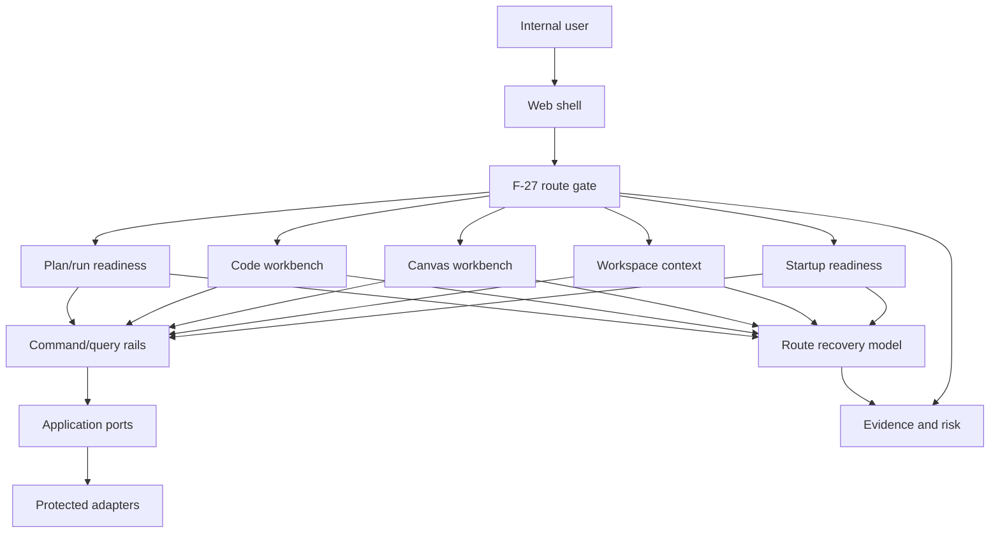

# Internal Alpha Architecture View Review

## Purpose

This review preserves the architecture-facing view over the internal alpha route.
It does not create a second backlog. `F-27` is closed and the
[Internal alpha product route plan](../../proposals/mandatory/frontend-and-ux/internal-alpha-product-route-plan-20260505.md)
is retained as accepted route-proof evidence; the authoritative closure is the
[F-27 alpha route closeout](../../closeouts/20260514-f27-alpha-route-acceptance-matrix-closeout.md).
Any new executable follow-up starts in GitHub Issues rather than reopening F-27
or a lane queue.

The architectural concern was whether the route could be governed as one product
boundary while its child slices remained independently testable. The accepted
route proof and closeout answer that question positively: startup, context,
Canvas, Code, plan/run readiness, recovery, cadence, and risk evidence reached
an accepted alpha-full decision with no remaining F-27 blockers.

## Governing Sources

- `AGENTS.md`
- `docs/planning/status/governance-document-rule-inventory.md`
- `docs/guides/ai-work-protocol.md`
- `docs/planning/state/github-mvp-issue-workflow.md`
- `docs/architecture/reference-architecture.md`
- `docs/architecture/command-query-rail-governance.md`
- `docs/architecture/fowler-opportunity-planning-governance.md`
- `docs/planning/proposals/mandatory/frontend-and-ux/internal-alpha-product-route-plan-20260505.md`
- `docs/planning/closeouts/20260514-f27-alpha-route-acceptance-matrix-closeout.md`
- `docs/planning/reviews/architecture-and-governance/20260504-internal-alpha-evolution-route.md`
- `docs/planning/reviews/architecture-and-governance/20260505-alpha-evolution-route-v3-critique.md`

## Architecture Thesis

Internal alpha is not a single feature. It is a cross-boundary route proof
covering startup, workspace context, Canvas, Code, plan/run readiness, recovery,
risk, and cadence.

The architecture must keep three authorities separate:

| Authority         | Owns                                            | Must not own                                   |
| ----------------- | ----------------------------------------------- | ---------------------------------------------- |
| Route gate        | Alpha entry, sequencing, closure prerequisites. | Child implementation details.                  |
| Child slice       | Stage behavior, ports, adapters, and tests.     | Route-level alpha completion.                  |
| Evidence and risk | Proof, residual risk, and traceability.         | Product semantics or route ordering by itself. |

If a child slice can declare the route complete by implication, the route has
hidden authority. If the route proof describes behavior without rails, it has
documentation drift. If evidence names only happy paths, the route has
test-only confidence.

## Boundary View

The route gate coordinates the product-path decision semantics. It must not
bypass rails, ports, or adapters to create local UI truth. Child slices prove
each route stage through their own rails and tests, then feed evidence back to
the route gate. The closed F-27 identifier records that accepted route proof; it
is not a current task queue.

## Boundary Map

| Boundary          | Owning source or rail                                     | Architecture failure if missing                                 |
| ----------------- | --------------------------------------------------------- | --------------------------------------------------------------- |
| Startup readiness | `ObserveAppBootstrapRouteReadiness`                       | First load can look broken, blocked, or complete without proof. |
| Workspace context | `ObserveWorkspaceContext`                                 | Tenant, project, and environment can become implicit UI state.  |
| Canvas draft      | `GetWorkspaceGraphDraft`, `SaveWorkspaceGraphDraft`       | Graph state can be treated as local product authority.          |
| Code files        | `ListWorkspaceFiles`, `GetWorkspaceFileContent`           | File reads can drift from authorization and filesystem policy.  |
| Plan/run posture  | `ObservePlanRunReadiness`                                 | Disabled execution can collapse into generic copy.              |
| Recovery states   | `MapRouteRecoveryState`                                   | Equivalent failures can use unrelated stage-specific language.  |
| Alpha cadence     | F-27 accepted route proof and closure evidence            | Alpha can mean either a smoke test or a readiness program.      |
| Route risk triage | `docs/risk-register/**` plus accepted F-27 route evidence | Residual risk inclusion becomes accidental.                     |

## Architecture Invariants

- One route-proof identity: `F-27` identifies the accepted alpha route decision;
  it is not an executable task authority after closure.
- New executable task lifecycle is owned by GitHub Issues; Planning DB remains
  scoped to architecture and mechanization governance.
- Child slices cannot declare alpha full by implication.
- Rails before behavior: every user-visible stage must reuse or define its
  command/query rail before implementation.
- No local product authority: local UI state, localStorage, fixtures, and
  mock-only flows cannot define route truth.
- Source-owned vocabulary: recovery and readiness copy must map to stable
  source-owned states, not repeated free text by stage.
- Runtime safety is not presentation: protected runtime, admission, and
  authorization sources own the vocabulary consumed by the route.
- Evidence is stage-specific: alpha full requires positive and negative proof
  for every route stage, not only the Code workbench slice.
- Risk is an input: route risk triage must explain included and excluded risks
  before an alpha-full claim.

## Accepted Architecture Posture

The F-27 closure evidence records an accepted alpha-full route with no remaining
parent blockers. The architecture remains governable because the accepted proof
keeps route-decision semantics distinct from child implementation ownership.

| Area                          | Accepted posture                                                                |
| ----------------------------- | ------------------------------------------------------------------------------- |
| Route proof                   | `F-27` and its closeout preserve the accepted sequencing and closure evidence.  |
| Executable follow-up          | GitHub Issues own new task lifecycle; the closed plan is not reopened.          |
| Child-slice separation        | Workspace-files and other child components retain stage implementation depth.   |
| Route review                  | Reviews preserve the route stages, owners, and evidence that supported closure. |
| Runtime dependency visibility | Protected runtime/admission rails provide the safety inputs consumed by route.  |
| Code workbench rails          | File-tree and file-content behavior have named query rails.                     |
| Fixture matrix                | Combined route proof covers happy and fail-closed route states.                 |
| Risk and cadence              | The acceptance matrix and closeout record accepted risk/cadence evidence.       |

A regression in route order, rails, risk, cadence, or child proof can still move
the semantic route decision from `accepted` back to `review` or `blocked`; that
does not reopen F-27 as a task queue. Any remediation is created and tracked in
GitHub Issues.

## Decision Pressure

The architecture no longer needs another F-27 planning wave. The accepted route
proof remains useful as a semantic guard, while new product work must be owned by
current components, rails, and GitHub issues.

Use this rule:

| Need                                                        | Correct surface                                                    |
| ----------------------------------------------------------- | ------------------------------------------------------------------ |
| Regress or reassess route acceptance semantics              | Route-gate component, accepted F-27 evidence, and new GitHub issue |
| Prove startup, context, Canvas, Code, or readiness behavior | A child component/proposal plus current issue when work is needed  |
| Add or rename executable behavior                           | Command/query rail catalog before implementation                   |
| Explain residual risk                                       | Risk register entry/update plus current issue when actionable      |
| Capture proof                                               | Evidence docs, closeouts, and stage-specific tests                 |

## Architectural Closure Artifact

The route acceptance matrix associated with F-27 lives at
`20260514-internal-alpha-route-acceptance-matrix.md`. It does not duplicate
child plans. It records each route stage, governing rail or owner, happy-path
fixture, fail-closed fixture, evidence source, risk decision, and alpha exit
impact that supported the accepted route decision.

This review explains why the matrix is the architecture-level closure artifact.
The corresponding closeout records that alpha full is accepted with no remaining
F-27 blockers. Future regressions or product changes must be routed through
current GitHub Issues and the owning component/rail rather than treating this
review or the closed plan as an executable backlog.
