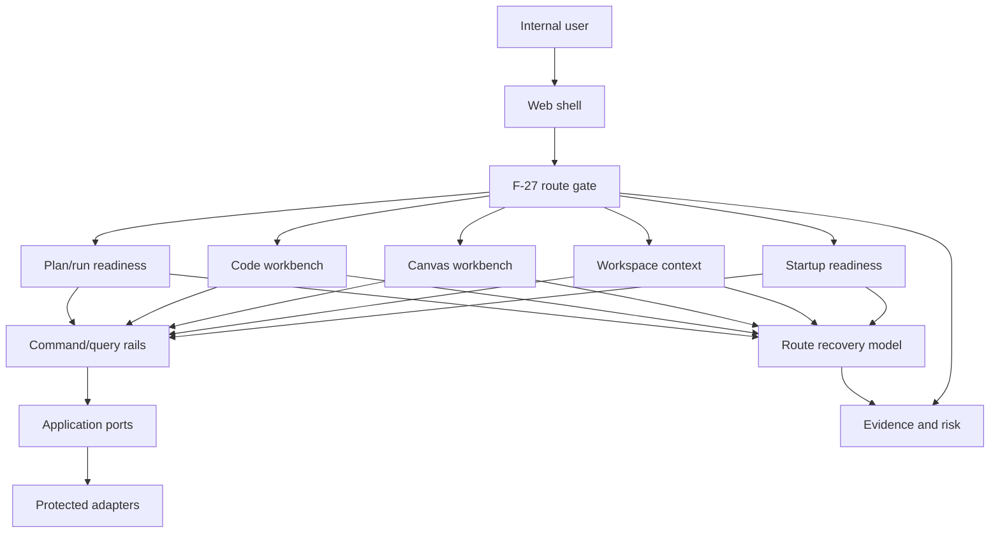

# Internal Alpha Architecture View Review

## Purpose

This review adds an architecture-facing view over the internal alpha route. It
does not create a second backlog, declare alpha complete, or supersede the
route plan. Execution authority remains with `F-27` and the
[Internal alpha product route plan](../../proposals/mandatory/frontend-and-ux/internal-alpha-product-route-plan-20260505.md).

The architectural concern is whether the route can be governed as one product
boundary while its child slices remain independently testable. The current
answer is: the route is now governable, but it is not alpha-ready until the
remaining state, rail, risk, fixture, and cadence gaps are closed.

## Governing Sources

- `AGENTS.md`
- `docs/planning/status/governance-document-rule-inventory.md`
- `docs/guides/ai-work-protocol.md`
- `docs/planning/state/planning-control-tower.md`
- `docs/architecture/reference-architecture.md`
- `docs/architecture/command-query-rail-governance.md`
- `docs/architecture/fowler-opportunity-planning-governance.md`
- `docs/planning/proposals/mandatory/frontend-and-ux/internal-alpha-product-route-plan-20260505.md`
- `docs/planning/reviews/architecture-and-governance/20260504-internal-alpha-evolution-route.md`
- `docs/planning/reviews/architecture-and-governance/20260505-alpha-evolution-route-v3-critique.md`

## Architecture Thesis

Internal alpha is not a single feature. It is a cross-boundary route proof
covering startup, workspace context, Canvas, Code, plan/run readiness, recovery,
risk, and cadence.

The architecture must keep three authorities separate:

| Authority         | Owns                                            | Must not own                                   |
| ----------------- | ----------------------------------------------- | ---------------------------------------------- |
| Route gate        | Alpha entry, sequencing, closure prerequisites. | Child implementation details.                  |
| Child slice       | Stage behavior, ports, adapters, and tests.     | Route-level alpha completion.                  |
| Evidence and risk | Proof, residual risk, and traceability.         | Product semantics or route ordering by itself. |

If a child slice can declare the route complete by implication, the route has
hidden authority. If the route plan describes behavior without rails, it has
documentation drift. If evidence names only happy paths, the route has
test-only confidence.

## Boundary View

The route gate coordinates the product path. It must not bypass rails, ports, or
adapters to create local UI truth. Child slices prove each route stage through
their own rails and tests, then feed evidence back to the route gate.

## Boundary Map

| Boundary          | Owning source or rail                               | Architecture failure if missing                                 |
| ----------------- | --------------------------------------------------- | --------------------------------------------------------------- |
| Startup readiness | `ObserveAppBootstrapRouteReadiness`                 | First load can look broken, blocked, or complete without proof. |
| Workspace context | `ObserveWorkspaceContext`                           | Tenant, project, and environment can become implicit UI state.  |
| Canvas draft      | `GetWorkspaceGraphDraft`, `SaveWorkspaceGraphDraft` | Graph state can be treated as local product authority.          |
| Code files        | `ListWorkspaceFiles`, `GetWorkspaceFileContent`     | File reads can drift from authorization and filesystem policy.  |
| Plan/run posture  | `ObservePlanRunReadiness`                           | Disabled execution can collapse into generic copy.              |
| Recovery states   | `MapRouteRecoveryState`                             | Equivalent failures can use unrelated stage-specific language.  |
| Alpha cadence     | `F-27` route plan                                   | Alpha can mean either a smoke test or a readiness program.      |
| Route risk triage | `docs/risk-register/**` plus F-27                   | Residual risk inclusion becomes accidental.                     |

## Architecture Invariants

- One route authority: `F-27` owns the alpha route gate; child manifests must
  not widen into route-level authority.
- Rails before behavior: every user-visible stage must reuse or define its
  command/query rail before implementation.
- No local product authority: local UI state, localStorage, fixtures, and
  mock-only flows cannot define route truth.
- Source-owned vocabulary: recovery and readiness copy must map to stable
  source-owned states, not repeated free text by stage.
- Runtime safety is not presentation: Lane C owns protected runtime, admission,
  and authorization vocabulary consumed by the route.
- Evidence is stage-specific: alpha full requires positive and negative proof
  for every route stage, not only the Code workbench slice.
- Risk is an input: route risk triage must explain included and excluded risks
  before an alpha-full claim.

## Current Architecture Posture

Governable:

| Area                          | Why it is governable now                                            |
| ----------------------------- | ------------------------------------------------------------------- |
| Route authority               | `F-27` and the route plan own alpha sequencing and closure posture. |
| Child-slice separation        | Workspace-files remains a child implementation plan.                |
| Route review                  | The active review names stages, owners, and gaps.                   |
| Runtime dependency visibility | Lane C names protected runtime inputs consumed by the alpha route.  |
| Code workbench rails          | File-tree and file-content behavior have named query rails.         |

Not alpha-ready:

| Area                    | Remaining architectural gap                                                     |
| ----------------------- | ------------------------------------------------------------------------------- |
| Fixture matrix          | No route-level matrix proves every stage across happy and fail-closed paths.    |
| Risk triage             | Route-stage inclusion and exclusion rationale is still incomplete.              |
| Cadence                 | Tester audience, duration, entry date, exit owner, and extension rule are open. |
| Recovery vocabulary     | Startup, Canvas, Code, and plan/run do not yet share a source-owned model.      |
| Readiness mapping       | Plan/run blockers are known but not route-proven through a readiness rail.      |
| Filesystem safety       | Traversal, oversize, binary, and freshness policy proof remains incomplete.     |
| Startup/context closure | First-load and scoped-context proofs are still not named as route evidence.     |

## Decision Pressure

The next architecture decision is not whether to make the route review longer.
The route review is already carrying enough route-level context. The pressure is
to split depth into child slice plans while keeping `F-27` as the route
orchestrator.

Use this rule:

| Need                                                        | Correct surface                                     |
| ----------------------------------------------------------- | --------------------------------------------------- |
| Change route order, gate, cadence, or alpha exit            | `F-27` and the internal alpha product route plan.   |
| Prove startup, context, Canvas, Code, or readiness behavior | A child proposal or component guide.                |
| Add or rename executable behavior                           | Command/query rail catalog before implementation.   |
| Explain residual risk                                       | Route risk triage plus risk register entry/update.  |
| Capture proof                                               | Evidence docs, closeouts, and stage-specific tests. |

## Architectural Next Cut

The route acceptance matrix owned by `F-27` now lives at
`20260514-internal-alpha-route-acceptance-matrix.md`. It does not duplicate
child plans. It lists each route stage, governing rail or owner, happy-path
fixture, fail-closed fixture, evidence source, risk decision, and alpha exit
impact.

This view defines why the matrix is the architecture-level closure artifact and
why alpha full remains blocked until child evidence fills the matrix rows.
