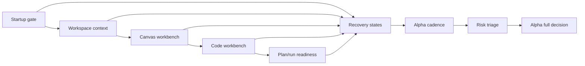

# Internal Alpha Route Acceptance Matrix

## Purpose

This matrix is the route-level F-27 acceptance artifact. It does not replace
child implementation plans. It records the proof that moved the internal alpha
route from blocked to review and now to alpha full.

Alpha full is blocked while any stage is `Gap`, lacks a fail-closed fixture, or
lacks a route-stage risk decision. Child slices cannot declare alpha full.

## Acceptance Matrix

<!-- markdownlint-disable MD060 -->

| Route stage        | Governing rail or owner                                                     | Happy-path fixture                                                                | Fail-closed fixture                                                                                                                          | Evidence source                                                                                               | Risk decision                                                                                                                                     | Alpha exit impact                   |
| ------------------ | --------------------------------------------------------------------------- | --------------------------------------------------------------------------------- | -------------------------------------------------------------------------------------------------------------------------------------------- | ------------------------------------------------------------------------------------------------------------- | ------------------------------------------------------------------------------------------------------------------------------------------------- | ----------------------------------- |
| Startup gate       | `ObserveAppBootstrapRouteReadiness`; Web Shell / App Bootstrap              | User sees route-ready startup after platform readiness settles.                   | Platform unavailable, bootstrap timeout, and route-ready/runtime-not-ready fail closed.                                                      | Accepted startup route-readiness proof.                                                                       | Included: startup ambiguity can block first-use trust. Excluded: public login bootstrap because it is outside protected alpha.                    | Accepted for alpha full.            |
| Workspace context  | `GetEffectiveWorkspaceContext`; protected runtime workspace context         | Tenant, project, and environment are visible for the active workspace.            | Missing, detached, unauthorized, or assertion-conflicted context fails closed.                                                               | Accepted effective workspace context proof.                                                                   | Included: implicit tenant/project/env state can leak product authority. Excluded: admin provisioning depth.                                       | Accepted for alpha full.            |
| Canvas workbench   | `GetWorkspaceGraphDraft`; `SaveWorkspaceGraphDraft`; Canvas graph component | Authoritative draft loads, nodes are visible, and drag/save feedback is governed. | Draft load failure, save denial, stale draft, retry exhaustion, and read-only posture are explicit.                                          | Accepted Canvas draft read/save and draft-access browser proof.                                               | Included: local graph state can become product authority. Excluded: advanced authoring workflows beyond alpha read/inspect posture.               | Accepted for alpha full.            |
| Code workbench     | `ListWorkspaceFiles`; `GetWorkspaceFileContent`; workspace-files child plan | Authorized tree and first-file preview load read-only with freshness metadata.    | Empty workspace, backend unavailable, unauthorized, not-found, traversal, oversize, unsupported file type, and freshness cases are explicit. | Accepted workspace-files query rail plan, API tests, UI proof, browser proof, and filesystem safety evidence. | Included: file reads can bypass authorization or filesystem policy. Excluded: file-write behavior, which requires a separate command rail.        | Accepted for alpha full.            |
| Plan/run readiness | `ObservePlanRunReadiness`; Runtime admission and plan readiness             | Controls explain ready-to-run posture with stable source-owned reasons.           | Plan integrity, backpressure, capability mismatch, adapter degraded, and authorization denied are distinct.                                  | Accepted `PlanRunReadinessReadModel`, unit, run-start, architecture, and browser proof.                       | Included: generic disabled copy hides platform risk. Excluded: executing real production runs during alpha gate proof.                            | Accepted for alpha full.            |
| Recovery states    | `MapRouteRecoveryState`; Route recovery vocabulary                          | Equivalent failures use one route-owned recovery vocabulary across stages.        | Unknown, unavailable, unauthorized, stale, and not-found states stay distinguishable.                                                        | Accepted recovery vocabulary guide, architecture guard, and browser fail-closed stage evidence.               | Included: duplicated recovery copy creates stage drift. Excluded: cosmetic copy iteration after source-owned keys exist.                          | Accepted for alpha full.            |
| Alpha cadence      | F-27 route plan; Product / Architecture                                     | Audience, entry date, duration, exit owner, and extension rule are named.         | Missing exit owner, missing duration, or indefinite extension keeps route blocked.                                                           | Accepted cadence decision in this matrix and F-27 closeout.                                                   | Included: alpha can become an undefined status. Excluded: launch/GTM cadence beyond internal alpha.                                               | Accepted and closed for alpha full. |
| Risk triage        | `docs/risk-register/**`; F-27 route risk review                             | Included and excluded risks are listed per route stage.                           | Untriaged high-impact route risks keep the route blocked.                                                                                    | Accepted risk register triage in this matrix and F-27 closeout.                                               | Included: route-stage safety, authorization, readiness, and data freshness risks. Excluded: unrelated roadmap or historical risks with rationale. | Accepted and closed for alpha full. |

<!-- markdownlint-enable MD060 -->

## Decision Rules

- `blocked`: at least one stage is missing owner, rail, happy proof,
  fail-closed proof, cadence, or risk decision.
- `review`: every stage has planned owners and proof surfaces, but at least one
  proof is not accepted.
- `accepted`: every stage has accepted proof, risk triage, cadence, ADR-0000
  traceability, and `pnpm verify:prepush` evidence.

## Alpha Cadence Decision

The internal alpha cadence is accepted. Internal alpha remains a gated
evaluation window, not a launch status.

- `audience`: Internal product, architecture, frontend, and runtime-safety
  testers.
- `entryDate`: First business day after all route-stage proofs in this matrix
  are accepted.
- `duration`: 10 business days.
- `exitOwner`: Product / Architecture.
- `extensionRule`: Product / Architecture may approve one extension of up to 5
  business days for named blockers.

Cadence is blocked when any field above is removed, when a route stage lacks
accepted happy-path or fail-closed proof, or when a blocker is extended without
an owner and a dated re-review.

## Route Risk Triage

This triage covers route-stage risk for internal alpha. It is accepted because
included risks now have stage evidence and excluded risks remain outside the
route boundary with rationale.

- `Startup gate`: Included
  [R-20260322-api-health-reconciler-runtime-degradation-visibility](../../../risk-register/quality/R-20260322-api-health-reconciler-runtime-degradation-visibility.md)
  because degraded readiness can make the first route appear trustworthy.
  Excluded
  [R-20260427-DEV-STACK-TEMPORAL-BOOTSTRAP](../../../risk-register/quality/R-20260427-DEV-STACK-TEMPORAL-BOOTSTRAP.yaml)
  because local Temporal startup is operator setup, not alpha route proof.
- `Workspace context`: Included
  [R-20260308-api-auth-runtime-integration-coverage](../../../risk-register/quality/R-20260308-api-auth-runtime-integration-coverage.md)
  because protected route auth can regress without full runtime proof. Excluded
  admin provisioning depth because F-27 only consumes already-scoped tenant,
  project, and environment context.
- `Workspace context`: Included
  [R-20260425-PRODUCTION-TENANT-ISOLATION-BASELINE](../../../risk-register/quality/R-20260425-PRODUCTION-TENANT-ISOLATION-BASELINE.yaml)
  because missing tenant isolation can leak product authority across contexts.
  Excluded historical gap IDs because active context truth must route through
  protected runtime rails and Lane C evidence.
- `Canvas workbench`: Included
  [R-20260423-CANVAS-HOST-DRAFT-BOUNDARY](../../../risk-register/quality/R-20260423-CANVAS-HOST-DRAFT-BOUNDARY.yaml)
  because host UX can overclaim persistence beyond the authoritative draft
  boundary. Excluded advanced multi-canvas persistence until a later
  command/query rail owns it.
- `Code workbench`: Included
  [R-20260411-WEB-WORKSPACE-FILE-NOT-FOUND-CONTRACT-GAP](../../../risk-register/quality/R-20260411-WEB-WORKSPACE-FILE-NOT-FOUND-CONTRACT-GAP.yaml)
  because missing-file copy can drift from backend reason vocabulary. Excluded
  file-write behavior because F-27 has no workspace-file command rail.
- `Plan/run readiness`: Included
  [R-20260424-TEMPORAL-PLAN-REF-CONTRACT](../../../risk-register/quality/R-20260424-TEMPORAL-PLAN-REF-CONTRACT.yaml)
  because runtime execution can regress to unchecked `PlanRef` behavior.
  Excluded
  [R-20260514-AR-D3-WORKER-SCALING](../../../risk-register/quality/R-20260514-AR-D3-WORKER-SCALING.yaml)
  because worker scale automation is outside internal alpha route proof; the
  route only needs readiness copy for blockers.
- `Recovery states`: Included
  [R-20260330-snapshot-staleness-caller-view](../../../risk-register/quality/R-20260330-snapshot-staleness-caller-view.yaml)
  because stale read models can be misread as read-your-writes guarantees.
  Excluded cosmetic copy iteration once source-owned recovery keys exist and
  stage coverage is proven.
- `Alpha cadence`: Included undefined cadence because it can turn alpha into an
  unbounded status; this matrix owns the cadence field contract and blocks
  missing `exitOwner`, `duration`, or `extensionRule`. Excluded launch/GTM
  cadence because F-27 governs internal alpha only.
- `Risk triage`: Included untriaged route-stage risk because it can hide
  authorization, readiness, data freshness, or local-authority regressions.
  Excluded risks unrelated to startup, context, Canvas, Code, plan/run
  readiness, recovery, cadence, or route evidence because they have no alpha
  exit impact.

Because included risks now have executable stage evidence and exclusion
rationale, alpha-full is accepted with no remaining alpha-full blockers.

## Route-Level Combined Fixture/Proof

The matrix is not complete with isolated child fixtures only. F-27 now has one
combined route-level fixture,
`apps/web/src/app/routes/internalAlphaRouteGate.test.fixtures.ts`, that
traverses:

1. startup gate,
2. workspace context admission,
3. Canvas and Code route entry,
4. plan/run readiness projection,
5. recovery vocabulary rendering under fail-closed posture.

This combined proof is the acceptance guard that prevents child-slice closure
from being misread as route-level alpha readiness.

The fixture evaluates to `review` when every required stage, owned rail,
traceable and resolvable evidence reference, planned evidence state,
happy-path proof, and fail-closed proof is present. It evaluates to `accepted`
only when every stage evidence state is `accepted`. Removing the Canvas
fail-closed proof returns the route decision to `blocked` and reports
`Canvas workbench` by name; removing the Code stage or `SaveWorkspaceGraphDraft`
rail also returns `blocked`.

Recovery vocabulary is part of the combined proof. Every stage must include at
least one non-ready recovery state, and the route-level vocabulary must include
`blocked`, `unauthorized`, `unavailable`, `stale`, and `not-found`. Omitting a
stage vocabulary or one of those recovery states returns the route decision to
`blocked`.

Startup gate evidence is now accepted for F-27 because it reuses the modern
`ObserveAppBootstrapRouteReadiness` rail through policy, Root integration, and
Cypress proof.

Workspace context evidence is also accepted for F-27 because it reuses the
server-owned `GetEffectiveWorkspaceContext` rail through protected-route
resolution, fail-closed workspace denial classification, and browser proof that
the shell renders scoped context as read-only after route admission.

Canvas workbench evidence is accepted for F-27 because it reuses
`GetWorkspaceGraphDraft` and `SaveWorkspaceGraphDraft` through protected draft
component guards, browser proof for governed draft reads, saves, and reload
posture, and browser proof that denied, forbidden-scope, and read-only draft
access fail closed without unsafe mutations.

Code workbench evidence is accepted for F-27 because it reuses
`ListWorkspaceFiles` and `GetWorkspaceFileContent` through the protected
workspace-files query rail, API authorization and filesystem-safety tests,
read-only UI proof, and browser proof that scoped workspace file reads reach the
Code route without introducing file-write authority.

Recovery states evidence is accepted for F-27 because it reuses
`MapRouteRecoveryState` through the route-owned recovery vocabulary, semantic
architecture guard coverage for every required recovery state, and browser
fail-closed evidence across startup, Canvas, and Code route stages.

This accepts alpha full because cadence and risk triage are closed with
resolvable F-27 evidence.

## Route Diagram

## Current Result

The route is `accepted` for internal alpha full because startup, workspace
context, Canvas, Code, plan/run readiness, recovery, cadence, and risk triage
all have accepted evidence.

There are no remaining alpha-full blockers:

- `Alpha cadence`: accepted and closed because the audience, entry date,
  duration, exit owner, and extension rule are named and governed by F-27.
- `Risk triage`: accepted and closed because included and excluded route-stage
  risks have rationale and the executable route evidence set proves the included
  risks can close for alpha full.

The next executable slice must not move route authority out of F-27. Follow-up
front-end work should start from the next Lane E task after this gate remains
green under `pnpm verify:prepush`.
