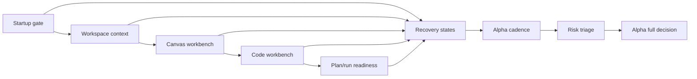

# Internal Alpha Route Acceptance Matrix

## Purpose

This matrix is the route-level F-27 acceptance artifact. It does not replace
child implementation plans. It records the minimum proof that must exist before
the internal alpha route can move from blocked to review, and eventually to
alpha full.

Alpha full is blocked while any stage is `Gap`, lacks a fail-closed fixture, or
lacks a route-stage risk decision. Child slices cannot declare alpha full.

## Acceptance Matrix

| Route stage        | Governing rail or owner                                                     | Happy-path fixture                                                                | Fail-closed fixture                                                                                                           | Evidence source                                                                       | Risk decision                                                                                                                                     | Alpha exit impact                                                                                |
| ------------------ | --------------------------------------------------------------------------- | --------------------------------------------------------------------------------- | ----------------------------------------------------------------------------------------------------------------------------- | ------------------------------------------------------------------------------------- | ------------------------------------------------------------------------------------------------------------------------------------------------- | ------------------------------------------------------------------------------------------------ |
| Startup gate       | `ObserveAppBootstrapRouteReadiness`; Web Shell / App Bootstrap              | User sees route-ready startup after platform readiness settles.                   | Platform unavailable, bootstrap timeout, and route-ready/runtime-not-ready fail closed.                                       | Accepted startup route-readiness proof.                                               | Included: startup ambiguity can block first-use trust. Excluded: public login bootstrap because it is outside protected alpha.                    | Accepted for route-gate evidence; alpha full still waits on remaining stages.                    |
| Workspace context  | `ObserveWorkspaceContext`; Workspace context owner                          | Tenant, project, and environment are visible for the active workspace.            | Missing, detached, unauthorized, or assertion-conflicted context fails closed.                                                | Workspace context child proof and protected runtime scope evidence.                   | Included: implicit tenant/project/env state can leak product authority. Excluded: admin provisioning depth.                                       | Blocks alpha full until scoped context has positive and negative proof.                          |
| Canvas workbench   | `GetWorkspaceGraphDraft`; `SaveWorkspaceGraphDraft`; Canvas graph component | Authoritative draft loads, nodes are visible, and drag/save feedback is governed. | Draft load failure, save denial, stale draft, and retry exhaustion are explicit.                                              | Canvas component docs, graph-draft rail proof, and Canvas browser proof.              | Included: local graph state can become product authority. Excluded: advanced authoring workflows beyond alpha read/inspect posture.               | Blocks alpha full until Canvas has route-level happy and fail-closed fixtures.                   |
| Code workbench     | `ListWorkspaceFiles`; `GetWorkspaceFileContent`; workspace-files child plan | Authorized tree and first-file preview load read-only.                            | Empty workspace, backend unavailable, unauthorized, not-found, traversal, oversize, binary, and freshness cases are explicit. | Workspace-files query rail plan, API tests, UI proof, and filesystem safety evidence. | Included: file reads can bypass authorization or filesystem policy. Excluded: file-write behavior, which requires a separate command rail.        | Child slice may be closed, but route remains blocked until combined route fixture includes Code. |
| Plan/run readiness | `ObservePlanRunReadiness`; Runtime admission and plan readiness             | Controls explain ready-to-run posture with stable source-owned reasons.           | Plan integrity, backpressure, capability mismatch, adapter degraded, and authorization denied are distinct.                   | Runtime admission, plan integrity, and readiness child proof.                         | Included: generic disabled copy hides platform risk. Excluded: executing real production runs during alpha gate proof.                            | Blocks alpha full until readiness copy is mapped to stable causes.                               |
| Recovery states    | `MapRouteRecoveryState`; Route recovery vocabulary                          | Equivalent failures use one route-owned recovery vocabulary across stages.        | Unknown, unavailable, unauthorized, stale, and not-found states stay distinguishable.                                         | Recovery vocabulary guide and architecture guard.                                     | Included: duplicated recovery copy creates stage drift. Excluded: cosmetic copy iteration after source-owned keys exist.                          | Blocks alpha full until vocabulary is source-owned and stage coverage is proven.                 |
| Alpha cadence      | F-27 route plan; Product / Architecture                                     | Audience, entry date, duration, exit owner, and extension rule are named.         | Missing exit owner, missing duration, or indefinite extension keeps route blocked.                                            | Cadence decision section in F-27 closeout or route plan update.                       | Included: alpha can become an undefined status. Excluded: launch/GTM cadence beyond internal alpha.                                               | Blocks alpha full until cadence is decidable.                                                    |
| Risk triage        | `docs/risk-register/**`; F-27 route risk review                             | Included and excluded risks are listed per route stage.                           | Untriaged high-impact route risks keep the route blocked.                                                                     | Risk register entries plus F-27 closeout evidence.                                    | Included: route-stage safety, authorization, readiness, and data freshness risks. Excluded: unrelated roadmap or historical risks with rationale. | Blocks alpha full until inclusion and exclusion rationale exist.                                 |

## Decision Rules

- `blocked`: at least one stage is missing owner, rail, happy proof,
  fail-closed proof, cadence, or risk decision.
- `review`: every stage has planned owners and proof surfaces, but at least one
  proof is not accepted.
- `accepted`: every stage has accepted proof, risk triage, cadence, ADR-0000
  traceability, and `pnpm verify:prepush` evidence.

## Alpha Cadence Decision

The internal alpha cadence is now decidable, but it is not active until the
stage proofs below are accepted. Internal alpha remains a gated evaluation
window, not a launch status.

- `audience`: Internal product, architecture, frontend, and runtime-safety
  testers.
- `entryDate`: First business day after all route-stage proofs in this matrix
  are accepted.
- `duration`: 10 business days.
- `exitOwner`: Product / Architecture.
- `extensionRule`: Product / Architecture may approve one extension of up to 5
  business days for named blockers.

Cadence is blocked when any field above is removed, when a route stage lacks
accepted happy-path or fail-closed proof, or when a blocker is extended without
an owner and a dated re-review.

## Route Risk Triage

This triage covers route-stage risk for internal alpha. It intentionally keeps
alpha-full blocked until the included risks have stage evidence and until
excluded risks remain outside the route boundary with rationale.

- `Startup gate`: Included
  [R-20260322-api-health-reconciler-runtime-degradation-visibility](../../../risk-register/quality/R-20260322-api-health-reconciler-runtime-degradation-visibility.md)
  because degraded readiness can make the first route appear trustworthy.
  Excluded
  [R-20260427-DEV-STACK-TEMPORAL-BOOTSTRAP](../../../risk-register/quality/R-20260427-DEV-STACK-TEMPORAL-BOOTSTRAP.yaml)
  because local Temporal startup is operator setup, not alpha route proof.
- `Workspace context`: Included
  [R-20260308-api-auth-runtime-integration-coverage](../../../risk-register/quality/R-20260308-api-auth-runtime-integration-coverage.md)
  because protected route auth can regress without full runtime proof. Excluded
  admin provisioning depth because F-27 only consumes already-scoped tenant,
  project, and environment context.
- `Workspace context`: Included
  [R-20260425-PRODUCTION-TENANT-ISOLATION-BASELINE](../../../risk-register/quality/R-20260425-PRODUCTION-TENANT-ISOLATION-BASELINE.yaml)
  because missing tenant isolation can leak product authority across contexts.
  Excluded historical gap IDs because active context truth must route through
  protected runtime rails and Lane C evidence.
- `Canvas workbench`: Included
  [R-20260423-CANVAS-HOST-DRAFT-BOUNDARY](../../../risk-register/quality/R-20260423-CANVAS-HOST-DRAFT-BOUNDARY.yaml)
  because host UX can overclaim persistence beyond the authoritative draft
  boundary. Excluded advanced multi-canvas persistence until a later
  command/query rail owns it.
- `Code workbench`: Included
  [R-20260411-WEB-WORKSPACE-FILE-NOT-FOUND-CONTRACT-GAP](../../../risk-register/quality/R-20260411-WEB-WORKSPACE-FILE-NOT-FOUND-CONTRACT-GAP.yaml)
  because missing-file copy can drift from backend reason vocabulary. Excluded
  file-write behavior because F-27 has no workspace-file command rail.
- `Plan/run readiness`: Included
  [R-20260424-TEMPORAL-PLAN-REF-CONTRACT](../../../risk-register/quality/R-20260424-TEMPORAL-PLAN-REF-CONTRACT.yaml)
  because runtime execution can regress to unchecked `PlanRef` behavior.
  Excluded
  [R-20260514-AR-D3-WORKER-SCALING](../../../risk-register/quality/R-20260514-AR-D3-WORKER-SCALING.yaml)
  because worker scale automation is outside internal alpha route proof; the
  route only needs readiness copy for blockers.
- `Recovery states`: Included
  [R-20260330-snapshot-staleness-caller-view](../../../risk-register/quality/R-20260330-snapshot-staleness-caller-view.yaml)
  because stale read models can be misread as read-your-writes guarantees.
  Excluded cosmetic copy iteration once source-owned recovery keys exist and
  stage coverage is proven.
- `Alpha cadence`: Included undefined cadence because it can turn alpha into an
  unbounded status; this matrix owns the cadence field contract and blocks
  missing `exitOwner`, `duration`, or `extensionRule`. Excluded launch/GTM
  cadence because F-27 governs internal alpha only.
- `Risk triage`: Included untriaged route-stage risk because it can hide
  authorization, readiness, data freshness, or local-authority regressions.
  Excluded risks unrelated to startup, context, Canvas, Code, plan/run
  readiness, recovery, cadence, or route evidence because they have no alpha
  exit impact.

Because included risks still require executable stage evidence, alpha-full stays
blocked after this triage update.

## Route-Level Combined Fixture/Proof

The matrix is not complete with isolated child fixtures only. F-27 now has one
combined route-level fixture,
`apps/web/src/app/routes/internalAlphaRouteGate.test.fixtures.ts`, that
traverses:

1. startup gate,
2. workspace context admission,
3. Canvas and Code route entry,
4. plan/run readiness projection,
5. recovery vocabulary rendering under fail-closed posture.

This combined proof is the acceptance guard that prevents child-slice closure
from being misread as route-level alpha readiness.

The fixture evaluates to `review` when every required stage, owned rail,
traceable and resolvable evidence reference, planned evidence state,
happy-path proof, and fail-closed proof is present. It evaluates to `accepted`
only when every stage evidence state is `accepted`. Removing the Canvas
fail-closed proof returns the route decision to `blocked` and reports
`Canvas workbench` by name; removing the Code stage or `SaveWorkspaceGraphDraft`
rail also returns `blocked`.

Recovery vocabulary is part of the combined proof. Every stage must include at
least one non-ready recovery state, and the route-level vocabulary must include
`blocked`, `unauthorized`, `unavailable`, `stale`, and `not-found`. Omitting a
stage vocabulary or one of those recovery states returns the route decision to
`blocked`.

Startup gate evidence is now accepted for F-27 because it reuses the modern
`ObserveAppBootstrapRouteReadiness` rail through policy, Root integration, and
Cypress proof. This does not accept alpha full: workspace context, Canvas, Code,
plan/run readiness, and recovery stage evidence remain planned until their
browser/runtime proof is accepted.

## Route Diagram

## Current Result

The route remains `blocked`. The matrix closes the route-level acceptance
definition, but it does not claim alpha full. The next executable slices must
fill the stage evidence rows without moving route authority out of F-27.
