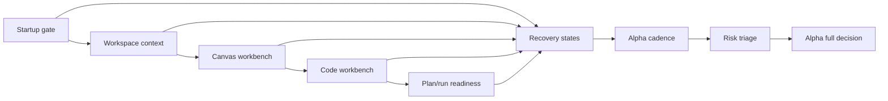

# Internal Alpha Route Acceptance Matrix

## Purpose

This matrix is the route-level F-27 acceptance artifact. It does not replace
child implementation plans. It records the minimum proof that must exist before
the internal alpha route can move from blocked to review, and eventually to
alpha full.

Alpha full is blocked while any stage is `Gap`, lacks a fail-closed fixture, or
lacks a route-stage risk decision. Child slices cannot declare alpha full.

## Acceptance Matrix

| Route stage        | Governing rail or owner                                                     | Happy-path fixture                                                                | Fail-closed fixture                                                                                                           | Evidence source                                                                       | Risk decision                                                                                                                                     | Alpha exit impact                                                                                |
| ------------------ | --------------------------------------------------------------------------- | --------------------------------------------------------------------------------- | ----------------------------------------------------------------------------------------------------------------------------- | ------------------------------------------------------------------------------------- | ------------------------------------------------------------------------------------------------------------------------------------------------- | ------------------------------------------------------------------------------------------------ |
| Startup gate       | `ObserveAppBootstrapRouteReadiness`; Web Shell / App Bootstrap              | User sees route-ready startup after platform readiness settles.                   | Platform unavailable, bootstrap timeout, and route-ready/runtime-not-ready fail closed.                                       | App bootstrap component guide and startup route readiness proof.                      | Included: startup ambiguity can block first-use trust. Excluded: public login bootstrap because it is outside protected alpha.                    | Blocks alpha full until startup happy and failure states are browser-proven.                     |
| Workspace context  | `ObserveWorkspaceContext`; Workspace context owner                          | Tenant, project, and environment are visible for the active workspace.            | Missing, detached, unauthorized, or assertion-conflicted context fails closed.                                                | Workspace context child proof and protected runtime scope evidence.                   | Included: implicit tenant/project/env state can leak product authority. Excluded: admin provisioning depth.                                       | Blocks alpha full until scoped context has positive and negative proof.                          |
| Canvas workbench   | `GetWorkspaceGraphDraft`; `SaveWorkspaceGraphDraft`; Canvas graph component | Authoritative draft loads, nodes are visible, and drag/save feedback is governed. | Draft load failure, save denial, stale draft, and retry exhaustion are explicit.                                              | Canvas component docs, graph-draft rail proof, and Canvas browser proof.              | Included: local graph state can become product authority. Excluded: advanced authoring workflows beyond alpha read/inspect posture.               | Blocks alpha full until Canvas has route-level happy and fail-closed fixtures.                   |
| Code workbench     | `ListWorkspaceFiles`; `GetWorkspaceFileContent`; workspace-files child plan | Authorized tree and first-file preview load read-only.                            | Empty workspace, backend unavailable, unauthorized, not-found, traversal, oversize, binary, and freshness cases are explicit. | Workspace-files query rail plan, API tests, UI proof, and filesystem safety evidence. | Included: file reads can bypass authorization or filesystem policy. Excluded: file-write behavior, which requires a separate command rail.        | Child slice may be closed, but route remains blocked until combined route fixture includes Code. |
| Plan/run readiness | `ObservePlanRunReadiness`; Runtime admission and plan readiness             | Controls explain ready-to-run posture with stable source-owned reasons.           | Plan integrity, backpressure, capability mismatch, adapter degraded, and authorization denied are distinct.                   | Runtime admission, plan integrity, and readiness child proof.                         | Included: generic disabled copy hides platform risk. Excluded: executing real production runs during alpha gate proof.                            | Blocks alpha full until readiness copy is mapped to stable causes.                               |
| Recovery states    | `MapRouteRecoveryState`; Route recovery vocabulary                          | Equivalent failures use one route-owned recovery vocabulary across stages.        | Unknown, unavailable, unauthorized, stale, and not-found states stay distinguishable.                                         | Recovery vocabulary guide and architecture guard.                                     | Included: duplicated recovery copy creates stage drift. Excluded: cosmetic copy iteration after source-owned keys exist.                          | Blocks alpha full until vocabulary is source-owned and stage coverage is proven.                 |
| Alpha cadence      | F-27 route plan; Product / Architecture                                     | Audience, entry date, duration, exit owner, and extension rule are named.         | Missing exit owner, missing duration, or indefinite extension keeps route blocked.                                            | Cadence decision section in F-27 closeout or route plan update.                       | Included: alpha can become an undefined status. Excluded: launch/GTM cadence beyond internal alpha.                                               | Blocks alpha full until cadence is decidable.                                                    |
| Risk triage        | `docs/risk-register/**`; F-27 route risk review                             | Included and excluded risks are listed per route stage.                           | Untriaged high-impact route risks keep the route blocked.                                                                     | Risk register entries plus F-27 closeout evidence.                                    | Included: route-stage safety, authorization, readiness, and data freshness risks. Excluded: unrelated roadmap or historical risks with rationale. | Blocks alpha full until inclusion and exclusion rationale exist.                                 |

## Decision Rules

- `blocked`: at least one stage is missing owner, rail, happy proof,
  fail-closed proof, cadence, or risk decision.
- `review`: every stage has planned owners and proof surfaces, but at least one
  proof is not accepted.
- `accepted`: every stage has accepted proof, risk triage, cadence, ADR-0000
  traceability, and `pnpm verify:prepush` evidence.

## Route Diagram

## Current Result

The route remains `blocked`. The matrix closes the route-level acceptance
definition, but it does not claim alpha full. The next executable slices must
fill the stage evidence rows without moving route authority out of F-27.
