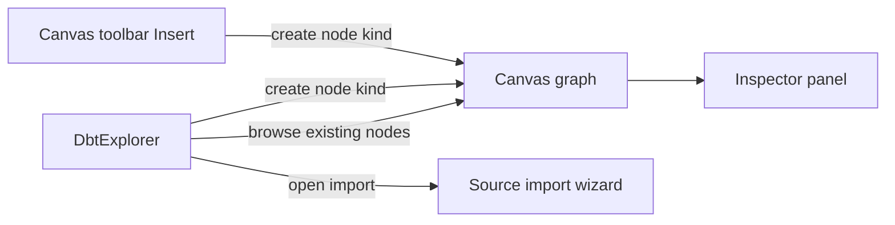
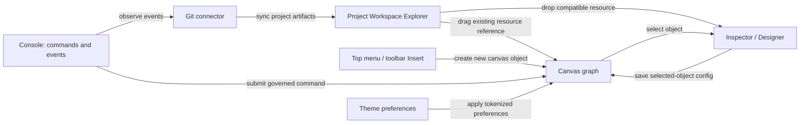
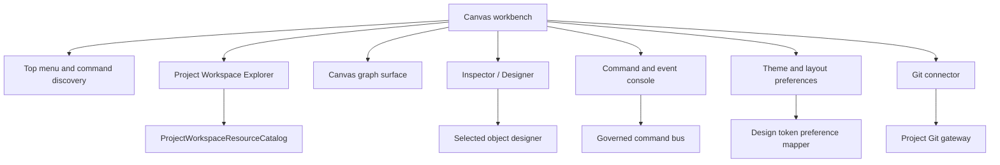
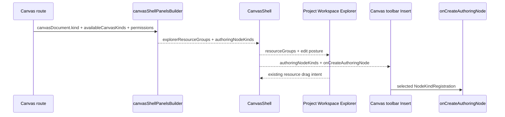

# Canvas Workspace Explorer Fowler Review

## Purpose

Review the Canvas workbench direction through a Fowler architecture lens before
changing behavior. The product target is a mature operator workbench: a project
object explorer, one clear insert path, a selection-driven designer, a command
and event console, governed theme preferences, and project source control.

This review records the architectural diagnosis and the first applied slice:
`E-CANVAS-WORKSPACE-EXPLORER-1`.

## Governing Sources

- `AGENTS.md`
- `docs/planning/status/governance-document-rule-inventory.md`
- `docs/guides/ai-work-protocol.md`
- `docs/architecture/command-query-rail-governance.md`
- `docs/architecture/fowler-opportunity-planning-governance.md`
- `docs/architecture/components/web/workbench-ui-contract-and-component-inventory.md`
- `docs/architecture/components/web/graph/canvas-shell-component.md`
- `docs/architecture/components/web/graph/canvas-workbench-command-query-catalog.md`
- `docs/planning/proposals/mandatory/frontend-and-ux/canvas-workspace-explorer-console-theme-modeling-plan-20260527.md`

## Mature System Comparison

Mature modeling tools such as Oracle SQL Developer, dbt Cloud, Dagster, Apache
NiFi, and VS Code keep three concepts distinct:

- object discovery: browse existing databases, schemas, files, jobs, artifacts,
  security objects, and project resources;
- object creation: create a new model, task, annotation, table, procedure, or
  graph node from one explicit command surface;
- object editing: inspect and edit the selected object in a designer or
  inspector with clear save and validation feedback.

The Canvas product currently has the raw ingredients, but the boundaries are
not yet as strong. The same side panel both browses existing nodes and creates
new node kinds, while `Insert` already owns creation. That duplication makes
the UI harder to learn and creates a code-level responsibility overload.

## Current Architecture Reading

The current shape shows a duplicated creation affordance. The issue is not
that either command is technically broken; the issue is that the product
language has two places for the same intent.

## Target Architecture

The first implementation slice only applies the explorer and insert boundary.
The remaining boxes stay as Planning DB tasks until their rails are promoted.

## Fowler Findings

<!-- markdownlint-disable MD013 MD060 -->

| Finding                                                             | Signal                  | Fowler reading                                                     | Current symptom                                                  | Target pattern                                                                 |
| ------------------------------------------------------------------- | ----------------------- | ------------------------------------------------------------------ | ---------------------------------------------------------------- | ------------------------------------------------------------------------------ |
| Explorer creates node kinds while `Insert` also creates node kinds. | Responsibility overload | Presentation Model should express one product purpose per surface. | `DbtExplorer` has `nodeKinds` and `onCreateAuthoringNode`.       | Explorer owns existing resources; `Insert` owns creation.                      |
| Canvas identity is mostly label text and route state.               | Primitive obsession     | Replace primitive with object.                                     | New canvas naming and properties are not first-class.            | `ProjectCanvasDescriptor` and `CanvasProperties`.                              |
| Console is an idle log drawer.                                      | Anemic domain           | Command Bus plus read model.                                       | The console cannot submit governed product commands.             | `SubmitWorkbenchCommand` and `ObserveWorkbenchEvents`.                         |
| Theme changes are grid-local.                                       | Hidden authority        | Value Object plus tokenized preferences.                           | Global color and font are not governed preferences.              | `WorkbenchThemePreference`.                                                    |
| Table modeling is passive metadata editing.                         | Anemic domain           | Domain Model for table and field definitions.                      | No explicit field/type/constraint model.                         | `TableDesignDraft` and `FieldDefinition`.                                      |
| Git status is visible but not actionable.                           | Hidden authority        | Gateway with anti-corruption layer.                                | UI can show detached/unknown but cannot persist project work.    | `ProjectGitRemoteBinding`, `ProjectGitChangeSet`, `ProjectGitStatusReadModel`. |
| Generated templates are not fully in the graph flow.                | Boundary drift          | Artifact as first-class project object.                            | Template output can be previewed but needs artifact integration. | Save generated source as artifact and attach as graph step.                    |

<!-- markdownlint-enable MD013 MD060 -->

## Antipatterns To Remove

- Duplicate semantics: node creation appears in both the side explorer and
  `Insert`.
- Mixed metaphor UI: the explorer says "Project Nodes" while acting partly as
  a node palette and partly as data import.
- Hidden command authority: panels can look like they own product mutations
  when they should only call cataloged route commands.
- Documentation drift: component docs still describe the side explorer as a
  ready-canvas creation entrypoint even after the toolbar owns `Insert`.
- Repetition: tests currently prove creation wiring in both Explorer and
  toolbar paths rather than guarding one canonical insertion path.

## Component Grouping Opportunity

The immediate code grouping is small: make the existing `DbtExplorer`
implementation semantically represent the Project Workspace Explorer. Future
work can rename the file after consumers and docs no longer use dbt-centric
language.

## Applied Pattern For This Slice

Pattern: Presentation Model plus Command Query Separation.

- Query side: the shell projects controller `explorerNodes` into
  `panels.explorerResourceGroups` before the explorer renders them.
- The active Canvas document is represented as a non-draggable project
  resource; canonical graph nodes remain draggable existing resources.
- Command side: `Insert` renders available node kinds from
  `panels.authoringNodeKinds` and calls
  `graphCommands.onCreateAuthoringNode`.
- The explorer no longer receives `authoringNodeKinds`, `nodeKinds`, or
  `onCreateAuthoringNode`.
- The architecture test proves the semantic split, not only barrel thinness.

## Drift Fixes In Scope

- Update component docs so ready-canvas node authoring is owned by `Insert`,
  not the explorer.
- Add a local component guide for the Canvas Workspace Explorer with API,
  invariants, transitions, consumers, and diagrams.
- Add user stories for existing-resource discovery and no-duplicate insertion.
- Add a module-owned concern docblock that names the explorer's owned concern.
- Add semantic architecture assertions that prevent node creation from drifting
  back into the explorer.

## Lessons For Future Work

- A visible command repeated in two surfaces must be treated as architecture
  drift unless one is clearly a shortcut to the same named command.
- Contextual panels are not dumping grounds. Left panel: browse existing
  resources. Right panel: inspect and design selected objects. Bottom panel:
  command and event work.
- A mature UI needs product nouns before controls. Canvas, artifact, resource,
  annotation, table field, Git remote, and theme preference must become owned
  objects before their editors grow.
- Technical states such as read-only, unavailable mutation, draft, and sync
  should be compact and explainable. They should not consume the workspace or
  hide the next user action.
- Tests must protect semantic ownership. A test that only proves a component is
  thin can still allow two components to mean the same thing.

## First Slice Flow

## ADR Disposition

No ADR is required for this first slice. The decision is an application of
existing command/query and workbench UI governance: one creation rail, one
resource explorer concern, no new bounded context.

If a later slice introduces a real Git gateway, command console execution rail,
or table design aggregate, that slice should evaluate a dedicated ADR because
it will cross UI, API, persistence, and authorization boundaries.
