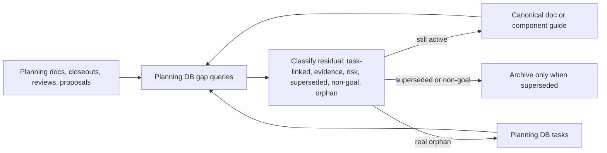
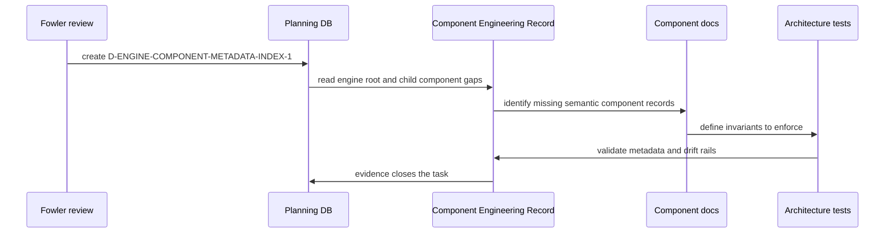
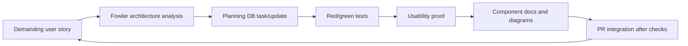

# Docs And Engine Component Reconciliation Fowler Review

## Purpose

Record the unattended reconciliation pass that turns scattered planning,
proposal, and component-engineering residue into canonical Planning DB-linked
work. The review separates what is already clean from what still needs a
task-backed remediation path.

This is a governance and architecture review, not a product behavior change.

## Governing Sources

- `AGENTS.md`
- `docs/planning/status/governance-document-rule-inventory.md`
- `docs/guides/ai-work-protocol.md`
- `docs/planning/state/planning-control-tower.md`
- `docs/architecture/command-query-rail-governance.md`
- `docs/architecture/fowler-opportunity-planning-governance.md`
- `docs/architecture/components/ci-governance/docs-disposition-canon-component.md`
- `docs/architecture/components/ci-governance/component-engineering-record-component.md`
- `docs/adr/adr-0055-planning-db-canonical-operational-source.md`

## Command And Query Rails

The work uses the Planning DB and component-engineering rails as the source of
truth.

| Intent                             | Rail    | Evidence                                                                                                     |
| ---------------------------------- | ------- | ------------------------------------------------------------------------------------------------------------ |
| Find proposal/action gaps          | Query   | `pnpm planning:db:query mandatory-proposal-gaps`, `task-gaps`, `knowledge-actions`                           |
| Resolve non-debt docs markers      | Command | `pnpm planning:db:operate docs-disposition resolve`                                                          |
| Create or update real tasks        | Command | `pnpm planning:db:operate task create/update`                                                                |
| Inspect engine component structure | Query   | `pnpm planning:db:query component-tree`, `component-metadata`, `component-quality`, `component-drift`, `cer` |

No Markdown-only backlog is introduced by this review.

## Reconciliation Result

The pass converted current visible gaps into canonical lineage:

- `docs/planning/proposals/mandatory/governance-and-docs/api-package-lint-ci-plan-20260526.md`
  now links to `D-API-LINT-CI-20260526`.
- `docs/planning/proposals/mandatory/frontend-and-ux/dbt-authoring-code-run-vertical-plan-20260526.md`
  now links its shipped vertical to `E-DBT-AUTHOR-RUN-1`.
- `docs/planning/proposals/mandatory/frontend-and-ux/dbt-project-roundtrip-product-plan-20260527.md`
  is the canonical product plan for `E-DBT-PROJECT-ROUNDTRIP-1` and
  `E-DBT-PROJECT-ROUNDTRIP-1A` through `E-DBT-PROJECT-ROUNDTRIP-1E`.
- Current Canvas workspace, top-menu, template, console, theme, annotation,
  table-designer, and Git-connector proposal lines are task-linked instead of
  relying on prose-only action statements.
- The active `docs-disposition` hotspot on
  `docs/architecture/components/web/graph/canvas-draft-access-posture-component.md`
  was resolved as non-debt because the matching terms are posture enum values
  and recovery states, not orphan follow-up language.
- `docs/planning/proposals/mandatory/frontend-and-ux/f31-authenticated-project-onboarding-plan-20260525.md`
  moved from Draft to Review so it no longer appears as an active draft
  without an explicit review posture.

After those changes, the following query rails returned no rows:

```bash
pnpm planning:db:query mandatory-proposal-gaps
pnpm planning:db:query task-gaps
pnpm planning:db:query docs-disposition
```

## Closeout Residual Inventory

The closeout corpus still needs the dedicated `GD-CLOSEOUT-DEBT-RECON-1`
sweep. A raw text scan found 231 closeout files containing residual or
follow-up language. A stricter heading scan found 42 explicit residual,
remaining-work, known-residual, debt, or follow-up sections.

Those rows are not automatically defects. Many are historical confirmations
that a named follow-up already existed or that a risk was accepted. The
classification rule remains:

| Classification       | Meaning                                              | Planning action                                                        |
| -------------------- | ---------------------------------------------------- | ---------------------------------------------------------------------- |
| `task-linked`        | Residual points to an existing Planning DB task.     | Add explicit lineage if missing.                                       |
| `closed-by-evidence` | Later evidence proves it was completed.              | Add evidence link without creating a task.                             |
| `risk-tracked`       | Residual is an accepted or monitored risk.           | Link to risk register entry.                                           |
| `superseded`         | Later architecture or product decision replaced it.  | Add supersession note and archive only if the doc is no longer active. |
| `non-goal`           | The residual is intentionally outside product scope. | Add non-goal disposition.                                              |
| `orphan`             | Actionable residual has no task, risk, or evidence.  | Create a Planning DB task.                                             |

## Documentation Canon Flow



## Demanding-User Product Stories Captured

The product-facing residue is now expressed as task-linked stories instead of
unowned notes:

| Story                                                                                                                                                         | Canonical task                       |
| ------------------------------------------------------------------------------------------------------------------------------------------------------------- | ------------------------------------ |
| As a dbt user, I can import an existing dbt project, inspect files, edit, save, run, and export dbt-compatible output.                                        | `E-DBT-PROJECT-ROUNDTRIP-1`          |
| As a workbench user, I can use one top navigation system for Canvas, Runs, Templates, Plugins, Admin, context, and Git without a second left navigation rail. | `E-SHELL-TOP-MENU-RATIONALIZATION-1` |
| As a modeling user, I can browse existing project resources separately from creating new node types.                                                          | `E-CANVAS-WORKSPACE-EXPLORER-1`      |
| As a template user, I can save generated template output as an artifact and add that artifact into the graph as a step.                                       | `E-TEMPLATES-ARTIFACT-GRAPH-FLOW-1`  |
| As a power user, I can use a bottom console for CLI-like commands and event logs without consuming graph space.                                               | `E-CANVAS-CONSOLE-CLI-EVENTS-1`      |
| As a user customizing the workbench, I can change theme, grid, color, and font preferences through governed preferences.                                      | `E-CANVAS-THEME-CONTROLS-1`          |

## Mature-System Comparison

Mature tools such as dbt Cloud, VS Code with dbt extensions, Oracle SQL
Developer, DBeaver, and data-flow workbenches keep three boundaries visible:

- a project/resource explorer for existing objects;
- an explicit creation command surface for new objects;
- a properties or designer surface for selected objects.

The current product is converging on that shape, but the docs and task system
must stay as disciplined as the UI. A feature is not ready to prioritize if it
only exists as a paragraph in a closeout, review, or proposal.

## Engine Component Current State

The engine component mapping is materially better than the original broad
root. The `SYS-RUNTIME-ENGINE-CORE` row is now an aggregator, not a direct file
bag.

Query evidence:

```bash
pnpm planning:db:query component-tree
pnpm planning:db:query component-metadata --component SYS-RUNTIME-ENGINE-CORE
pnpm planning:db:query component-quality --component SYS-RUNTIME-ENGINE-CORE
pnpm planning:db:query component-drift --component SYS-RUNTIME-ENGINE-CORE
pnpm planning:db:query cer --component SYS-RUNTIME-ENGINE-CORE --schema-version v2
```

Observed state:

- `SYS-RUNTIME-ENGINE-CORE` has 16 child components.
- The root has 0 direct files and 199 descendant files.
- `component-quality` reports `pass`.
- `component-drift` reports no rows for the engine root.
- `component-metadata` reports `incomplete`, which means the remaining issue is
  semantic metadata depth, not mechanical ownership drift.

## Engine Component Map

```mermaid
flowchart TB
  Root["SYS-RUNTIME-ENGINE-CORE<br/>0 direct files<br/>199 descendants"]
  Root --> Adapters["ADAPTERS"]
  Root --> Application["APPLICATION"]
  Root --> ArchitectureTests["ARCHITECTURE-TESTS"]
  Root --> Contracts["CONTRACTS"]
  Root --> CoreLifecycle["CORE-LIFECYCLE"]
  Root --> Determinism["DETERMINISM-UTILS"]
  Root --> DomainPorts["DOMAIN-PORTS"]
  Root --> Outbox["OUTBOX"]
  Root --> PackageSurface["PACKAGE-SURFACE"]
  Root --> RunControl["RUN-CONTROL"]
  Root --> RunMaintenance["RUN-MAINTENANCE"]
  Root --> RuntimeServices["RUNTIME-SERVICES"]
  Root --> Security["SECURITY"]
  Root --> StartRun["START-RUN"]
  Root --> State["STATE"]
  Root --> WorkflowUseCases["WORKFLOW-USE-CASES"]
```



## Fowler Findings

<!-- markdownlint-disable MD013 -->

| Area                | Finding                                                                                                                | Fowler reading                                                         | Disposition                                                                  |
| ------------------- | ---------------------------------------------------------------------------------------------------------------------- | ---------------------------------------------------------------------- | ---------------------------------------------------------------------------- |
| Documentation queue | Proposal and action rows can exist without task lineage.                                                               | Knowledge management drift.                                            | Fixed current visible gaps through task links and DB dispositions.           |
| Closeout residue    | Residual language can imply complete work while hiding remaining debt.                                                 | False closure.                                                         | Keep `GD-CLOSEOUT-DEBT-RECON-1` active for closeout-specific residual sweep. |
| Engine root         | Root component still exposes missing semantic indexes.                                                                 | Aggregate is structurally decomposed but not semantically rich enough. | Create `D-ENGINE-COMPONENT-METADATA-INDEX-1`.                                |
| Product UX route    | Product stories were spread across screenshots, comments, and proposal notes.                                          | Implicit requirements.                                                 | Canonical stories are task-linked in proposal docs.                          |
| Component evidence  | Component tree and drift are query-backed, but capability, code-symbol, runtime, and contract metadata are incomplete. | Executable architecture model is partial.                              | Enrich component metadata before claiming engine map closure.                |

<!-- markdownlint-enable MD013 -->

## Antipatterns Detected

- Markdown backlog: actionable language exists in docs but is not linked to a
  Planning DB task.
- False finality: closeout files can read as complete while keeping residual
  follow-up outside task lineage.
- Aggregate label without semantic record: a component can have clean file
  ownership while still lacking capability, contract, runtime, failure, and
  test metadata.
- UI promise drift: product UX expectations can be captured in chat or images
  but not yet represented as user stories with acceptance checks.

## Patterns Applied

- Planning DB as system of record for task lifecycle.
- Component Engineering Record as query-backed architecture model.
- Composite for component hierarchy.
- Explicit command/query rails before behavior or docs are treated as
  canonical.
- User story extraction from demanding-user review before implementation.

## Residual Work

`D-ENGINE-COMPONENT-METADATA-INDEX-1` should close the engine-specific
component maturity gap without changing runtime behavior.

Acceptance:

- add semantic indexes for engine root and its 16 children where the component
  engineering model currently reports missing capability, code-symbol,
  component-connection, contract, runtime-profile, dependency, failure-mode,
  and test-file indexes;
- keep `component-quality` passing;
- keep `component-drift --component SYS-RUNTIME-ENGINE-CORE` empty;
- update component docs with public API, invariants, transitions, consumers,
  and diagrams only where they are missing or stale;
- add or update architecture tests that prove semantic component invariants,
  not only barrel thinness.

## Remediation Sequence



## Iteration Rule

Future unattended passes must keep this loop:


