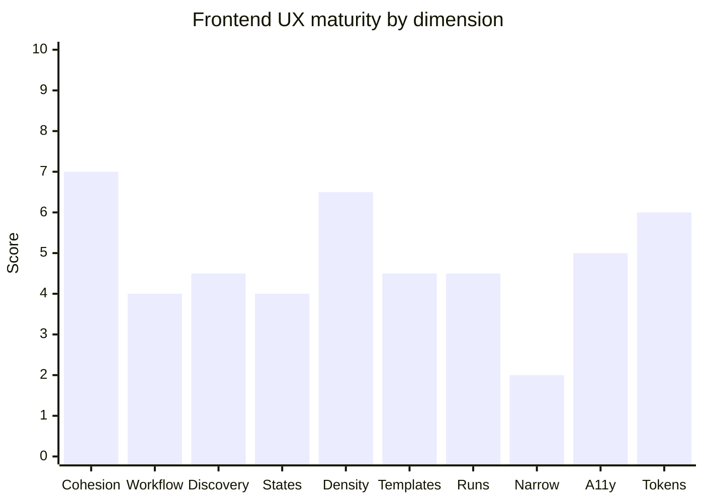
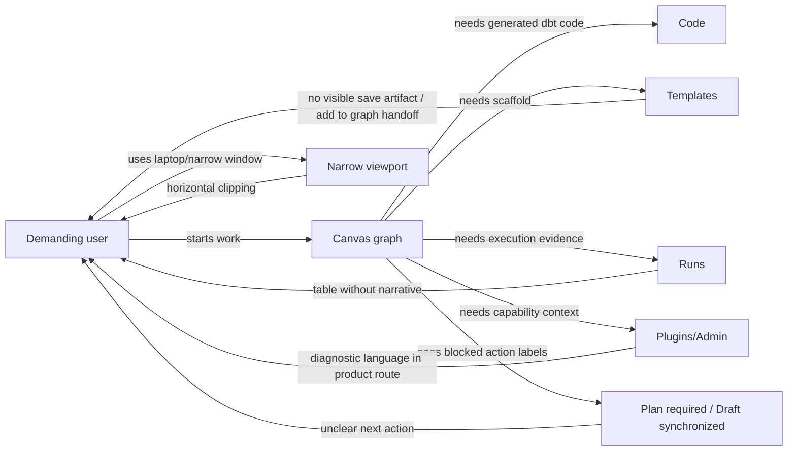
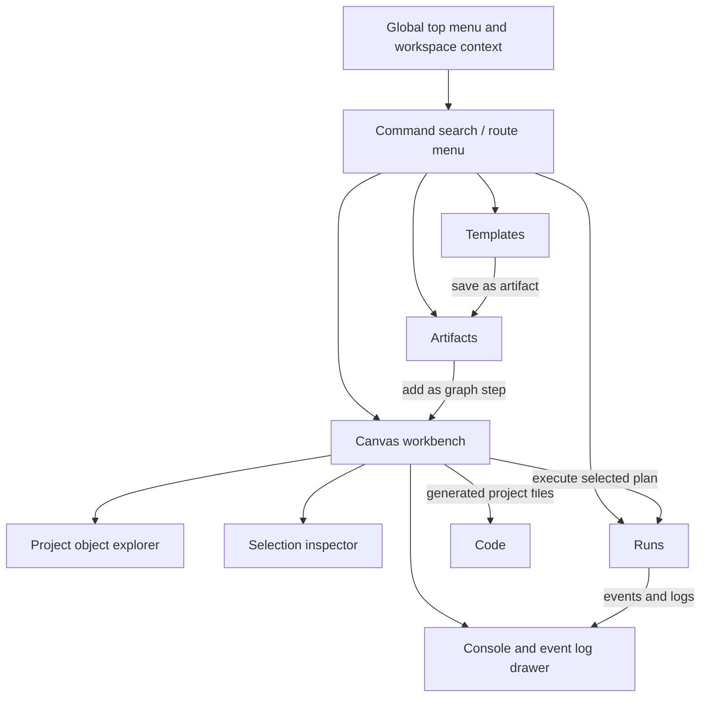

# Frontend UX Maturity Audit Review

## Purpose

Audit the current Raven frontend as a product workbench, not as isolated
screens. The review applies the local web component governance, the available
frontend design/testing skills, and a demanding user lens: a user should be
able to discover work, complete the dbt authoring flow, understand execution
state, and move between Canvas, Runs, Templates, Plugins, and Admin without
learning implementation vocabulary.

This review records product UX findings and routes them to Planning DB tasks.
It is not a Markdown-only backlog.

## Governing Sources

- `AGENTS.md`
- `docs/planning/status/governance-document-rule-inventory.md`
- `docs/guides/ai-work-protocol.md`
- `docs/architecture/command-query-rail-governance.md`
- `docs/architecture/fowler-opportunity-planning-governance.md`
- `docs/planning/state/planning-control-tower.md`
- `docs/planning/reviews/review-naming-policy.md`
- `docs/architecture/components/web/ux-implementation-guide.md`
- `docs/architecture/components/web/screen-layout-and-cross-surface-behavior-rules.md`
- `docs/architecture/components/web/workbench-ui-contract-and-component-inventory.md`
- `docs/architecture/components/web/iconography-and-design-tokens-contract.md`

## Skill And Evidence Notes

The requested skill names `web-design-guidelines` and `frontend-design` are not
installed in this environment. The closest installed skills used for the audit
were:

- `build-web-apps:frontend-app-builder`
- `build-web-apps:frontend-testing-debugging`
- `build-web-apps:react-best-practices`
- `browser:browser`

Rendered evidence came from the local app at `http://127.0.0.1:5173` for:

- `/canvas`
- `/runs`
- `/templates`
- `/plugins`
- `/admin`

Desktop screenshots were captured at `1440x900`; narrow screenshots were
captured at `390x844`. The in-app Browser backend was unavailable for this run,
Playwright was not installed in the workspace, and Cypress failed before the
spec executed with `Invalid or incompatible cached data`. The fallback evidence
path used Chrome headless screenshots under:

`C:\Users\jasim\AppData\Local\Temp\dvt-ux-audit-47e804aa0a5541d4add9c8b35053fd3a`

That failure is treated as tooling evidence only, not as a product defect.

## Product Maturity Score

Overall UX maturity: **5.2 / 10**

Desktop operator maturity: **6.1 / 10**

Narrow viewport maturity: **3.2 / 10**

The application has the shape of a serious workbench on desktop, especially in
Canvas and Templates. It is not yet a mature product flow because navigation,
state language, template-to-artifact handoff, and execution readiness require
the user to infer too much.

| Dimension                       | Score | Reading                                                                 |
| ------------------------------- | ----: | ----------------------------------------------------------------------- |
| Workbench visual cohesion       |   7.0 | Dark operator UI is coherent and not marketing-like.                    |
| Primary workflow completion     |   4.0 | dbt authoring pieces exist, but the user path is not complete enough.   |
| Navigation and discovery        |   4.5 | Canvas and non-Canvas routes use different discovery models.            |
| State and action clarity        |   4.0 | "Plan required" and "Draft synchronized" are not user-actionable.       |
| Information density             |   6.5 | Density is appropriate on desktop, but several views waste empty space. |
| Template-to-artifact continuity |   4.5 | Template generation is promising but not wired into the Canvas flow.    |
| Runs operational narrative      |   4.5 | Runs are listed, but the user does not get a clear execution story.     |
| Narrow viewport behavior        |   2.0 | Toolbars, tables, and route shells clip horizontally.                   |
| Accessibility affordances       |   5.0 | Icon surfaces and disabled states need clearer labels and causes.       |
| Token and component discipline  |   6.0 | Local component rules exist; runtime still shows drift across routes.   |

## Mature System Comparison

| Mature system                     | Relevant mature behavior                                                                | Raven current state                                                                                  | Gap                                                                                  |
| --------------------------------- | --------------------------------------------------------------------------------------- | ---------------------------------------------------------------------------------------------------- | ------------------------------------------------------------------------------------ |
| VS Code                           | Top menu and command palette provide global discovery; panels are contextual.           | Canvas has a route toolbar; other routes still expose a left route rail and different chrome.        | One canonical top-menu/command model is needed.                                      |
| dbt Cloud IDE                     | Project files, model code, lineage, and runs are part of one import/edit/run workflow.  | Graph, Code, Runs, Templates, and Artifacts exist as surfaces, but handoff is not fully productized. | Finish dbt round-trip: import, edit, save, run, export.                              |
| Databricks Workflows              | Job/task state gives an immediate "what happened and what do I do next" narrative.      | Runs table lists pending runs, but does not yet explain cause, progress, logs, or next action.       | Runs needs an operational detail model and better summary.                           |
| Airflow UI                        | DAG graph, run history, task logs, and retries are connected through execution context. | Canvas and Runs are separated, but the execution link is not obvious from Canvas state language.     | Make plan/run context an explicit product path, not a technical gate.                |
| Snowflake Snowsight               | SQL/procedure/task editing makes save/run context clear before execution.               | Templates generate useful SQL scaffolds, but do not visibly save as artifacts or insert into graph.  | Template output needs "save artifact" and "add as graph step" commands.              |
| Oracle SQL Developer Data Modeler | Object explorer, table editor, object properties, and diagram editing are distinct.     | Canvas object browsing and node creation are being separated, but object/property flows are early.   | Keep explorer for existing objects and Insert for creation; add stronger inspectors. |

## Current Friction Map

## Target Workbench Model

Target principle: global navigation belongs to the top command model; Canvas
keeps the graph-first workspace; contextual panels are object-specific; the
bottom drawer is for CLI-style commands and event/log evidence.

## Screen Findings

### Canvas

Strengths:

- Graph-first use of space is aligned with the workbench target.
- The prior large mutation warning banner is not present in the current
  captured state, so the graph is no longer visually dominated by a technical
  message.
- Canvas nodes, minimap, and zoom controls are visually coherent on desktop.

Problems:

- `Plan required`, disabled `Plan`, disabled `Execute`, and `Draft
synchronized` are implementation-state labels. They do not explain what the
  user must do next.
- Canvas navigation differs from Runs, Templates, Plugins, and Admin. This
  matches the product decision to avoid a left rail on Canvas, but creates a
  discovery gap until the global top menu is strong enough.
- Icon-only edge toggles and console controls need clear labels, tooltips, and
  focus behavior.
- Narrow viewport screenshots show toolbar clipping. If narrow screens are not
  a supported target, the product needs an explicit unsupported layout posture;
  if they are supported, this is a P0 UX defect.

Planning linkage:

- `E-SHELL-TOP-MENU-RATIONALIZATION-1`
- `E-DBT-AUTHOR-RUN-1`
- `E-CANVAS-WORKSPACE-EXPLORER-1`

### Runs

Strengths:

- Dense table design is appropriate for an operator surface.
- Filtering by run, plan, environment, SHA, and status is mature in concept.

Problems:

- The page is a list, not yet an operational story. A user cannot quickly see
  why a run is pending, what plan it belongs to, whether it is related to the
  current canvas, or what the next action is.
- The table wastes a large amount of vertical space on desktop.
- On narrow viewports, the left rail and table columns clip content.

Planning linkage:

- `E-DBT-AUTHOR-RUN-1`
- later follow-up should be routed through the run-detail/read-model rail, not a
  Markdown-only list.

### Templates

Strengths:

- Template catalog, parameter form, validation messages, and generated SQL
  preview are strong product ingredients.
- The screen already feels closer to a usable scaffold builder than a raw admin
  diagnostic page.

Problems:

- The template output does not visibly become a governed artifact.
- There is no visible "add this generated artifact to the graph" handoff.
- The route uses a side rail, while Canvas is moving toward top navigation.
- Narrow viewport captures show the form and generated preview clipping.

Planning linkage:

- `E-SHELL-TOP-MENU-RATIONALIZATION-1`
- `E-DBT-PROJECT-ROUNDTRIP-1`

### Plugins

Strengths:

- Capability table plus detail panel is clear for diagnostic work.
- Status pills are readable and useful for engineering/admin contexts.

Problems:

- The copy reads as runtime diagnostics, not as an everyday product workflow.
- If Plugins remains user-visible, the route should be positioned as Admin or
  Capability Center rather than a primary authoring path.
- Header and detail content degrade poorly on narrow screens.

Planning linkage:

- `E-SHELL-TOP-MENU-RATIONALIZATION-1`

### Admin

Strengths:

- Cards are acceptable here because Admin is a repeated diagnostic/status
  surface rather than the main workbench.
- RBAC and backend capability status are discoverable.

Problems:

- "Backend status Online" and "Readiness unavailable" can appear
  contradictory without a cause and next action.
- Admin should not leak diagnostics vocabulary into primary authoring flows.

Planning linkage:

- `E-SHELL-TOP-MENU-RATIONALIZATION-1`

## User Stories For The Next UX Slice

These stories reflect a demanding human user, not implementation convenience.

| Story ID | Story                                                                                                          | Acceptance signal                                                                                       |
| -------- | -------------------------------------------------------------------------------------------------------------- | ------------------------------------------------------------------------------------------------------- |
| UX-01    | As a user, I can move between Canvas, Runs, Templates, Plugins, and Admin from the same top navigation model.  | No left rail is required for global route discovery; keyboard and mouse discovery both work.            |
| UX-02    | As a user, I can understand why execution is unavailable and what action unlocks it.                           | Every disabled primary action has a visible reason and next action.                                     |
| UX-03    | As a dbt author, I can configure a source and model, inspect generated dbt code, and execute the plan.         | Canvas, Code, and Runs share the same plan/project context.                                             |
| UX-04    | As a template author, I can save generated template output as an artifact.                                     | The artifact appears in Artifacts and can be referenced from Canvas.                                    |
| UX-05    | As a modeler, I can add an artifact or existing project object as a graph step without duplicating node menus. | Explorer is for existing objects; Insert is for new node types; both have distinct labels and behavior. |
| UX-06    | As an operator, I can read run history as execution evidence, not just rows of IDs.                            | Run detail shows plan, environment, state cause, timestamps, logs/events, and related artifacts.        |
| UX-07    | As a laptop user, I can use the product without horizontal clipping.                                           | 1440, 1280, and 1024 widths pass screenshot QA; narrower support is explicit and tested.                |

## Recommended Product Route

1. Finish `E-SHELL-TOP-MENU-RATIONALIZATION-1`.

   The top menu should become the canonical global discovery surface for
   Canvas, Runs, Templates, Plugins, Admin, workspace context, git context, and
   workbench commands. Do not add another persistent left sidebar. Non-Canvas
   routes should converge toward the same top-navigation language.

2. Continue `E-DBT-AUTHOR-RUN-1`.

   Replace technical blocked states with product actions: create or select
   project, configure source/model, generate/preview plan, then run. Read-only
   and execution modes need to be explicit user choices.

3. Start `E-DBT-PROJECT-ROUNDTRIP-1` after the author/run rail is stable.

   Import an existing dbt project, edit, save, run, and export in a dbt-compatible
   shape. This is the shortest path from interesting demo to real product.

4. Fold Templates into the product flow.

   Generated SQL should be saved as an artifact. That artifact should be
   insertable into the graph as a step. This should reuse the artifact and graph
   command/query rails, not a one-off route-local shortcut.

5. Add a narrow-width posture.

   Either support laptop/narrow workbench widths with drawers and wrapping
   command groups, or explicitly define minimum supported viewport behavior.
   The current horizontal clipping is not a mature product posture.

## Anti-Patterns To Avoid

- Adding another permanent left navigation bar to fix discovery.
- Hiding disabled-state reasons in tooltips only.
- Treating Templates as a separate generator instead of part of the artifact
  and graph workflow.
- Letting Admin or Plugins diagnostics vocabulary leak into the primary author
  path.
- Shipping responsive screenshots that only prove the app loads while route
  controls are clipped.
- Creating Markdown-only follow-up lists outside the Planning DB.

## UX Acceptance Gate

Before claiming the next frontend slice as product-ready:

- global route discovery works through the top menu without a Canvas left rail;
- Canvas, Runs, Templates, Plugins, and Admin share the same workspace and git
  context language;
- every disabled primary action states the cause and the next action;
- template output can become an artifact, or the absence is task-linked in the
  Planning DB;
- Canvas graph, top toolbar, bottom console, and contextual panels do not clip
  at `1440`, `1280`, and `1024` widths;
- if mobile/narrow workbench is out of scope, the product has an explicit
  minimum-width treatment rather than a broken layout;
- screenshot evidence is captured for Canvas, Runs, Templates, Plugins, and
  Admin before PR closeout.

## Documentation Disposition

This review is the canonical UX maturity audit for the 2026-05-27 frontend
state. It complements, rather than replaces:

- [Canvas Workspace Explorer Fowler Review](./20260527-canvas-workspace-explorer-fowler-review.md)
- [Docs And Engine Component Reconciliation Fowler Review](./20260527-docs-engine-component-reconciliation-fowler-review.md)
- [Web UX Implementation Guide](../../../architecture/components/web/ux-implementation-guide.md)
- [Screen Layout And Cross-Surface Behavior Rules](../../../architecture/components/web/screen-layout-and-cross-surface-behavior-rules.md)

Executable follow-up remains owned by the Planning DB tasks named in the
frontmatter.
