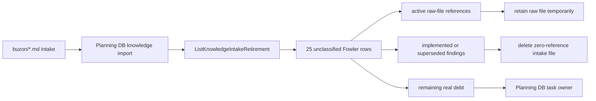
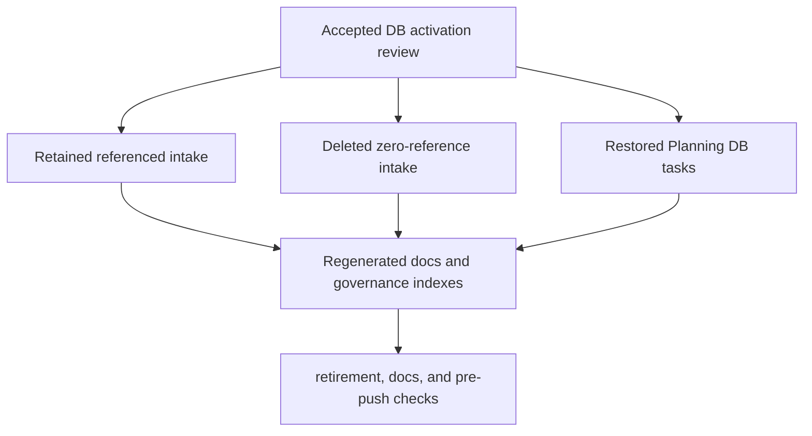

# Buzon Fowler DB Activation Review

## Purpose

This review executes the next unattended `buzon/` Fowler-retirement sweep from
the Planning DB read model. The goal is to stop treating mailbox Markdown as a
second backlog and to move each finding into one of three governed states:

- retained because active code, tests, proposals, or closeouts still reference
  the raw file;
- closed or superseded by an accepted canonical document and safe to delete;
- still real product debt, but owned by a Planning DB task instead of by the
  mailbox file.

## Governing Sources

- [Governance document and rule inventory](../../status/governance-document-rule-inventory.md)
- [AI work protocol](../../../guides/ai-work-protocol.md)
- [Planning control tower](../../state/planning-control-tower.md)
- [Buzon Fowler canonization inventory](./20260525-buzon-fowler-canonization-inventory.md)
- [Knowledge intake retirement component](../../../architecture/components/ci-governance/knowledge-intake-retirement-component.md)
- [Command and query rail governance](../../../architecture/command-query-rail-governance.md)
- [Fowler opportunity planning governance](../../../architecture/fowler-opportunity-planning-governance.md)

## Think-First Analysis

Problem summary: the Planning DB retirement query reported 25 unclassified
Fowler intake files under `buzon/`. Some were still read by active tests or
referenced by accepted closeouts, while others described work that had already
been implemented, superseded, or routed into newer Planning DB gaps.

Root cause: earlier mailbox reviews created the right canonical review posture
but did not fully restore every named task into Planning DB, and later
implementation slices closed several frontend/backend gaps without retiring the
older zero-reference source files.

Constraints and invariants:

- `buzon/` is an intake import source, not a canonical planning queue.
- Physical deletion is allowed only when no active docs or tests require the
  raw file.
- Existing command/query rails and task owners must be reused; this review must
  not create parallel commands, route semantics, or fake implementation state.
- A mailbox finding can remain useful rationale without becoming executable
  work.
- Runtime, adapter, contract, and planner files are not changed in this slice.

Options considered:

- Delete all 25 unclassified files. Rejected because eight still have active
  tests, closeouts, proposals, or lane snapshots reading the exact raw path.
- Keep all 25 and only add another status note. Rejected because it leaves the
  mailbox as an operational queue after the DB-first retirement component is
  active.
- Retain referenced files, delete only zero-reference files, and create or
  update Planning DB owners for remaining debt. Selected because it follows the
  DB-first retirement rule and keeps product work in the task rail.

## Command And Query Rails

| Rail                                | Type    | Owner                                 | Use in this sweep                                                             |
| ----------------------------------- | ------- | ------------------------------------- | ----------------------------------------------------------------------------- |
| `ListKnowledgeIntakeRetirement`     | query   | `KnowledgeIntakeRetirementReadModel`  | Identify unclassified `buzon/` intake.                                        |
| `GenerateKnowledgeIntakeLiterature` | command | `KnowledgeIntakeLiteratureProjection` | Regenerate DB-backed literature after the sweep.                              |
| `CheckBuzonIntakeRetirement`        | command | `KnowledgeIntakeRetirementGuard`      | Prove the changed slice adds no new `buzon/*.md` intake.                      |
| `planning:db:operate task create`   | command | Planning DB task lifecycle aggregate  | Restore missing canonicalization task rows named by the 2026-05-25 inventory. |
| `planning:db:operate task update`   | command | Planning DB task lifecycle aggregate  | Attach this review as evidence to ongoing linkage work.                       |

## Current State

## Selected Solution

## Referenced Files Retained

These files remain in `buzon/` for now because active repository surfaces still
refer to the exact raw file. They are no longer hidden backlog; this review
routes each one to its canonical disposition or follow-up owner.

| Source                                                                                  | Active reference                                                    | Disposition                                                                                                                                    |
| --------------------------------------------------------------------------------------- | ------------------------------------------------------------------- | ---------------------------------------------------------------------------------------------------------------------------------------------- |
| `buzon/20260421-codex-fowler-http-entrypoint-component-analysis-and-remediation.md`     | API entrypoint response componentization closeout and evidence doc. | Retain until closeout/evidence validation prose is decoupled from the raw intake path. Closed by accepted API componentization evidence.       |
| `buzon/20260423-codex-fowler-access-decision-component-analysis-and-remediation.md`     | Lane C snapshot and access-decision closeout.                       | Retain until Planning DB export no longer needs the raw evidence path. Closed by access-decision contract vocabulary closeout.                 |
| `buzon/20260424-codex-fowler-ar-c3-admission-observability-analysis-and-remediation.md` | AR-C3 closeout.                                                     | Retain until the closeout evidence list is updated to canonical component docs. Closed by admission observability semantic hardening.          |
| `buzon/20260424-codex-fowler-provider-vocabulary-hard-cut-qa.md`                        | AR-A8 closeout.                                                     | Retain until the QA evidence reference moves to closeout/evidence docs. Closed by provider vocabulary hard-cut.                                |
| `buzon/20260513-codex-fowler-ar-c2-inv-1-immutable-evidence-gate-analysis.md`           | AR-C2 proposal and architecture test.                               | Retain. A test still reads the raw file as a canonicalization fixture; follow-up should move that proof to the active plan and component docs. |
| `buzon/20260513-codex-fowler-ar-d4-zero-downtime-schema-rollback-analysis.md`           | AR-D4 proposal and adapter architecture test.                       | Retain. A test still reads the raw file as a canonicalization fixture; follow-up should move that proof to the active plan and component docs. |
| `buzon/20260531-db-first-architecture-generated-docs-fowler-analysis.md`                | Workflow-scope classification test.                                 | Retain until the CI test validates the active DB-first docs/governance surfaces rather than the mailbox source.                                |

## Zero-Reference Files Retired

The following source IDs had no exact references outside their own files during
this sweep. Their findings are now represented by accepted closeouts, active
status docs, active proposals, or Planning DB tasks, so the raw intake files
are deleted in this slice.

| Source ID                                                              | Canonical reality after inspection                                                                                                                        |
| ---------------------------------------------------------------------- | --------------------------------------------------------------------------------------------------------------------------------------------------------- |
| `20260530-codex-fowler-admin-audit-log-stub.md`                        | Admin route activation remains in `F-11`; workspace port decomposition already names the backend-backed admin rails.                                      |
| `20260530-codex-fowler-admin-rbac-dead-actions.md`                     | Admin RBAC action activation remains in `F-11`; unavailable UI actions are not treated as implemented behavior.                                           |
| `20260530-codex-fowler-code-view-save-git.md`                          | Still real product debt, now tracked as `MS-GAP-003` in the frontend mature-system gap status.                                                            |
| `20260530-codex-fowler-cost-node-field-missing.md`                     | Cost route authority was hardened by the DVT21 cost closeout; backend finance attribution remains in the existing cost attribution task.                  |
| `20260530-codex-fowler-db-connection-flow.md`                          | Server-known warehouse connection list/import is implemented by the source import backend closeout; create/test connection remains `MS-GAP-002`.          |
| `20260530-codex-fowler-db-connection-port-stub.md`                     | Throw-only source import API mode was removed; user-created credentialed connection work remains `MS-GAP-002`.                                            |
| `20260530-codex-fowler-dvt-inspector-ui-gap-analysis.md`               | Inspector authoring is governed by the active canvas inspector authoring component and plugin authoring-fields proposal.                                  |
| `20260530-codex-fowler-dvt-sql-authoring.md`                           | DVT/dbt authoring-field work is governed by active inspector authoring docs and tests.                                                                    |
| `20260530-codex-fowler-git-file-write.md`                              | Code persistence remains `MS-GAP-003`; existing file-save rails are not broadened by mailbox prose.                                                       |
| `20260530-codex-fowler-plugin-catalog-stub.md`                         | Closed by the implemented DB-first plugin catalog MVP plan and protected `ListWorkspacePlugins` rail.                                                     |
| `20260530-codex-fowler-source-api-import.md`                           | API source import is explicitly out of scope for the warehouse source import slice and should become a future source-provider task only when prioritized. |
| `20260530-codex-fowler-source-dbt-project-import.md`                   | dbt project import belongs to the existing dbt roundtrip/proposal-disposition track, not to a mailbox file.                                               |
| `20260530-codex-fowler-source-file-import.md`                          | File source import is an explicit future provider type, not implemented behavior.                                                                         |
| `20260530-codex-fowler-source-stream-import.md`                        | Stream source import is an explicit future provider type, not implemented behavior.                                                                       |
| `20260530-codex-fowler-source-type-hardcoded.md`                       | Warehouse import is implemented; non-warehouse source types remain explicit non-goals until a source-provider task is accepted.                           |
| `20260530-codex-fowler-sql-authoring-inspector.md`                     | SQL authoring belongs to active DVT/dbt inspector authoring docs and tests.                                                                               |
| `20260602-codex-fowler-canvas-interaction-command-surface-analysis.md` | Closed by the active canvas interaction command surface component and canvas command/query catalog.                                                       |

## Planning DB Activation

The 2026-05-25 inventory named several tasks that were not present in the
Planning DB effective task view. This sweep restores them through
`planning:db:operate task create` and updates the ongoing linkage owner with
this review as evidence.

| Task                       | Lane | Status target | Purpose                                                                                                                   |
| -------------------------- | ---- | ------------- | ------------------------------------------------------------------------------------------------------------------------- |
| `A-BUZON-FOWLER-CANON-1`   | A    | `done`        | Architecture, contracts, planner, DDD, and state-store Fowler intake was canonized by the 2026-05-25 architecture review. |
| `E-BUZON-FOWLER-CANON-1`   | E    | `done`        | Frontend and product-workbench Fowler intake was canonized by the 2026-05-25 frontend review.                             |
| `C-BUZON-FOWLER-CANON-1`   | C    | `queued`      | Runtime, API, Temporal, admission, and operability intake still has retained raw references to decouple.                  |
| `D-BUZON-GOV-CANON-1`      | D    | `queued`      | Governance, docs, CI, planning, and DB-first intake still needs test/reference decoupling.                                |
| `D-RISK-DEBT-CANON-1`      | D    | `queued`      | Risk-register prose that implies action must be reconciled into tasks, accepted risk, or non-goals.                       |
| `D-MAND-PROP-GAP-INTAKE-1` | D    | `queued`      | Mandatory proposal gap rows must resolve into task owners or explicit dispositions.                                       |
| `RUNTIME-PROP-DISP-1`      | C    | `queued`      | Runtime mandatory proposal gaps need the same DB-first disposition posture as Lane E.                                     |

## Remaining Follow-Up

1. Replace raw `buzon/` fixture reads in AR-C2, AR-D4, and workflow-scope tests
   with active proposal/component evidence.
2. Update older closeouts and lane snapshots so their evidence lists point at
   canonical closeouts, evidence docs, and component docs rather than raw intake
   files.
3. Run another `ListKnowledgeIntakeRetirement` sweep after the DB import and
   retire the next zero-reference set.
4. Inspect remote branches after this PR-ready slice and create reality-based
   proposal/review docs only for work not already merged or superseded.

## Closeout Rule

This review is not permission to implement API, frontend, adapter, engine, or
contract behavior. Any such work must start from its owning command/query rail,
task, and feature mechanization plan. The only product-state change in this
slice is governance activation: intake moves from mailbox files into Planning
DB tasks, accepted reviews, and active component documentation.
