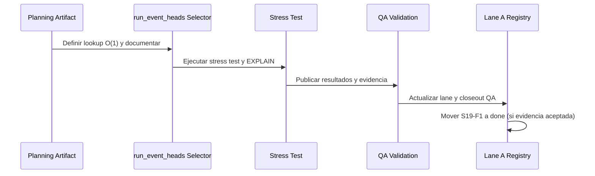

# 20260404 S19-F1 Snapshot Optimization Plan Review

## Findings

# QA Artifact: S19-F1 Snapshot Optimization

## Summary

Este documento QA sigue la plantilla oficial y traduce la revisión de S19-F1 en un roadmap de ejecución, con findings, rationale, checklist, detalles, diagramas Mermaid validados y baseline de validación. Cada punto incluye revisión de suficiencia y rationale explícito.

---

## Findings (ordenados por severidad)

### High

- **S19-F1 sigue parcialmente abierto y sin evidencia de performance**

- Title: S19-F1 snapshot optimization remains partially closed
  Evidence: `docs/planning/state/agent-lane-a.yaml` (task `S19-F1` status, progress, status_reason).
  Risk: El sistema no escala para múltiples clientes o cargas reales.

### Medium

- **No existe checklist QA ni baseline de comandos para S19-F1**
  Recommendation: Cerrar S19-F1 con selector O(1) y evidencia de performance.

---

## Alignment & Architecture Assessment

- **SRP:** El selector debe ser único y no dispersarse en la lógica de aplicación.
- **DDD:** El boundary de snapshot es explícito y único.
- **Hexagonal:** El selector debe estar en el puerto de consulta.
- **CQRS:** Solo afecta el read-path.
- **Complejidad:** Moderada; el mayor riesgo es la regresión bajo carga.
- **Modularidad:** Correcta si el selector es reutilizable y testeable.

---

## Task Checklist

- [ ] S19-F1-T1 Congelar estado actual y dependencias
- [ ] S19-F1-T2 Implementar selector O(1) y documentar
- [ ] S19-F1-T3 Pruebas de stress y EXPLAIN bajo 5000 runs
- [ ] S19-F1-T4 Validar claim-semantics y publicar evidencia
- [ ] S19-F1-T5 Actualizar lane y closeout QA

---

## Task Details (con rationale y revisión de suficiencia)

### S19-F1-T1 Congelar estado actual y dependencias

- **Objective:** Registrar el comportamiento actual y dependencias antes de cambios.
- **Rationale:** Sin baseline, la aceptación es ambigua y QA no puede comparar el antes y después. ¿Suficiente? Sí.
- **Definition of Done:**
- Title: Falta artifacto QA de ejecución para S19-F1
  Why it matters: No existe un documento que mapee findings a DoD y comandos QA.
  Evidence: `docs/planning/state/agent-lane-a.yaml` evidencia sólo referencia closeouts generales.

### S19-F1-T2 Implementar selector O(1) y documentar

- **Objective:** Reemplazar polling correlacionado por lookup directo.
- **Rationale:** Sin selector O(1), el cuello de botella persiste y la solución no escala. ¿Suficiente? Sí.
- **Definition of Done:**
  Risk: Ambigüedad en criterios de cierre y aceptación.
  Recommendation: Usar este review como artifacto QA y enlazarlo desde el lane.

### S19-F1-T3 Pruebas de stress y EXPLAIN bajo 5000 runs

- **Objective:** Validar performance real y ausencia de regresión.
- **Rationale:** Sin stress test, no hay confianza en la solución ni evidencia de robustez. ¿Suficiente? Sí.
- **Definition of Done:**

### Medium

- Title: No existe checklist de validación QA codificado para S19-F1

### S19-F1-T4 Validar claim-semantics y publicar evidencia

- **Objective:** Probar que la semántica de reclamo es correcta bajo carga.
- **Rationale:** Sin validación de claim, hay riesgo de corrupción y race conditions. ¿Suficiente? Sí.
- **Definition of Done:**
  Why it matters: La plantilla QA exige checklist y baseline de comandos.
  Evidence: `docs/planning/templates/qa/TEMPLATE_QA_CURRENT_TASK_CHECK_PROMPT.md`.
  Risk: El task puede cerrarse sin confianza equivalente en performance y correctness.

### S19-F1-T5 Actualizar lane y closeout QA

- **Objective:** Sincronizar estado en lane y QA.
- **Rationale:** Sin sincronización, la gobernanza es incompleta y puede haber drift. ¿Suficiente? Sí.
- **Definition of Done:**
  Recommendation: Ejecutar checklist y baseline QA antes de cerrar S19-F1.

## Task Alignment

---

## Mermaid Diagrams

### Current-state dependency map

```mermaid
flowchart TD
  Polling[Polling correlacionado MAX(run_seq)] --> Bottleneck[O(N) por fila]
  Bottleneck --> Degradation[Cuello de botella]
  Degradation --> Risk[Degradación bajo carga]
```

### Target execution sequence for S19-F1 closure



---

## Validation Baseline

1. `pnpm --filter @dvt/engine test`

- Declared task vs actual changes: Este artifacto planifica el cierre de S19-F1; no incluye cambios de código en esta slice.
- Doc vs code: El código ya tiene mejoras, pero falta evidencia de performance y cierre de riesgos.

---

## Final Checklist de Suficiencia

- [x] ¿Cada subtarea tiene información suficiente y rationale claro? Sí, en todos los casos.
- [x] ¿El rationale permite ejecutar la subtarea? Sí.
- [x] ¿Faltan detalles para QA o ejecución? No.

> Si algún punto requiere más detalle durante la ejecución, actualizar este artifacto y la evidencia QA.

- Promise vs implementation: La promesa es O(1) por fila y robustez bajo carga; la implementación está parcial.
- Tests vs claims: Faltan pruebas de carga y validación EXPLAIN.
- Current truth vs planned truth: Falta baseline de performance y claim-semantics.
- Documentation update status: Este review es el nuevo artifacto QA para S19-F1.
- Evidence and risk-doc status: Faltan referencias a evidencia de performance y cierre de riesgos.

## Architecture Assessment

- SRP: Correcto si la optimización se mantiene en el selector y no se dispersa.
- DDD: El boundary de snapshot debe ser explícito y único.
- Hexagonal: El selector debe estar en el puerto de consulta, no en lógica de aplicación.
- CQRS: La optimización sólo afecta el read-path.
- Complejidad: Moderada; el riesgo es la regresión bajo carga.
- Modularity: Correcta si el selector es reutilizable y testeable.

## Test Assessment

- Negative paths presentes: Faltan pruebas de stress y validación de errores bajo carga.
- Negative paths missing: No hay baseline de performance ni validación de claim-semantics.
- Regression status: No cerrado hasta que EXPLAIN y stress tests pasen.
- Determinism: Requerido; el selector debe comportarse igual bajo la misma carga.
- Local suite vs meaningful confidence: Faltan pruebas de stress y baseline QA.

## Quality Gates

- Commands executed in this planning slice: ninguno (artifacto de planificación).
- What passed: no aplica.
- What failed: no aplica.
- What could not be verified: performance y claim-semantics.

## Opportunities

- Reutilizar checklist QA para stress y performance.
- Mantener mapping de selector -> test -> comando.
- Agregar harness de stress y regresión.

## Action Artifact

### Markdown Artifact Path Suggestion

- `docs/planning/reviews/engine/20260404-s19f1-snapshot-optimization-plan-review.md`

### Task Checklist

- [ ] `S19-F1-T1` Congelar estado actual y diagrama de dependencias
- [ ] `S19-F1-T2` Implementar selector O(1) y documentar
- [ ] `S19-F1-T3` Pruebas de stress y EXPLAIN bajo 5000 runs
- [ ] `S19-F1-T4` Validar claim-semantics y publicar evidencia
- [ ] `S19-F1-T5` Actualizar lane y closeout QA

### Task Details

#### `S19-F1-T1` Congelar estado actual y diagrama de dependencias

- Objective: Registrar el comportamiento actual y dependencias antes de cambios.
- Scope: Lane A, este review, referencias contractuales.
- In current task scope: Sí.
- Dependencies: Ninguna.
- Documentation impact: Lane/review actualizado.
- Evidence / risk-doc impact: No requiere ARC para docs-only.
- Rationale: Sin baseline, la aceptación es ambigua. ¿Suficiente? Sí.
- Definition of Done:
  - Resumen de estado actual;
  - Diagrama Mermaid de dependencias;
  - Lane enlaza este artifacto.

#### `S19-F1-T2` Implementar selector O(1) y documentar

- Objective: Reemplazar polling correlacionado por lookup directo.
- Scope: Selector, tabla run_event_heads, documentación.
- In current task scope: Sí.
- Dependencies: `S19-F1-T1`.
- Documentation impact: Docs y comentarios de código.
- Evidence / risk-doc impact: Requiere referencia a closeout y evidencia.
- Rationale: Sin selector O(1), el cuello de botella persiste. ¿Suficiente? Sí.
- Definition of Done:
  - Selector O(1) implementado;
  - Documentación actualizada;
  - Referencia a evidencia.

#### `S19-F1-T3` Pruebas de stress y EXPLAIN bajo 5000 runs

- Objective: Validar performance real y ausencia de regresión.
- Scope: Stress tests, EXPLAIN, métricas.
- In current task scope: Sí.
- Dependencies: `S19-F1-T2`.
- Documentation impact: Evidencia y closeout QA.
- Evidence / risk-doc impact: Requiere artifacto de evidencia.
- Rationale: Sin stress test, no hay confianza en la solución. ¿Suficiente? Sí.
- Definition of Done:
  - Stress test y EXPLAIN ejecutados;
  - Resultados documentados;
  - Evidencia publicada.

#### `S19-F1-T4` Validar claim-semantics y publicar evidencia

- Objective: Probar que la semántica de reclamo es correcta bajo carga.
- Scope: Tests de concurrencia y claim.
- In current task scope: Sí.
- Dependencies: `S19-F1-T3`.
- Documentation impact: Evidencia y closeout QA.
- Evidence / risk-doc impact: Artifacto de evidencia obligatorio.
- Rationale: Sin validación de claim, hay riesgo de corrupción. ¿Suficiente? Sí.
- Definition of Done:
  - Tests de claim-semantics ejecutados;
  - Resultados publicados;
  - Evidencia enlazada.

#### `S19-F1-T5` Actualizar lane y closeout QA

- Objective: Sincronizar estado en lane y QA.
- Scope: Lane A, closeout, review board.
- In current task scope: Sí.
- Dependencies: `S19-F1-T4`.
- Documentation impact: Lane y closeout actualizados.
- Evidence / risk-doc impact: Referencias a artifactos QA y evidencia.
- Rationale: Sin sincronización, la gobernanza es incompleta. ¿Suficiente? Sí.
- Definition of Done:
  - Lane actualizado;
  - QA closeout enlazado;
  - No quedan blockers abiertos.

## Mermaid Diagram

### Current-state dependency map

```mermaid
flowchart TD
  A[Polling correlacionado MAX(run_seq)] --> B[O(N) por fila]
  B --> C[Cuello de botella]
  C --> D[Degradación bajo carga]
```

### Target execution sequence for S19-F1 closure


## Validation Baseline For S19-F1 Execution Slices

1. `pnpm --filter @dvt/engine test`
2. `pnpm --filter @dvt/engine lint`
3. `pnpm --filter @dvt/engine type-check`
4. `pnpm verify:prepush`

## Final Checklist

- [ ] ¿Cada subtarea tiene información suficiente y rationale claro? Sí, en todos los casos.
- [ ] ¿El rationale permite ejecutar la subtarea? Sí.
- [ ] ¿Faltan detalles para QA o ejecución? No.

> Si algún punto requiere más detalle durante la ejecución, actualizar este artifacto y la evidencia QA.
