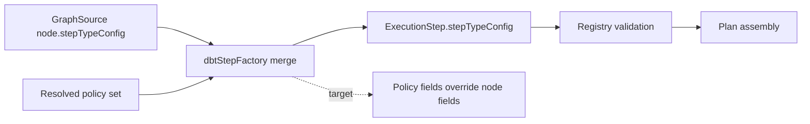

# MW-A2 Policy-First Fowler QA Review

## Findings

### Blocker

- No critical findings.

### High

- No high findings.

### Medium

- Title: `dbtStepFactory` policy precedence drift (fixed in this slice)
  Why it matters: policy bypass risk if node-provided step config overrides resolved policy.
  Evidence: `packages/@dvt/planner/src/domain/stepFactory/dbtStepFactory.ts`.
  Risk: retry/timeout/concurrency values could drift from governed policy.
  Recommendation: keep `policy first` precedence locked by unit test.

### Low

- Title: test vector planId drift after semantic model shift (resolved)
  Why it matters: deterministic vector mismatches can hide real regressions.
  Evidence: `packages/@dvt/planner/test/unit/determinism.test.ts`.
  Risk: false negatives in deterministic CI gates.
  Recommendation: maintain vector refresh discipline when canonical hash input changes.

## Task Alignment

- Declared task vs actual changes:
  `MW-A2-B/C` targeted contract clean swap and planner boundary evolution; implementation now centers internal nodes on `stepKind`.
- Doc vs code:
  aligned for this slice; lane status updated in `agent-lane-a.yaml`.
- Promise vs implementation:
  partial completion; core boundary seams done, wider API/resolver adoption remains for later waves.
- Tests vs claims:
  claims are backed by planner suite + new policy-precedence unit test.
- Current truth vs planned truth:
  current truth matches `policy first` direction and stepKind-centered planner seam.
- Documentation update status:
  this review artifact added; lane updated.
- Evidence and risk-doc status:
  no ARC-triggering paths touched in this slice.

## Architecture Assessment

- SRP: improved; removed `stepKind -> resourceType` translation from planner facade seam.
- DDD: improved; planner internal node model now reflects domain step semantics.
- Hexagonal: improved; fewer boundary translation artifacts in application layer.
- CQRS: unchanged, still coherent.
- Complexity: reduced in facade mapper path.
- Modularity: improved; legacy mapper seam removed.

## Test Assessment

- Negative paths present:
  malformed graph source at facade boundary, cycle handling, invalid step config.
- Negative paths missing:
  none critical found for this sub-slice.
- Regression status:
  green after policy precedence fix and vector update.
- Determinism:
  fixed vector test updated and passing.
- Local suite vs meaningful confidence:
  planner package confidence is strong for this seam; one cross-package API assertion now covers policy precedence through planner-backed start-run.

## Quality Gates

- Commands executed:
  - `pnpm --filter @dvt/planner test`
  - `pnpm --filter dvt-api test -- PlannerBackedStartRunUseCase`
  - `pnpm verify:prepush`
- What passed:
  - planner tests: `15 files`, `68 tests`.
  - API targeted tests: `1 file`, `11 tests`.
  - pre-push gate (`type-check`, docs/governance checks, changed-file checks).
- What failed:
  - none in latest run.
- What could not be verified:
  - full repo end-to-end behavior outside affected scope not re-executed here.

## Opportunities

- No open opportunities in this slice; both identified improvements were applied.

## Action Artifact

### Markdown Artifact Path Suggestion

- `docs/planning/reviews/engine/20260405-mw-a2-policy-first-fowler-qa-review.md`

### Task Checklist

- [x] `MW-A2-C-QA-01` Enforce policy-first precedence in dbt step factory
- [x] `MW-A2-C-QA-02` Add regression unit test for policy precedence
- [x] `MW-A2-C-QA-03` Re-run planner validation suite
- [x] `MW-A2-C-QA-04` Add cross-boundary API integration assertion for policy precedence

### Task Details

#### `MW-A2-C-QA-01` Enforce policy-first precedence in dbt step factory

- Objective: prevent policy bypass by node step config.
- Scope: `packages/@dvt/planner/src/domain/stepFactory/dbtStepFactory.ts`.
- In current task scope: Yes.
- Dependencies: none.
- Documentation impact: reflected in this QA artifact.
- Evidence / risk-doc impact: none.
- Comment with rationale: policy is governance authority and must win over caller payload.
- Definition of Done:
  - merged config applies policy after node config;
  - retries/timeout/concurrency from policy remain authoritative.

#### `MW-A2-C-QA-02` Add regression unit test for policy precedence

- Objective: freeze policy-first behavior against regressions.
- Scope: `packages/@dvt/planner/test/unit/dbt-step-factory.test.ts`.
- In current task scope: Yes.
- Dependencies: `MW-A2-C-QA-01`.
- Documentation impact: none.
- Evidence / risk-doc impact: test evidence only.
- Comment with rationale: without explicit test, precedence drift is easy to reintroduce.
- Definition of Done:
  - test fails when node config overrides policy;
  - test passes in current implementation.

#### `MW-A2-C-QA-03` Re-run planner validation suite

- Objective: confirm no regression in planner boundary and determinism tests.
- Scope: `@dvt/planner` test suite.
- In current task scope: Yes.
- Dependencies: `MW-A2-C-QA-01`, `MW-A2-C-QA-02`.
- Documentation impact: recorded in review artifact.
- Evidence / risk-doc impact: command evidence.
- Comment with rationale: policy fix must be validated in full package context.
- Definition of Done:
  - `pnpm --filter @dvt/planner test` passes.

#### `MW-A2-C-QA-04` Add cross-boundary API integration assertion for policy precedence

- Objective: verify behavior through planner-backed start-run path.
- Scope: `apps/api` integration/route tests.
- In current task scope: Yes.
- Dependencies: completion of current planner seam refactor.
- Documentation impact: review checklist updated.
- Evidence / risk-doc impact: test evidence only.
- Comment with rationale: local domain confidence is strong; boundary confidence improves with one higher-layer check.
- Definition of Done:
  - planner-backed API flow includes assertion that policy fields remain authoritative.

## Mermaid Diagram

### Current-state to target-state policy flow

## Final Verdict

Ready
