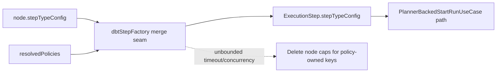
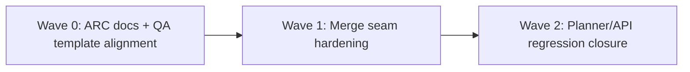

# MW-A2 Policy-First Fowler QA Review

## Summary

This artifact converts the MW-A2 QA review into executable closure tasks for policy precedence and planner boundary hardening.

Canonical execution tracking remains in:

- `docs/planning/state/agent-lane-a.yaml`
- `docs/planning/proposals/mandatory/runtime-and-contracts/dvt-dbt-agnostic-generalization-plan-20260403.md`

## Governing Sources

- `docs/planning/status/governance-document-rule-inventory.md`
- `AGENTS.md`
- `docs/guides/ai-work-protocol.md`
- `docs/planning/templates/qa/TEMPLATE_QA_ARTIFACT_EXAMPLE.md`
- `docs/architecture/components/planner/index.md`
- `docs/planning/proposals/mandatory/runtime-and-contracts/dvt-dbt-agnostic-generalization-plan-20260403.md`

## Findings

### High

- Title: policy precedence drift for `unbounded` timeout/concurrency in `dbtStepFactory` (resolved)
  Why it matters: unbounded policy intent was violated by leaked node caps.
  Evidence: `packages/@dvt/planner/src/domain/stepFactory/dbtStepFactory.ts`.
  Risk: planner can enforce stricter runtime limits than declared policy classes.
  Recommendation: use explicit overwrite/delete semantics for policy-owned fields and keep regression tests at planner + API boundary.

### Medium

- Title: cross-boundary precedence confidence gap before API assertion (resolved)
  Why it matters: unit-only confidence leaves planner-backed run-start path underprotected.
  Evidence: `apps/api/test/application/services/PlannerBackedStartRunUseCase.test.ts`.
  Risk: regressions can pass planner package tests while failing at API orchestration boundary.
  Recommendation: keep planner-backed start-run assertion as permanent regression guard.

### Low

- Title: QA artifact was not fully aligned to template sections (resolved)
  Why it matters: review artifacts lose execution consistency when section contract drifts.
  Evidence: this file now includes full template sections.
  Risk: inconsistent QA closeout and weaker handoff quality.
  Recommendation: enforce template sections (`Summary`, `Governing Sources`, `Unblock Roadmap`, `Validation Baseline`) in future updates.

## Alignment

- Doc vs code: aligned after fixing unbounded precedence behavior and documenting invariants.
- Promise vs implementation: policy-first is now explicit for bounded and unbounded classes.
- Tests vs claims: claims are covered by planner unit tests and planner-backed API regression.
- Current truth vs planned truth: current code matches MW-A2 policy-first direction.
- Documentation update status: planner component docs, QA review, evidence, and risk surfaces updated.
- Evidence and risk-doc status when applicable: ARC-2 obligations satisfied with new `ED-20260405-*` and `R-20260405-*`.

## Architecture Assessment

- SRP: improved at step factory seam; policy ownership remains localized.
- DDD: improved; policy semantics are enforced where step config is materialized.
- Hexagonal: improved; boundary behavior is now contract-faithful from planner to API.
- CQRS if relevant: unchanged.
- Complexity: slightly increased in merge code, justified by correctness.
- Modularity: improved due to explicit ownership of policy-owned keys.

## Test Assessment

- Negative paths present: invalid graph and cycle paths remain covered; unbounded policy regression now covered.
- Negative paths missing: none critical in this slice.
- Regression status: green on targeted planner/API runs.
- Determinism: existing determinism suite remains passing for touched scope.
- Local suite vs meaningful global confidence: good for this slice, full repo runtime matrix remains out of scope.
- Global system view applied: yes, with API planner-backed path assertion.
- Harness or shared fixture need: no new harness needed; existing test setup sufficient.
- Test grouping by type (`unit` / `integration` / `contract` / `e2e` / regression) and rationale:
  - `unit`: `dbt-step-factory.test.ts` for local precedence logic.
  - `integration` (application boundary): `PlannerBackedStartRunUseCase.test.ts` for end-to-end planner-backed merge behavior.
  - `contract/e2e`: unchanged in this fix slice.

## Quality Gates

- Commands executed:
  - `pnpm --filter @dvt/planner test`
  - `pnpm --filter dvt-api test -- PlannerBackedStartRunUseCase`
  - `pnpm docs:sync`
  - `pnpm verify:prepush`
- What passed:
  - planner package tests
  - targeted API planner-backed suite
  - docs index sync
  - pre-push gate
- What failed:
  - none in latest run.
- What could not be verified:
  - full end-to-end production topology with external services.

## Unblock Roadmap

### Wave 0 - Truth and documentation baseline

Tasks: `MW-A2-C-QA-05`, `MW-A2-C-QA-06`

Target:

- ARC evidence and risk surfaces aligned with planner/contracts changes;
- QA artifact shape aligned with governed template.

### Wave 1 - Boundary and ownership hardening

Tasks: `MW-A2-C-QA-01`, `MW-A2-C-QA-02`

Target:

- policy-owned fields behave as policy-first for bounded and unbounded classes;
- ownership of merge behavior is explicit and regression-protected.

### Wave 2 - Runtime and regression closure

Tasks: `MW-A2-C-QA-03`, `MW-A2-C-QA-04`

Target:

- runtime-facing boundary behavior is verified at planner and API layers;
- slice closes with governed validation evidence.

## Action Artifact

### Markdown Artifact Path Suggestion

- `docs/planning/reviews/engine/20260405-mw-a2-policy-first-fowler-qa-review.md`

### Task Checklist

- [x] `MW-A2-C-QA-01` Enforce policy-first precedence in dbt step factory
- [x] `MW-A2-C-QA-02` Add regression unit test for policy precedence
- [x] `MW-A2-C-QA-03` Re-run planner validation suite
- [x] `MW-A2-C-QA-04` Add cross-boundary API integration assertion for policy precedence
- [x] `MW-A2-C-QA-05` Add ARC-2 evidence and risk artifacts for planner/contracts touch set
- [x] `MW-A2-C-QA-06` Align QA review artifact with governed template sections

### Task Details

#### `MW-A2-C-QA-01` Enforce policy-first precedence in dbt step factory

- Objective: prevent node-level caps from overriding unbounded policy intent.
- Scope: `packages/@dvt/planner/src/domain/stepFactory/dbtStepFactory.ts`.
- Recommended owner: `@dvt/planner`.
- Dependencies: none.
- Documentation impact: reflected in QA artifact and planner component docs.
- Evidence / risk-doc impact: covered by `ED-20260405-mwa2-policy-unbounded-precedence.md` and `R-20260405-MWA2-POLICY-UNBOUNDED-PRECEDENCE.yaml`.
- Comment with rationale: policy vocabulary is governance authority; omitted keys for unbounded must clear node caps.
- Definition of Done:
  - `stepTimeoutMs` removed when policy timeout is unbounded;
  - `concurrency` removed when policy concurrency is unbounded;
  - bounded policies still overwrite node values.

#### `MW-A2-C-QA-02` Add regression unit test for policy precedence

- Objective: lock merge semantics at step-factory boundary.
- Scope: `packages/@dvt/planner/test/unit/dbt-step-factory.test.ts`.
- Recommended owner: `@dvt/planner`.
- Dependencies: `MW-A2-C-QA-01`.
- Documentation impact: QA evidence section updated.
- Evidence / risk-doc impact: test evidence only.
- Comment with rationale: unbounded policy behavior must be asserted explicitly.
- Definition of Done:
  - test covers bounded overwrite;
  - test covers unbounded key removal.

#### `MW-A2-C-QA-03` Re-run planner validation suite

- Objective: validate no planner regressions after merge-behavior change.
- Scope: `@dvt/planner` test suite.
- Recommended owner: `@dvt/planner`.
- Dependencies: `MW-A2-C-QA-01`, `MW-A2-C-QA-02`.
- Documentation impact: quality gates updated.
- Evidence / risk-doc impact: evidence command list updated.
- Comment with rationale: correctness fix must prove no collateral break in planner domain.
- Definition of Done:
  - planner suite passes.

#### `MW-A2-C-QA-04` Add cross-boundary API integration assertion for policy precedence

- Objective: verify planner-backed start-run path preserves policy-first semantics.
- Scope: `apps/api/test/application/services/PlannerBackedStartRunUseCase.test.ts`.
- Recommended owner: `dvt-api`.
- Dependencies: `MW-A2-C-QA-01`.
- Documentation impact: QA review and evidence docs updated.
- Evidence / risk-doc impact: test evidence only.
- Comment with rationale: this is the public boundary where merged step config is consumed.
- Definition of Done:
  - API test asserts bounded overwrite and unbounded removal behavior.

#### `MW-A2-C-QA-05` Add ARC-2 evidence and risk artifacts for planner/contracts touch set

- Objective: satisfy mandatory ARC policy for this PR scope.
- Scope: `docs/evidence/**`, `docs/risk-register/quality/**`.
- Recommended owner: slice owner.
- Dependencies: ARC check classification.
- Documentation impact: direct.
- Evidence / risk-doc impact: direct.
- Comment with rationale: ARC-2 requires both evidence and risk update; skipping leads to governance drift and CI failure.
- Definition of Done:
  - ARC check indicates required artifacts are present and valid.

#### `MW-A2-C-QA-06` Align QA review artifact with governed template sections

- Objective: make review output executable and consistent.
- Scope: this artifact.
- Recommended owner: QA/doc owner.
- Dependencies: none.
- Documentation impact: direct.
- Evidence / risk-doc impact: none.
- Comment with rationale: template alignment enables repeatable QA execution across slices.
- Definition of Done:
  - all required template sections present and populated with task-specific content.

## Mermaid Diagram

### Current-state dependency map

### Unblock sequence

## Validation Baseline For Each Execution Slice

Every correction slice under this artifact closes with:

1. touched-package checks (`pnpm --filter @dvt/planner test`);
2. boundary regression checks (`pnpm --filter dvt-api test -- PlannerBackedStartRunUseCase`);
3. `pnpm docs:sync` when docs were added or moved;
4. ARC evidence/risk checks for planner/contracts touch sets;
5. `pnpm verify:prepush`.

## Final Verdict

Ready
