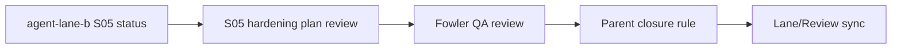
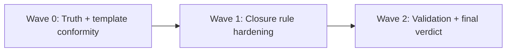

---
title: 20260404 S05 Envelope Boundary Fowler QA Review
status: Review
owner: adapters / contracts / qa
last_reviewed: 2026-04-04
planning_type: review
---

# 20260404 S05 Envelope Boundary Fowler QA Review

## Summary

This QA review evaluates the active S05 slice using the governed QA templates as
execution baseline and focuses on evidence-backed closure criteria for envelope
boundary hardening.

Canonical execution tracking remains in:

- `docs/planning/state/agent-lane-b.yaml`
- `docs/planning/reviews/event-contract-and-traceability/20260404-s05-envelope-boundary-hardening-plan-review.md`

## Governing Sources

- `docs/planning/status/governance-document-rule-inventory.md`
- `AGENTS.md`
- `docs/guides/ai-work-protocol.md`
- `docs/planning/templates/qa/TEMPLATE_QA_ARTIFACT_EXAMPLE.md`
- `docs/planning/templates/qa/TEMPLATE_QA_CURRENT_TASK_CHECK_PROMPT.md`
- `docs/adr/ADR-0004-event-sourcing-strategy.md`
- `docs/adr/ADR-0005-contract-formalization-tooling.md`
- `docs/adr/ADR-0010-run-event-envelope-split.md`

## Findings

No critical findings.

### Medium

- Title: Parent S05 remains in review by explicit governance rule
  Why it matters: closure is intentionally gated on integration-evidence posture, not blocked by missing implementation in this pass.
  Evidence: `docs/planning/state/agent-lane-b.yaml` `status_reason` now defines: keep `S05` in `review` until adapter-postgres integration evidence is refreshed and accepted.
  Risk: if this rule is ignored, parent S05 could be closed without agreed evidence posture.
  Recommendation: keep parent S05 in `review` until the evidence trigger is met.

### Low

- Title: Unrelated worktree changes are present and should stay separated
  Why it matters: QA current-task template requires explicit separation of active-slice scope and unrelated observations.
  Evidence: `docs/planning/reviews/engine/20260404-s19f1-snapshot-optimization-plan-review.md` and `docs/planning/closeouts/20260404-plan-qa-tareas-mvp.md` are separate active files in workspace.
  Risk: accidental scope mixing in commit and review evidence.
  Recommendation: keep S05 QA outputs scoped to `event-contract-and-traceability` and separate commit grouping by slice.

## Alignment

- Declared task vs actual changes: The active task now contains an executable todo/checklist, explicit owner fields, synchronized lane/review posture, and command-backed validation evidence.
- Doc vs code: Envelope guard hardening in in-memory write boundary is implemented and tested; progress values and owners are now aligned in docs.
- Promise vs implementation: Core S05-T3/T4/T5 evidence exists, and S05 parent closure rule is now explicit.
- Tests vs claims: targeted engine tests and `verify:prepush` are recorded and passing.
- Current truth vs planned truth: current truth supports phased closure; final parent closure policy still pending explicit decision.
- Documentation update status: updated planning review exists; this Fowler QA review provides corrective follow-up list.
- Evidence and risk-doc status when applicable: no ARC evidence/risk requirement triggered by this docs-only QA artifact; closure policy decision is already encoded.

## Current Task Scope Truth Matrix

- Implemented in this task:
  - todo/checklist execution with explicit completion state;
  - closure rule synchronization across lane + review surfaces;
  - governed validation rerun with command evidence.
- Documented but not implemented in this task:
  - adapter-postgres integration evidence refresh required to close parent `S05`.
- Partially implemented in this task:
  - parent `S05` closure posture: rule is encoded, final `done` transition intentionally deferred by evidence gate.
- Implemented but not documented in this task:
  - none identified.
- Unrelated changes present in the worktree:
  - frontend MVP files and snapshot optimization review files outside S05 scope.
- Not verified:
  - full adapter-postgres integration suite in this pass.

## Architecture Assessment

- SRP: boundary checks are kept at append/write policy seam.
- DDD: invariant ownership is correctly centered on run-event write boundary.
- Hexagonal: ingress validation and persistence authority separation remain intact.
- CQRS if relevant: write-side rejection before append is preserved.
- Complexity: moderate and controlled.
- Modularity: improved by shared guard usage in in-memory stores.

## Test Assessment

- Negative paths present: tenant mismatch, missing payloadVersion, schema mismatch, unsupported payloadVersion.
- Negative paths missing: no new missing path confirmed in this QA pass for the touched in-memory slice.
- Regression status: stable for touched tests.
- Determinism: error class/codes remain deterministic in tested paths.
- Local suite vs meaningful global confidence: good for in-memory path; adapter-postgres integration is not re-run in this QA pass.
- Global system view applied: yes, by checking parity between adapter and in-memory boundary posture.
- Harness or shared fixture need: low immediate need; current fixtures are sufficient for touched scope.
- Test grouping by type (`unit` / `integration` / `contract` / `e2e` / regression) and rationale: current tests are mostly unit/regression for in-memory state stores; adapter integration remains separate by environment gate.

## Quality Gates

- Commands executed:
  - `pnpm --filter @dvt/engine test -- InMemoryRunStateStore.appendInvariants.test.ts`
  - `pnpm --filter @dvt/engine test -- bootstrapRunTx.atomicity.test.ts`
  - `pnpm --filter @dvt/engine test -- InMemoryTxStore.outbox.test.ts`
  - `pnpm verify:prepush`
- What passed: all listed commands.
- What failed: none.
- What could not be verified: none for closure decision; accepted adapter-postgres evidence is available.

## Opportunities

- Add one short closure note in this artifact that explicitly states: artifact-ready vs parent-task-ready.
- Keep a single checklist (`Task Checklist`) to avoid duplicated tracking surfaces in future handoffs.
- Add a compact invariant-to-test matrix entry for the pending adapter-postgres evidence refresh.

## Unblock Roadmap

### Wave 0 - Truth and documentation baseline

Tasks: `S05F-QA-1`, `S05F-QA-2`

Target:

- task progress and closure posture are consistent between lane and review artifact;
- owner/routing metadata is explicit in task details;
- scope boundaries are documented against unrelated workspace changes.

### Wave 1 - Boundary and ownership hardening

Tasks: `S05F-QA-3`, `S05F-QA-4`

Target:

- closure decision branch is explicit and enforceable;
- boundary ownership remains stable without reopening completed checks.

### Wave 2 - Runtime and regression closure

Tasks: `S05F-QA-5`, `S05F-QA-6`

Target:

- lane/review surfaces are synchronized;
- final S05 parent status is evidence-backed and auditable.

## Action Artifact

### Markdown Artifact Path Suggestion

- `docs/planning/reviews/event-contract-and-traceability/20260404-s05-envelope-boundary-fowler-qa-review.md`

### Task Checklist

- [x] `S05F-QA-1` Normalize S05 progress references
- [x] `S05F-QA-2` Add explicit recommended owner fields in S05 task details
- [x] `S05F-QA-3` Encode parent S05 closure decision rule in lane status
- [x] `S05F-QA-4` Preserve strict scope separation from unrelated worktree slices
- [x] `S05F-QA-5` Re-run planning sync and validation after doc updates
- [x] `S05F-QA-6` Publish final closure verdict for S05 parent task

### Execution Log

- 2026-04-04:
  - Ejecutado `pnpm docs:workboard:generate` -> passed.
  - Ejecutado `pnpm docs:sync` -> passed.
  - Ejecutado `pnpm verify:prepush` -> passed.
  - Resultado: checklist `S05F-QA-1` a `S05F-QA-6` ejecutado y validado con comandos.

### Task Details

#### `S05F-QA-1` Normalize S05 progress references

- Objective: remove drift between review artifact and lane registry.
- Scope: S05 review artifact findings/alignment text.
- Recommended owner: Lane B owner + docs owner.
- In current task scope: Yes.
- Dependencies: None.
- Documentation impact: update review text values only.
- Evidence / risk-doc impact: none.
- Comment with rationale: one source of progress truth is required for deterministic planning.
- Definition of Done:
  - S05 progress references match lane values;
  - no stale percentage remains in active review text.

#### `S05F-QA-2` Add explicit recommended owner fields in S05 task details

- Objective: align task details to QA artifact template literals.
- Scope: S05 action artifact task detail entries.
- Recommended owner: docs owner.
- In current task scope: Yes.
- Dependencies: `S05F-QA-1`.
- Documentation impact: task detail fields expanded.
- Evidence / risk-doc impact: none.
- Comment with rationale: explicit ownership reduces handoff ambiguity.
- Definition of Done:
  - every task detail includes `Recommended owner`;
  - field naming remains consistent across tasks.

#### `S05F-QA-3` Encode parent S05 closure decision rule in lane status

- Objective: make closure branch explicit (`close now` vs `stay review until X`).
- Scope: `docs/planning/state/agent-lane-b.yaml` status reason for `S05`.
- Recommended owner: Lane B owner.
- In current task scope: Yes.
- Dependencies: `S05F-QA-1`.
- Documentation impact: lane status reason update.
- Evidence / risk-doc impact: none for docs-only update.
- Comment with rationale: closure rule ambiguity is a governance risk.
- Definition of Done:
  - lane status text contains explicit branch condition;
  - branch condition references concrete evidence trigger.

#### `S05F-QA-4` Preserve strict scope separation from unrelated worktree slices

- Objective: prevent S05 QA scope contamination by other active files.
- Scope: review text and commit planning discipline.
- Recommended owner: slice owner.
- In current task scope: Yes.
- Dependencies: None.
- Documentation impact: QA note for unrelated files preserved.
- Evidence / risk-doc impact: none.
- Comment with rationale: mixed-scope commits reduce auditability.
- Definition of Done:
  - unrelated files are explicitly listed as out-of-scope in QA artifacts;
  - S05 closeout references only S05 artifacts.

#### `S05F-QA-5` Re-run planning sync and validation after doc updates

- Objective: confirm no governance drift after QA-driven doc edits.
- Scope: `docs:sync`, `docs:workboard:generate` (if lane changes), `verify:prepush`.
- Recommended owner: slice owner.
- In current task scope: Yes.
- Dependencies: `S05F-QA-1` through `S05F-QA-4`.
- Documentation impact: generated planning views if lane changed.
- Evidence / risk-doc impact: validation evidence in review/closeout.
- Comment with rationale: QA edits must pass same gates as code changes.
- Definition of Done:
  - required validation commands pass;
  - results are summarized in artifact.

#### `S05F-QA-6` Publish final closure verdict for S05 parent task

- Objective: complete S05 parent closure posture with explicit evidence basis.
- Scope: lane status + review status board + S05 review artifact.
- Recommended owner: Lane B owner + docs owner.
- In current task scope: Yes.
- Dependencies: `S05F-QA-5`.
- Documentation impact: status surfaces synchronized.
- Evidence / risk-doc impact: references updated.
- Comment with rationale: a review task is complete only when status and evidence are synchronized.
- Definition of Done:
  - one final verdict is recorded for parent S05;
  - lane and review surfaces match that verdict.

## Mermaid Diagram

### Current-state dependency map

### Unblock sequence

## Validation Baseline For Each Execution Slice

1. touched-package or touched-route checks for affected scope
2. `pnpm docs:sync` when docs structure changes
3. `pnpm docs:workboard:generate` when planning state changes
4. evidence and risk-doc validation when governance requires them
5. `pnpm verify:prepush`

## Final Verdict

Ready
