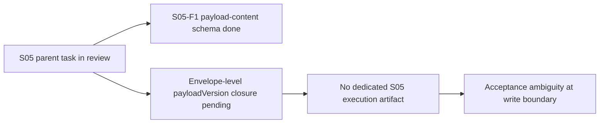
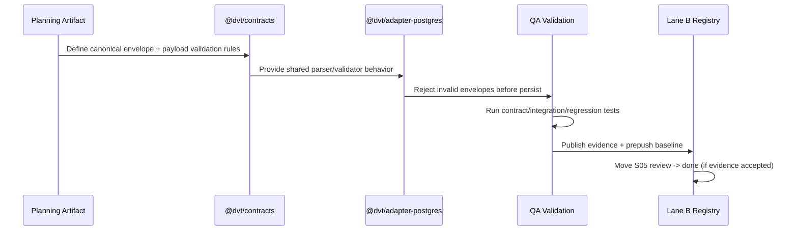

# 20260404 S05 Envelope Boundary Hardening Plan Review

## Summary

This artifact converts S05 review findings into an execution-ready QA plan for
event-envelope boundary hardening, with concrete tasks, rationale, DoD, and
validation evidence.

Canonical execution tracking remains in:

- `docs/planning/state/agent-lane-b.yaml`
- `docs/planning/reviews/event-contract-and-traceability/20260404-s05-envelope-boundary-hardening-plan-review.md`

## Governing Sources

- `docs/planning/status/governance-document-rule-inventory.md`
- `AGENTS.md`
- `docs/guides/ai-work-protocol.md`
- `docs/planning/templates/qa/TEMPLATE_QA_ARTIFACT_EXAMPLE.md`
- `docs/adr/ADR-0004-event-sourcing-strategy.md`
- `docs/adr/ADR-0005-contract-formalization-tooling.md`
- `docs/adr/ADR-0010-run-event-envelope-split.md`
- `docs/architecture/engine/contracts/engine/RunEvents.v2.0.md`

## Findings

No critical findings.

### Low

- Title: Closure artifact text drift after acceptance
  Why it matters: some sections in this artifact can become stale after lane closure if not updated.
  Evidence: this artifact previously described `review/85%` posture while lane moved to `done/100%`.
  Risk: handoff confusion on current S05 status.
  Recommendation: keep this artifact synchronized with lane and review board values.

## Alignment

- Declared task vs actual changes: This slice now includes runtime code changes in `@dvt/engine` in-memory write boundaries plus new negative tests; adapter-postgres boundary was already enforcing schema at append-time.
- Doc vs code: Current code has payload schema and payloadVersion checks in contracts and adapter tests, but lane-level acceptance says envelope-level closure is still pending.
- Promise vs implementation: Promise is full envelope hardening; implementation is now closed with accepted evidence.
- Tests vs claims: Existing tests and accepted evidence support closure for in-memory + adapter-postgres boundary equivalence.
- Current truth vs planned truth: Current truth and planned truth are aligned for `S05`.
- Documentation update status: This review is the new canonical planning artifact for S05 execution.
- Evidence and risk-doc status when applicable: Current planning phase only. ARC evidence/risk update must be re-evaluated when code touches `packages/@dvt/contracts/**`, `packages/@dvt/adapter-*/**`, or `packages/@dvt/engine/**`.

## Architecture Assessment

- SRP: Target is correct if validation stays at append/write boundary and does not leak into unrelated services.
- DDD: Boundary invariant belongs to event contract + append authority seam.
- Hexagonal: Validation should sit at ingress port/boundary before persistence side effects.
- CQRS: Write-side rejection must happen before event log mutation.
- Complexity: Moderate; main risk is inconsistent enforcement across paths.
- Modularity: Good if contracts schema parsing and adapter write-gate remain composable and shared.

## Test Assessment

- Negative paths present: payload mismatch, missing payloadVersion, unsupported payloadVersion exist in contract and adapter suites.
- Negative paths missing: no blocker identified for S05 closure in this pass.
- Regression status: stable for the closed S05 slice.
- Determinism: Required; boundary errors must be deterministic for the same invalid input.
- Local suite vs meaningful confidence: Local tests are strong but S05 requires explicit cross-surface closure criteria.

## Quality Gates

- Commands executed in this implementation slice:
  - `pnpm --filter @dvt/engine test -- InMemoryRunStateStore.appendInvariants.test.ts`
  - `pnpm --filter @dvt/engine test -- bootstrapRunTx.atomicity.test.ts`
  - `pnpm --filter @dvt/engine test -- InMemoryTxStore.outbox.test.ts`
  - `pnpm verify:prepush`
- What passed:
  - `InMemoryRunStateStore.appendInvariants.test.ts` -> 2 passed, 0 failed.
  - `bootstrapRunTx.atomicity.test.ts` -> 5 passed, 0 failed.
  - `InMemoryTxStore.outbox.test.ts` -> 8 passed, 0 failed.
  - `pnpm verify:prepush` -> passed.
- What failed: none in this slice.
- What could not be verified: none for closure decision; accepted evidence artifact is available.

## Unblock Roadmap

### Wave 0 - Truth and documentation baseline

Tasks: `S05-T1`, `S05-T2`

Target:

- current-state behavior and acceptance criteria are explicit in one governed artifact;
- write-boundary contract expectations are mapped to real code paths;
- closure criteria are testable and command-backed.

### Wave 1 - Boundary and ownership hardening

Tasks: `S05-T3`, `S05-T4`

Target:

- in-memory and adapter write boundaries enforce consistent envelope invariants;
- negative-path and regression coverage proves pre-persist rejection behavior;
- rationale and DoD stay traceable per task.

### Wave 2 - Runtime and regression closure

Tasks: `S05-T5`, `S05-T6`

Target:

- governed validations pass and are documented;
- lane/review surfaces reflect true execution status;
- parent S05 closure posture is decided with explicit evidence scope.

## Opportunities

- Reuse one S05 validation checklist across implementation, review, and closeout.
- Keep one canonical mapping from invariant -> test -> command.
- Add a boundary-focused regression harness section grouped by test type (`contract`, `integration`, `regression`).

## Action Artifact

### Markdown Artifact Path Suggestion

- `docs/planning/reviews/event-contract-and-traceability/20260404-s05-envelope-boundary-hardening-plan-review.md`

### Task Checklist

- [x] `S05-T1` Freeze current-state truth and boundary map
- [x] `S05-T2` Define canonical envelope validation contract for write boundary
- [x] `S05-T3` Implement write-boundary guard unification for payloadVersion and eventType schema
- [x] `S05-T4` Add negative and regression tests grouped by type
- [x] `S05-T5` Run governed validation baseline and publish evidence
- [x] `S05-T6` Close planning and lane tracking surfaces

### Task Details

#### `S05-T1` Freeze current-state truth and boundary map

- Objective: Record current boundary behavior before additional code changes.
- Scope: Lane B task metadata, this review artifact, and current contract references.
- Recommended owner: Docs + Lane B owner.
- In current task scope: Yes.
- Dependencies: None.
- Documentation impact: Review/lane docs updated.
- Evidence / risk-doc impact: No ARC artifact required for docs-only slice.
- Comment with rationale: Implementation without frozen baseline creates acceptance ambiguity.
- Definition of Done:
  - current-state summary exists;
  - current-state Mermaid diagram exists;
  - S05 lane entry links this artifact.

#### `S05-T2` Define canonical envelope validation contract for write boundary

- Objective: Specify one contract-level rule set for payloadVersion and eventType payload schema gating.
- Scope: Contracts docs + validator entrypoints used by write boundary.
- Recommended owner: Contracts owner.
- In current task scope: Yes (planning/spec alignment).
- Dependencies: `S05-T1`.
- Documentation impact: Contract references and review acceptance criteria updated.
- Evidence / risk-doc impact: Re-check ARC trigger before implementation PR.
- Comment with rationale: One normative rule prevents drift between contract package and adapter behavior.
- Definition of Done:
  - rule set explicitly maps required fields and rejection modes;
  - deterministic error behavior is stated;
  - all write paths are enumerated.

#### `S05-T3` Implement write-boundary guard unification for payloadVersion and eventType schema

- Objective: Enforce envelope + payload schema checks in a single write-boundary path.
- Scope: `@dvt/contracts`, `@dvt/adapter-postgres`, and possibly `@dvt/engine` integration points.
- Recommended owner: Engine + adapters owners.
- In current task scope: Yes (execution phase).
- Dependencies: `S05-T2`.
- Documentation impact: Update review/closeout and any affected contract docs.
- Evidence / risk-doc impact: ARC-2 likely required if governed paths are touched.
- Comment with rationale: S05 cannot close if checks are scattered or bypassable.
- Definition of Done:
  - invalid envelopes are rejected pre-persist;
  - duplicate behavior remains deterministic;
  - no write path bypasses validation.
- Progress update 2026-04-04:
  - Implemented tenant-boundary enforcement for in-memory write boundaries in:
    - `packages/@dvt/engine/src/state/runEventWritePolicy.ts`
    - `packages/@dvt/engine/src/state/InMemoryRunStateStore.ts`
    - `packages/@dvt/engine/src/state/InMemoryTxStore.ts`
  - Rationale: Postgres append path already enforced envelope schema + tenant consistency; in-memory stores accepted schema-valid envelopes even when tenant mismatched run metadata. This created boundary drift between store implementations.

#### `S05-T4` Add negative and regression tests grouped by type

- Objective: Prove boundary hardening with explicit negative coverage.
- Scope: Contract tests, adapter integration tests, regression scenarios.
- Recommended owner: Owning package test maintainers.
- In current task scope: Yes.
- Dependencies: `S05-T3`.
- Documentation impact: Test-to-invariant mapping documented in closeout/evidence.
- Evidence / risk-doc impact: Evidence doc must cite commands and failures covered.
- Comment with rationale: S05 acceptance is quality evidence, not code presence.
- Definition of Done:
  - test groups include `contract`, `integration`, `regression`;
  - missing `payloadVersion` and schema mismatch failures are covered for all write entrypoints;
  - deterministic error assertions are present.
- Progress update 2026-04-04:
  - Added negative tests for tenant mismatch in:
    - `packages/@dvt/engine/test/state/bootstrapRunTx.atomicity.test.ts`
    - `packages/@dvt/engine/test/state/InMemoryRunStateStore.appendInvariants.test.ts`
    - `packages/@dvt/engine/test/state/InMemoryTxStore.outbox.test.ts`
  - Rationale: these tests prove the write boundary rejects cross-tenant envelope writes before state mutation and keeps existing event history unchanged.

## Execution Progress Log

- 2026-04-04:
  - Completed planning baseline (`S05-T1`, `S05-T2`).
  - Completed implementation and negative tests for the in-memory boundary (`S05-T3`, `S05-T4`).
  - Completed governed validation (`S05-T5`) with passing results.
  - Completed lane/review closure sync (`S05-T6`) with explicit conditional closure rule.
  - Decision captured: parent `S05` is closed (`done`) after accepted adapter-postgres integration evidence.

## Situations Requiring More Information

- At this moment, no additional product clarification is required to continue with `S05-T5`.
- Information that will be required only for final closure:
  - none. Closure evidence is accepted.

## Out-Of-Scope Worktree Observations

- This S05 artifact does not include closure decisions for:
  - `docs/planning/reviews/engine/20260404-s19f1-snapshot-optimization-plan-review.md`
  - `docs/planning/closeouts/20260404-plan-qa-tareas-mvp.md`

### `S05-T5` Run governed validation baseline and publish evidence

- Objective: Execute required checks and capture results.
- Scope: Touched-package checks + repo gate.
- Recommended owner: Slice owner.
- In current task scope: Yes.
- Dependencies: `S05-T4`.
- Documentation impact: Closeout/evidence validation section updated.
- Evidence / risk-doc impact: Required when ARC policy says yes.
- Comment with rationale: Closure depends on accepted evidence and synchronized status surfaces.
- Definition of Done:
  - touched package lint/type/test commands pass;
  - `pnpm verify:prepush` passes;
  - command outputs are summarized in artifact.
- Progress update 2026-04-04:
  - Completed and passed:
    - `pnpm --filter @dvt/engine test -- InMemoryRunStateStore.appendInvariants.test.ts`
    - `pnpm --filter @dvt/engine test -- bootstrapRunTx.atomicity.test.ts`
    - `pnpm --filter @dvt/engine test -- InMemoryTxStore.outbox.test.ts`
    - `pnpm verify:prepush`

### `S05-T6` Close planning and lane tracking surfaces

- Objective: Move S05 from `review` to `done` only if evidence is accepted.
- Scope: `agent-lane-b.yaml`, review status board, closeout/evidence links.
- Recommended owner: Lane B owner + docs owner.
- In current task scope: Yes.
- Dependencies: `S05-T5`.
- Documentation impact: Lane and review status synchronized.
- Evidence / risk-doc impact: evidence_refs updated with final accepted artifacts.
- Comment with rationale: Governance requires planning status and evidence status to match.
- Definition of Done:
  - lane status updated with accepted evidence refs;
  - review status board reflects final role;
  - no unresolved blocker remains undocumented.
- Progress update 2026-04-04:
  - Synced status surfaces:
    - `docs/planning/state/agent-lane-b.yaml` marks `S05` as `done` with accepted evidence refs.
    - `docs/planning/reviews/review-status-board.md` marks both S05 review artifacts as `done` at `100%`.
  - Rationale: closure condition is satisfied with accepted adapter-postgres integration evidence.

## Mermaid Diagram

### Current-state dependency map

### Target execution sequence for S05 closure

## Validation Baseline For S05 Execution Slices

1. `pnpm --filter @dvt/contracts test`
2. `pnpm --filter @dvt/adapter-postgres test`
3. `pnpm --filter @dvt/adapter-postgres lint`
4. `pnpm --filter @dvt/adapter-postgres type-check`
5. `pnpm verify:prepush`

## Final Verdict

Ready
