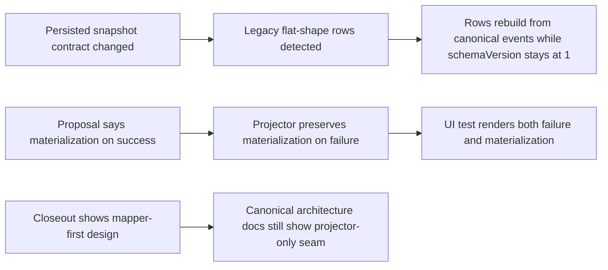

# TF-C2-B runtime read-surface hard QA review

## Artifact Metadata

### Markdown Artifact Path Suggestion

- `docs/planning/reviews/execution-runtime/20260409-tf-c2-b-read-surface-hard-qa-review.md`

## Summary

This review records the hard, evidence-first QA pass for Lane C `TF-C2-B` after
the runtime read surface moved from flat outcome fields to a nested
`execution` object and the projector was decomposed into mapper-first
normalization plus focused mutation handlers.

The goal of this QA pass is to verify four things:

- the persisted snapshot contract can evolve without serving stale rows as if
  they were current truth;
- the canonical engine and frontend contract docs actually describe the shipped
  read surface;
- the new `execution.materialization` semantics are coherent with the product
  contract on failed runs;
- canonical diagrams, not only closeout notes, reflect the new mapper-first
  projection seam.

Canonical execution tracking remains in:

- `docs/planning/state/agent-lane-c.yaml`
- `docs/planning/closeouts/20260408-tf-c2-b-read-surface-evidence-closeout.md`
- `docs/planning/proposals/mandatory/runtime-and-contracts/tf-c2-b-runtime-read-surface-evidence-plan-20260408.md`

This document is the hard-QA intake, correction map, and Definition of Done
baseline for closing `TF-C2-B` credibly.

Debt handling for this review:

- the canonical contract/doc drift finding is accepted as open debt in
  `R-20260409-TF-C2-B-CANONICAL-CONTRACT-DOC-DRIFT`
- the failed-run materialization semantics finding is accepted as open debt in
  `R-20260409-TF-C2-B-FAILED-RUN-MATERIALIZATION-SEMANTICS`
- the previous snapshot schema-version blocker is closed in development by
  keeping `schemaVersion = 1` and treating legacy flat-shape rows as stale for
  rebuild

## Governing Sources

- `docs/planning/status/governance-document-rule-inventory.md`
- `AGENTS.md`
- `docs/guides/ai-work-protocol.md`
- `docs/planning/state/planning-control-tower.md`
- `docs/planning/reviews/review-status-board.md`
- `docs/planning/reviews/review-naming-policy.md`
- `docs/planning/templates/qa/TEMPLATE_QA_ARTIFACT_EXAMPLE.md`
- `docs/adr/ADR-0004-event-sourcing-strategy.md`
- `docs/adr/ADR-0015-getRunStatus-read-model-separation.md`
- `docs/adr/ADR-0039-hexagonal-port-hardening-and-solid-remediation.md`
- `docs/architecture/engine/VERSIONING.md`
- `docs/planning/proposals/mandatory/runtime-and-contracts/transformation-flow-architecture-and-contracts-20260405.md`
- `docs/planning/proposals/mandatory/runtime-and-contracts/tf-c2-b-runtime-read-surface-evidence-plan-20260408.md`

## Findings

### High

- Title: Persisted snapshot safety now stays on one schema line and rebuilds
  legacy flat-shape rows.
  Why it matters: the development branch explicitly wants one internal snapshot
  schema line. That only stays safe if legacy flat-shape rows are detected and
  rebuilt from canonical events instead of introducing a second schema number.
  Evidence:
  - `packages/@dvt/contracts/src/engine/IRunStateStore.v1.ts:142-148` now
    states the development baseline remains on `schemaVersion = 1`.
  - `packages/@dvt/adapter-postgres/src/PostgresRunSnapshotStore.ts:122-128`
    now rebuilds when either the schema value mismatches or legacy flat TF-C2-B
    keys are present on the stored snapshot.
  - `packages/@dvt/adapter-postgres/src/PostgresSnapshotStalenessQuerySql.ts:15-55`
    now marks legacy flat-shape rows as stale for projector refresh.
  - `packages/@dvt/adapter-postgres/test/PostgresRunSnapshotStore.test.ts`
    now includes a regression proving legacy flat-shape rows rebuild even when
    `schemaVersion` stays on the current value.
    Risk: the multi-line snapshot-version concern is removed for this branch,
    but legacy-shape detection must remain aligned with the real retired fields.
    Recommendation: keep the single-line development policy explicit and retain
    regression coverage for flat-shape snapshot rebuild.

- Title: Canonical contract docs still describe the old run-status shape.
  Why it matters: this slice changes caller-visible runtime read semantics. If
  canonical docs still describe the old shape, the branch is green only in code,
  not in repository truth.
  Evidence:
  - `docs/architecture/engine/VERSIONING.md:39-45`, `:82-85`, and `:98-103`
    require canonical contract docs and dependent docs to be updated when
    contract behavior changes.
  - `docs/architecture/engine/contracts/engine/IWorkflowEngine.v1.md:101-119`
    still defines `RunStatusSnapshot` without `substatus` or `execution`.
  - `docs/architecture/engine/contracts/engine/IWorkflowEngine.reference.v1.md:94-113`
    still shows the pre-TF-C2-B snapshot shape.
  - `docs/architecture/frontend/runs/frontend-runtime-contract-technical-manual.md:56-109`
    describes the route baseline but does not document the shipped `execution`
    evidence fields consumed by the frontend.
    Risk: reviewers and future slices will read stale contract truth and make
    incompatible changes, while the PR claims the read surface is already closed.
    Recommendation: update the canonical engine contract docs and the frontend
    runtime manual so the `execution` object, its optionality, and its operator
    semantics are governed outside the closeout/evidence docs.

- Title: The implementation and tests allow `execution.materialization` on failed runs, but the governing proposal says it is success-only.
  Why it matters: a read model that simultaneously communicates failure and
  materialization success needs explicit semantics. Right now the product docs
  say one thing and the implementation proves another.
  Evidence:
  - `docs/planning/proposals/mandatory/runtime-and-contracts/transformation-flow-architecture-and-contracts-20260405.md:439-445`
    requires `execution.materialization` "on success" and `execution.failure.*`
    on failure.
  - `packages/@dvt/run-domain/src/applyRunEvent.ts:96-108` persists
    `execution.materialization` on `StepCompleted`.
  - `packages/@dvt/run-domain/src/applyRunEvent.ts:82-87` and `:110-116` do not
    clear `execution.materialization` when a step or run fails.
  - `apps/web/src/app/views/runs/RunStates.test.tsx:177-221` explicitly asserts
    a failed snapshot that renders both materialization evidence and failure
    diagnostics.
    Risk: operators can read a failed run as if sink-write success is part of the
    final outcome, or stale materialization from an earlier step can leak into the
    terminal failed state without a governed meaning.
    Recommendation: either clear `execution.materialization` on failure paths or
    update the canonical contract/docs to define it as "last successful sink
    evidence, even when the overall run fails" and add regression tests for that
    decision.

### Medium

- Title: Canonical architecture diagrams were not updated to show the mapper-first projection seam.
  Why it matters: this slice was sold as a structural remediation, not just a
  DTO rename. The canonical architecture surfaces should show the new
  decomposition instead of leaving it trapped in the closeout note.
  Evidence:
  - `docs/architecture/engine/c4-engine.md:111-128` still models the read path
    as `WorkflowEngine -> SnapshotProjector` with no mapper component or
    normalization seam.
  - `docs/architecture/engine/workflow-engine-subsystem-context.md:154-179`
    still shows the projector rebuild sequence without the event-to-projectable
    mapper stage.
  - `docs/planning/closeouts/20260408-tf-c2-b-read-surface-evidence-closeout.md:80-102`
    is currently the only place where the current-state and target-state mapper
    diagrams exist.
    Risk: the code has moved, but the architecture entrypoints still teach the old
    decomposition, inviting future drift back into projector-centric parsing.
    Recommendation: update `c4-engine.md` and the workflow-engine subsystem
    context doc, or add a canonical runtime-projection architecture doc that is
    linked from the engine index.

### Low

- No low-severity findings.

## Alignment

- Doc vs code:
  Not aligned. Closeout/evidence docs describe the new `execution` shape, but
  canonical contract and architecture entrypoints still describe the old or
  incomplete model.
- Promise vs implementation:
  Not aligned. The proposal says `execution.materialization` is success-only,
  while the implementation and tests allow it to coexist with failure.
- Tests vs claims:
  Partial alignment. The new tests now protect the single-line snapshot rebuild
  policy, but they still do not settle the failed-run materialization semantics
  explicitly.
- Current truth vs planned truth:
  The branch now matches the chosen development posture for snapshots, but
  canonical-doc drift and failed-run materialization semantics still remain
  before TF-C2-B can be treated as closure-ready.
- Documentation update status:
  Updated in closeout/evidence/proposal surfaces, stale in canonical engine,
  frontend, and architecture entrypoints.
- Evidence and risk-doc status when applicable:
  ARC evidence and risk docs exist for the slice, but this QA pass identifies
  additional closure blockers that are not yet reflected in lane status.

## Architecture Assessment

- SRP:
  Improved in code. Mapper-first normalization reduces the projector blob.
- DDD:
  Improved in code, but weakened in documentation because the read-model
  contract is not yet canonically described.
- Hexagonal:
  Improved. Normalization moved out of the projector, but the architecture docs
  still depict the old seam.
- CQRS if relevant:
  Improved. Persisted snapshot safety now keeps one development schema line and
  rebuilds legacy flat-shape rows from events instead of serving them directly.
- Complexity:
  Reasonable in the implementation, but documentary complexity is high because
  current-state truth is split across code, closeout, and stale contract docs.
- Modularity:
  Improved in code, incomplete in canonical diagrams and manuals.

## Test Assessment

- Negative paths present:
  - malformed step events without `stepId` are covered in
    `packages/@dvt/run-domain/test/applyRunEvent.test.ts`
  - run-state transition guards are covered in
    `packages/@dvt/run-domain/test/applyRunEvent.test.ts`
  - frontend snapshot rendering covers absence of evidence and presence of
    failure/materialization fields in
    `apps/web/src/app/views/runs/RunStates.test.tsx`
- Negative paths missing:
  - no semantic regression test that fixes the contract meaning of
    materialization on failed runs
  - no documentary fitness test guarding canonical contract docs against stale
    `RunStatusSnapshot` examples
- Regression status:
  Repo gate is green, and the snapshot-safety regression is now covered, but
  documentary and semantic blockers remain.
- Determinism:
  The mapper-first projection remains deterministic. Legacy flat-shape rows are
  now forced back through event-authoritative rebuild instead of being served
  directly.
- Local suite vs meaningful global confidence:
  Good code confidence for touched packages; insufficient closure confidence for
  persisted snapshot migration and canonical-doc truth.
- Global system view applied:
  Yes. This review checked contracts, persisted snapshots, API/web consumers,
  architecture docs, and planning surfaces together.
- Harness or shared fixture need:
  No additional harness blocker. The persisted old-shape snapshot regression is
  now covered in the adapter store tests.
- Test grouping by type (`unit` / `integration` / `contract` / `e2e` / regression) and rationale:
  - `contract`: `packages/@dvt/contracts/test/validation.test.ts`
  - `unit/regression`: `packages/@dvt/run-domain/test/applyRunEvent.test.ts`
  - `integration`: `apps/api/test/...getRunStatus...`, `apps/api/test/...getRunEvents...`
  - `ui regression`: `apps/web/src/app/views/runs/RunStates.test.tsx`
  - missing `semantic regression`: failed-run materialization rule

## Quality Gates

- Commands executed:
  - `git status -sb`
  - `git diff --stat origin/main...HEAD`
  - `rg -n "currentStepId|failedStepId|errorReason|materialization|execution\\.activeStepId|RunStatusSnapshot|WorkflowSnapshot" docs packages apps -g '!dist'`
  - `rg -n "CURRENT_WORKFLOW_SNAPSHOT_SCHEMA_VERSION|schemaVersion.*CURRENT_WORKFLOW_SNAPSHOT_SCHEMA_VERSION|rebuildSnapshot\\(" packages apps -g '!dist'`
  - `pnpm verify:prepush`
- What passed:
  - repo pre-push validation gate
  - changed-file lint and formatting checks
  - touched-package type-check baseline included in `verify:prepush`
- What failed:
  - no command failed in the final QA baseline
  - documentary truth and semantic closure did fail this hard-QA review
- What could not be verified:
  - real executor emission from `TF-C2-A` remains out of scope for this review
  - GitHub-hosted CI status was not used as the documentary source of truth for
    this artifact

## Current-state contradiction map

## Unblock Roadmap

### Wave 0 - Contract truth

Tasks: `TF-C2-B-QA-02`

Target:

- canonical engine and frontend contracts describe the shipped `execution`
  object and its compatibility posture.

### Wave 1 - Semantic ownership closure

Tasks: `TF-C2-B-QA-03`

Target:

- the system has one governed meaning for `execution.materialization` on failed
  runs, with code, docs, and tests all aligned.

### Wave 2 - Architecture and closure evidence

Tasks: `TF-C2-B-QA-04`, `TF-C2-B-QA-05`

Target:

- canonical architecture diagrams show the mapper-first projector seam;
- lane and review surfaces state the real blocker posture before the PR is
  considered closure-ready.

## Action Artifact

### Task Checklist

- [x] `TF-C2-B-QA-01` Keep `WorkflowSnapshot` schemaVersion at `1` and rebuild legacy flat-shape rows by detection
- [ ] `TF-C2-B-QA-02` Update canonical engine and frontend contract docs for `RunStatusSnapshot.execution`
- [ ] `TF-C2-B-QA-03` Reconcile failed-run materialization semantics in code, tests, and contract docs
- [ ] `TF-C2-B-QA-04` Update canonical architecture diagrams to show mapper-first projection
- [ ] `TF-C2-B-QA-05` Re-run validation, update lane truth, and close the slice with consistent evidence

### Task Details

#### `TF-C2-B-QA-01` Keep `WorkflowSnapshot` schemaVersion at `1` and rebuild legacy flat-shape rows by detection

- Objective: Prevent stale persisted snapshot rows from being treated as current
  truth after the `execution` shape landed while keeping one development schema
  line.
- Scope: `IRunStateStore` contract, snapshot stores, migration-sensitive tests,
  and related evidence docs.
- Recommended owner: Lane C runtime/contracts owner.
- Dependencies: none.
- Documentation impact: update evidence/closeout text to record the migration
  consequence explicitly.
- Evidence / risk-doc impact: existing ARC evidence/risk docs should be updated
  once the schema-version fix lands.
- Comment with rationale: this is the most serious hard-QA finding because it
  affects persisted state truth, not just prose.
- Definition of Done:
  - `CURRENT_WORKFLOW_SNAPSHOT_SCHEMA_VERSION` stays at `1`;
  - legacy flat-shape snapshots trigger rebuild;
  - regression coverage proves that legacy-shape handling works end to end.

#### `TF-C2-B-QA-02` Update canonical engine and frontend contract docs for `RunStatusSnapshot.execution`

- Objective: make repository truth match the shipped read surface.
- Scope: engine contract docs, reference docs, and frontend runtime contract
  manual.
- Recommended owner: Architecture + runtime/frontend owners.
- Dependencies: `TF-C2-B-QA-01`.
- Documentation impact: direct and required by the contract versioning policy.
- Evidence / risk-doc impact: none beyond normal docs sync unless additional
  governed contract docs are introduced.
- Comment with rationale: closeout/evidence docs are not a substitute for the
  canonical contract entrypoints.
- Definition of Done:
  - canonical docs show the `execution` object;
  - stale examples are removed or versioned correctly;
  - dependent manual text explains operator-visible semantics.

#### `TF-C2-B-QA-03` Reconcile failed-run materialization semantics in code, tests, and contract docs

- Objective: remove the contradiction between proposal language and shipped UI
  behavior.
- Scope: projector mutation rules, UI expectations, and contract/proposal text.
- Recommended owner: Lane C runtime owner with product/architecture review.
- Dependencies: `TF-C2-B-QA-02`.
- Documentation impact: product and architecture docs must name the chosen
  semantics explicitly.
- Evidence / risk-doc impact: update current evidence if the semantic decision
  changes the user-facing meaning of the field.
- Comment with rationale: without a governed meaning, the read surface can
  communicate mutually contradictory success/failure signals.
- Definition of Done:
  - the system either clears materialization on failure or documents and tests
    coexistence as intentional;
  - one regression test protects the chosen rule.

#### `TF-C2-B-QA-04` Update canonical architecture diagrams to show mapper-first projection

- Objective: publish the new decomposition where engineers will actually look
  for it.
- Scope: engine architecture diagrams and subsystem context docs.
- Recommended owner: Architecture / runtime owner.
- Dependencies: `TF-C2-B-QA-02`.
- Documentation impact: add or update Mermaid diagrams under canonical
  architecture surfaces.
- Evidence / risk-doc impact: none expected for docs-only work.
- Comment with rationale: target-state truth belongs in canonical architecture,
  not only in closeout notes.
- Definition of Done:
  - at least one canonical engine diagram shows the mapper-first seam;
  - subsystem sequence text matches the implementation.

#### `TF-C2-B-QA-05` Re-run validation, update lane truth, and close the slice with consistent evidence

- Objective: make planning status match hard-QA reality after the blockers are
  resolved.
- Scope: lane state, review board, closeout/evidence updates, and final
  validation.
- Recommended owner: Lane C owner.
- Dependencies: `TF-C2-B-QA-01..04`.
- Documentation impact: direct because the lane currently overstates closure
  readiness.
- Evidence / risk-doc impact: existing ARC docs should be refreshed if the fix
  changes contracts or snapshot semantics again.
- Comment with rationale: a slice is not closure-ready if planning state says
  "remaining dependency is executor emission" while documentary blockers still
  exist.
- Definition of Done:
  - lane status_reason matches current truth;
  - review board links this hard-QA artifact;
  - validation evidence is re-run after fixes.
