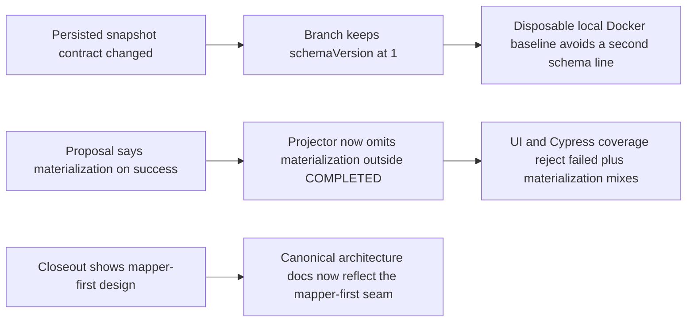

# TF-C2-B runtime read-surface hard QA review

## Artifact Metadata

### Markdown Artifact Path Suggestion

- `docs/planning/reviews/execution-runtime/20260409-tf-c2-b-read-surface-hard-qa-review.md`

## Summary

This review records the hard, evidence-first QA pass for Lane C `TF-C2-B` after
the runtime read surface moved from flat outcome fields to a nested
`execution` object and the projector was decomposed into mapper-first
normalization plus focused mutation handlers.

The goal of this QA pass is to verify four things:

- the persisted snapshot contract can evolve without serving stale rows as if
  they were current truth;
- the canonical engine and frontend contract docs actually describe the shipped
  read surface;
- the new `execution.materialization` semantics are coherent with the product
  contract on failed runs;
- canonical diagrams, not only closeout notes, reflect the new mapper-first
  projection seam.

Canonical execution tracking remains in:

- `docs/planning/state/agent-lane-c.yaml`
- `docs/planning/closeouts/20260408-tf-c2-b-read-surface-evidence-closeout.md`
- `docs/planning/proposals/mandatory/runtime-and-contracts/tf-c2-b-runtime-read-surface-evidence-plan-20260408.md`

This document is the hard-QA intake, correction map, and Definition of Done
baseline for closing `TF-C2-B` credibly.

Debt handling for this review:

- the canonical contract/doc drift finding was closed in the follow-up TF-C2-B
  hardening slices that updated the engine/frontend contract entrypoints and
  current-state diagram pack
- the failed-run materialization semantics finding is now closed in
  `R-20260409-TF-C2-B-FAILED-RUN-MATERIALIZATION-SEMANTICS`
- the previous snapshot schema-version blocker is closed in development by
  keeping `schemaVersion = 1` on the disposable local Docker baseline instead
  of carrying a second snapshot-schema line

## Governing Sources

- `docs/planning/status/governance-document-rule-inventory.md`
- `AGENTS.md`
- `docs/guides/ai-work-protocol.md`
- `docs/planning/state/planning-control-tower.md`
- `docs/planning/reviews/review-status-board.md`
- `docs/planning/reviews/review-naming-policy.md`
- `docs/planning/templates/qa/TEMPLATE_QA_ARTIFACT_EXAMPLE.md`
- `docs/adr/ADR-0004-event-sourcing-strategy.md`
- `docs/adr/ADR-0015-getRunStatus-read-model-separation.md`
- `docs/adr/ADR-0039-hexagonal-port-hardening-and-solid-remediation.md`
- `docs/architecture/engine/VERSIONING.md`
- `docs/planning/proposals/mandatory/runtime-and-contracts/transformation-flow-architecture-and-contracts-20260405.md`
- `docs/planning/proposals/mandatory/runtime-and-contracts/tf-c2-b-runtime-read-surface-evidence-plan-20260408.md`

## Findings

### High

- Title: Persisted snapshot safety now stays on one schema line and rebuilds
  one disposable development baseline.
  Why it matters: the development branch explicitly wants one internal snapshot
  schema line. In the current disposable local Docker posture, that means
  staying on `schemaVersion = 1` instead of introducing a second schema number.
  Closure evidence:
  - `packages/@dvt/contracts/src/engine/IRunStateStore.v1.ts:142-148` now
    states the development baseline remains on `schemaVersion = 1`.
  - `packages/@dvt/engine/src/ports/IRunStateStore.ts:142-148` mirrors the same
    single-line baseline for engine consumers.
  - `packages/@dvt/adapter-postgres/src/PostgresRunSnapshotStore.ts:122-126`
    still rebuilds on real schema mismatch, but the branch no longer introduces
    a `2` line purely for this TF-C2-B development slice.
    Risk: if persisted snapshots become a compatibility concern outside the
    disposable local baseline, this posture will need a governed revisit.
    Recommendation: keep the single-line development policy explicit and avoid
    inventing snapshot-schema branches until a real migration problem exists.

- Title: Canonical contract docs now describe the shipped run-status shape.
  Why it matters: this slice changes caller-visible runtime read semantics. If
  canonical docs still describe the old shape, the branch is green only in code,
  not in repository truth.
  Closure evidence:
  - `docs/architecture/engine/VERSIONING.md:39-45`, `:82-85`, and `:98-103`
    require canonical contract docs and dependent docs to be updated when
    contract behavior changes.
  - `docs/architecture/components/engine/contracts/engine/IWorkflowEngine.v1.md`
    now exposes the nested `execution` object on the active read boundary.
  - `docs/architecture/components/web/runs/frontend-runtime-contract-technical-manual.md`
    now documents the shipped `execution` evidence fields and their
    operator-facing semantics.
    Residual risk: future contract changes still need the same canonical-doc
    discipline; this fix only closes the TF-C2-B drift.
    Recommendation: keep treating contract entrypoints, not closeout notes, as
    the source of truth for caller-visible read surfaces.

- Title: Caller-visible `execution.materialization` is now success-only in code, tests, and docs.
  Why it matters: a read model that simultaneously communicates failure and
  materialization success needs explicit semantics. Right now the product docs
  and the implementation now converge on one rule.
  Closure evidence:
  - `docs/planning/proposals/mandatory/runtime-and-contracts/transformation-flow-architecture-and-contracts-20260405.md:439-445`
    requires `execution.materialization` "on success" and `execution.failure.*`
    on failure.
  - `packages/@dvt/run-domain/src/applyRunEvent.ts` now clears
    `execution.materialization` on failure and cancel paths.
  - `packages/@dvt/engine/src/core/SnapshotProjector.ts` now omits
    materialization outside `COMPLETED` so engine canonical reads match the
    normative contract at source.
  - `apps/web/src/app/views/runs/RunStates.test.tsx` and
    `apps/web/cypress/e2e/canvas/canvas-preview-run-persisted.cy.ts` now assert
    failed snapshots render failure diagnostics without materialization
    evidence.
    Residual risk: future UI fixtures or non-API read consumers could drift if
    they bypass the canonical projector rule.
    Recommendation: keep projector-level regression coverage as the primary
    guardrail for this semantic.

### Medium

- Title: Canonical architecture diagrams now show the mapper-first projection seam.
  Why it matters: this slice was sold as a structural remediation, not just a
  DTO rename. The canonical architecture surfaces should show the new
  decomposition instead of leaving it trapped in the closeout note.
  Closure evidence:
  - `docs/architecture/diagrams/implementation-architecture-diagrams.md` now
    routes readers into the extracted current-state diagram pack.
  - `docs/architecture/diagrams/engine-internal-components.md` and
    `docs/architecture/components/engine/architecture/workflow-engine-subsystem-context.md`
    now show the mapper-first read seam instead of the old projector-only
    narrative.
    Residual risk: diagram truth can still drift if future refactors update
    code/tests without touching the extracted diagram pack.
    Recommendation: keep the smaller diagram docs current instead of letting
    truth accumulate in closeout notes.

### Low

- No low-severity findings.

## Alignment

- Doc vs code:
  Aligned for the TF-C2-B read surface. Canonical engine/frontend docs and the
  extracted current-state diagram pack now describe the shipped `execution`
  shape and mapper-first projection posture.
- Promise vs implementation:
  Aligned. Caller-visible `execution.materialization` is now success-only in
  projector, API, UI, and regression coverage.
- Tests vs claims:
  Aligned for the closed findings in this review. Regression coverage now
  protects the success-only materialization rule and the updated contract/docs.
- Current truth vs planned truth:
  The branch matches the chosen development posture for snapshots and the
  caller-visible materialization rule. Remaining TF-C2-B closeout work is now
  limited to any still-open follow-up tasks outside this review artifact.
- Documentation update status:
  Updated in canonical engine/frontend docs, current-state diagrams, planning,
  evidence, and risk surfaces touched by the slice.
- Evidence and risk-doc status when applicable:
  ARC evidence and risk docs exist for the slice; the failed-run
  materialization risk entry is now closed to match the shipped behavior.

## Architecture Assessment

- SRP:
  Improved in code. Mapper-first normalization reduces the projector blob.
- DDD:
  Improved in code and documentation. The read-model contract is now
  canonically described.
- Hexagonal:
  Improved. Normalization moved out of the projector and the architecture docs
  now depict that seam.
- CQRS if relevant:
  Improved. The branch keeps one development snapshot schema line and avoids a
  premature migration story in a disposable local environment.
- Complexity:
  Reasonable in the implementation. Documentary complexity is lower now that
  current-state truth is in canonical contracts and the extracted diagram pack.
- Modularity:
  Improved in code, canonical diagrams, and manuals.

## Test Assessment

- Negative paths present:
  - malformed step events without `stepId` are covered in
    `packages/@dvt/run-domain/test/applyRunEvent.test.ts`
  - run-state transition guards are covered in
    `packages/@dvt/run-domain/test/applyRunEvent.test.ts`
  - frontend snapshot rendering covers absence of evidence and presence of
    failure and success-only materialization fields in
    `apps/web/src/app/views/runs/RunStates.test.tsx`
- Negative paths missing:
  - no documentary fitness test guarding canonical contract docs against stale
    `RunStatusSnapshot` examples
- Regression status:
  Semantic and documentary blockers from this review are now closed on the
  current branch; repo gates still need to be rerun after each follow-up edit.
- Determinism:
  The mapper-first projection remains deterministic. Snapshot-version posture is
  no longer the hard-QA blocker for this branch.
- Local suite vs meaningful global confidence:
  Good code confidence for touched packages. The remaining confidence gap is
  mostly around broader system behavior that sits outside this review scope.
- Global system view applied:
  Yes. This review checked contracts, persisted snapshots, API/web consumers,
  architecture docs, and planning surfaces together.
- Harness or shared fixture need:
  No additional harness blocker was required for the snapshot-version posture.
- Test grouping by type (`unit` / `integration` / `contract` / `e2e` / regression) and rationale:
  - `contract`: `packages/@dvt/contracts/test/validation.test.ts`
  - `unit/regression`: `packages/@dvt/run-domain/test/applyRunEvent.test.ts`
  - `engine regression`: `packages/@dvt/engine/test/core/SnapshotProjector.transitions.test.ts`
  - `integration`: `apps/api/test/...getRunStatus...`, `apps/api/test/...getRunEvents...`
  - `ui regression`: `apps/web/src/app/views/runs/RunStates.test.tsx`
  - `e2e fixture regression`: `apps/web/cypress/e2e/canvas/canvas-preview-run-persisted.cy.ts`

## Quality Gates

- Commands executed:
  - `pnpm --filter @dvt/run-domain test`
  - `pnpm --filter @dvt/engine test`
  - `pnpm --filter dvt-api typecheck`
  - `pnpm --filter dvt-api test`
  - `pnpm --filter dvt-api test:arch`
  - `pnpm --filter @dvt/web typecheck`
  - `pnpm --filter @dvt/web test`
  - `pnpm docs:workboard:generate`
  - `pnpm docs:planning:generated:check`
  - `pnpm exec markdownlint-cli2 "docs/architecture/components/engine/contracts/engine/ExecutionSemantics.v1.md" "docs/architecture/components/web/runs/frontend-runtime-contract-technical-manual.md" "docs/planning/reviews/execution-runtime/20260409-tf-c2-b-read-surface-hard-qa-review.md"`
  - `pnpm verify:prepush`
- What passed:
  - touched package tests and type-checks for run-domain, engine, API, and web
  - docs/planning regeneration checks
  - targeted markdown lint on the governed docs touched by the slice
  - repo pre-push validation gate
- What failed:
  - no command failed in the final closeout baseline
  - this review originally identified documentary truth and semantic-closure
    blockers; those findings are now closed on the current branch
- What could not be verified:
  - targeted Cypress execution of
    `apps/web/cypress/e2e/canvas/canvas-preview-run-persisted.cy.ts` was
    blocked locally by the Cypress launcher environment, not by a spec
    assertion failure
  - real executor emission from `TF-C2-A` remains out of scope for this review
  - GitHub-hosted CI status was not used as the documentary source of truth for
    this artifact

## Current-state contradiction map

## Unblock Roadmap

### Wave 0 - Contract truth

Tasks: `TF-C2-B-QA-02`

Target:

- canonical engine and frontend contracts describe the shipped `execution`
  object and its compatibility posture.

Status: closed on current branch.

### Wave 1 - Semantic ownership closure

Tasks: `TF-C2-B-QA-03`

Target:

- the system has one governed meaning for `execution.materialization` on failed
  runs, with code, docs, and tests all aligned.

Status: closed on current branch.

### Wave 2 - Architecture and closure evidence

Tasks: `TF-C2-B-QA-04`, `TF-C2-B-QA-05`

Target:

- canonical architecture diagrams show the mapper-first projector seam;
- lane and review surfaces state the real blocker posture before the PR is
  considered closure-ready.

Status: closed on current branch for `TF-C2-B-QA-04` and `TF-C2-B-QA-05`.

## Action Artifact

### Task Checklist

- [x] `TF-C2-B-QA-01` Keep `WorkflowSnapshot` schemaVersion at `1` for the disposable development baseline
- [x] `TF-C2-B-QA-02` Update canonical engine and frontend contract docs for `RunStatusSnapshot.execution`
- [x] `TF-C2-B-QA-03` Reconcile failed-run materialization semantics in code, tests, and contract docs
- [x] `TF-C2-B-QA-04` Update canonical architecture diagrams to show mapper-first projection
- [x] `TF-C2-B-QA-05` Re-run validation, update lane truth, and close the slice with consistent evidence

### Task Details

#### `TF-C2-B-QA-01` Keep `WorkflowSnapshot` schemaVersion at `1` for the disposable development baseline

- Objective: Prevent stale persisted snapshot rows from being treated as current
  truth after the `execution` shape landed while keeping one development schema
  line.
- Scope: `IRunStateStore` contract, snapshot stores, migration-sensitive tests,
  and related evidence docs.
- Recommended owner: Lane C runtime/contracts owner.
- Dependencies: none.
- Documentation impact: update evidence/closeout text to record the migration
  consequence explicitly.
- Evidence / risk-doc impact: existing ARC evidence/risk docs should be updated
  once the schema-version fix lands.
- Comment with rationale: this is the most serious hard-QA finding because it
  affects persisted state truth, not just prose.
- Definition of Done:
  - `CURRENT_WORKFLOW_SNAPSHOT_SCHEMA_VERSION` stays at `1`;
  - the branch does not introduce a `2` snapshot-schema line for TF-C2-B;
  - planning and QA surfaces reflect the disposable development posture
    explicitly.

#### `TF-C2-B-QA-02` Update canonical engine and frontend contract docs for `RunStatusSnapshot.execution`

- Objective: make repository truth match the shipped read surface.
- Scope: engine contract docs, reference docs, and frontend runtime contract
  manual.
- Recommended owner: Architecture + runtime/frontend owners.
- Dependencies: `TF-C2-B-QA-01`.
- Documentation impact: direct and required by the contract versioning policy.
- Evidence / risk-doc impact: none beyond normal docs sync unless additional
  governed contract docs are introduced.
- Comment with rationale: closeout/evidence docs are not a substitute for the
  canonical contract entrypoints.
- Definition of Done:
  - canonical docs show the `execution` object;
  - stale examples are removed or versioned correctly;
  - dependent manual text explains operator-visible semantics.

#### `TF-C2-B-QA-03` Reconcile failed-run materialization semantics in code, tests, and contract docs

- Objective: remove the contradiction between proposal language and shipped UI
  behavior.
- Scope: projector mutation rules, UI expectations, and contract/proposal text.
- Recommended owner: Lane C runtime owner with product/architecture review.
- Dependencies: `TF-C2-B-QA-02`.
- Documentation impact: product and architecture docs must name the chosen
  semantics explicitly.
- Evidence / risk-doc impact: update current evidence if the semantic decision
  changes the user-facing meaning of the field.
- Comment with rationale: without a governed meaning, the read surface can
  communicate mutually contradictory success/failure signals.
- Definition of Done:
  - the system either clears materialization on failure or documents and tests
    coexistence as intentional;
  - one regression test protects the chosen rule.
- Current branch closure:
  - projector now clears caller-visible materialization on failure and cancel
    paths;
  - API and UI now expose materialization only for successful snapshots.

#### `TF-C2-B-QA-04` Update canonical architecture diagrams to show mapper-first projection

- Objective: publish the new decomposition where engineers will actually look
  for it.
- Scope: engine architecture diagrams and subsystem context docs.
- Recommended owner: Architecture / runtime owner.
- Dependencies: `TF-C2-B-QA-02`.
- Documentation impact: add or update Mermaid diagrams under canonical
  architecture surfaces.
- Evidence / risk-doc impact: none expected for docs-only work.
- Comment with rationale: target-state truth belongs in canonical architecture,
  not only in closeout notes.
- Definition of Done:
  - at least one canonical engine diagram shows the mapper-first seam;
  - subsystem sequence text matches the implementation.

#### `TF-C2-B-QA-05` Re-run validation, update lane truth, and close the slice with consistent evidence

- Objective: make planning status match hard-QA reality after the blockers are
  resolved.
- Current branch closure:
  - lane truth and risk status now reflect the resolved failed-run
    materialization rule;
  - package tests, docs/planning checks, and `verify:prepush` were rerun on the
    slice.
- Scope: lane state, review board, closeout/evidence updates, and final
  validation.
- Recommended owner: Lane C owner.
- Dependencies: `TF-C2-B-QA-01..04`.
- Documentation impact: direct because the lane currently overstates closure
  readiness.
- Evidence / risk-doc impact: existing ARC docs should be refreshed if the fix
  changes contracts or snapshot semantics again.
- Comment with rationale: a slice is not closure-ready if planning state says
  "remaining dependency is executor emission" while documentary blockers still
  exist.
- Definition of Done:
  - lane status_reason matches current truth;
  - review board links this hard-QA artifact;
  - validation evidence is re-run after fixes.
