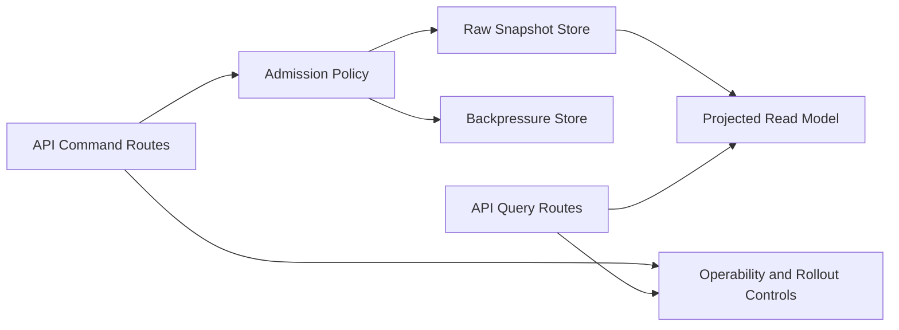

# API And Admission Architecture Delta

Architecture delta view for API admission and query-side hardening.

## Missing / Residual Architecture Focus

- admission policy orchestration under burst backpressure
- raw-store and projected read-model coherence for operational reads
- rollout safety gates and operability controls across PR1..PR5

## References

- [Domain - API And Admission](../../domains/api-and-admission.md)
- [Gap 4 Admission Design](../../proposals/gap4-backpressure-admission-design-20260319.md)
