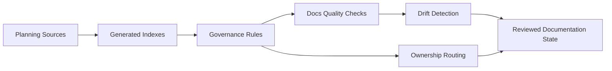

# Documentation Governance Architecture Delta

Architecture delta view for documentation governance and planning hygiene.

## Missing / Residual Architecture Focus

- automated drift detection between roadmap, status, gaps, and closeouts
- stronger ownership routing for planning-domain updates
- continuous quality gate posture for docs structure and references

## References

- [Domain - Documentation Governance](../../domains/documentation-governance.md)
- [Governance Document And Rule Inventory](../../status/governance-document-rule-inventory.md)
