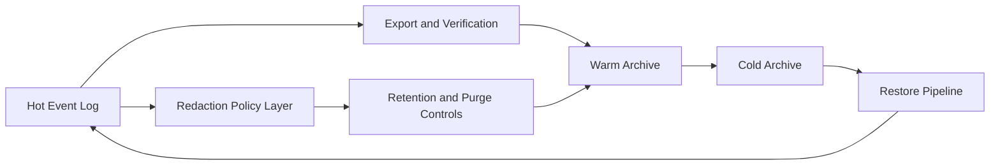

# Event Lifecycle And Retention Architecture Delta

Architecture delta view for event archival lifecycle and retention controls.

## Missing / Residual Architecture Focus

- hot/warm/cold tier boundaries with explicit archival transitions
- restore workflow and verification chain for replay-safe recovery
- redaction and retention policy enforcement without mutating canonical log

## References

- [Domain - Event Lifecycle And Retention](../../domains/event-lifecycle-and-retention.md)
- [Gap 5 Event Lifecycle Design](../../proposals/gap-5-event-lifecycle-and-archival-design-20260319.md)
