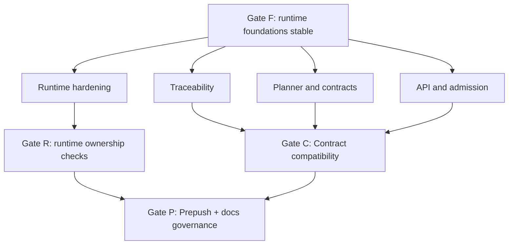

# Execution Dependency Gates

Execution dependencies with synchronization gates.

## Canonical References

- [GitHub MVP Issue Workflow](../../state/github-mvp-issue-workflow.md)
- [Roadmap By Domain](../roadmap-by-domain.md)
