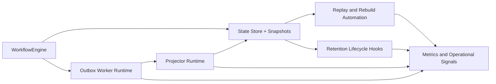

# Execution Runtime Architecture Delta

Architecture delta view for remaining runtime hardening when new slices are
opened.

## Missing / Residual Architecture Focus

- deterministic replay and rebuild automation hardening
- projector/runtime ownership and fencing observability
- retention-lifecycle hooks aligned with archival policies

## References

- [Domain - Execution Runtime](../../domains/execution-runtime.md)
- [Gap Execution Route](../../state/gap-execution-route.md)
