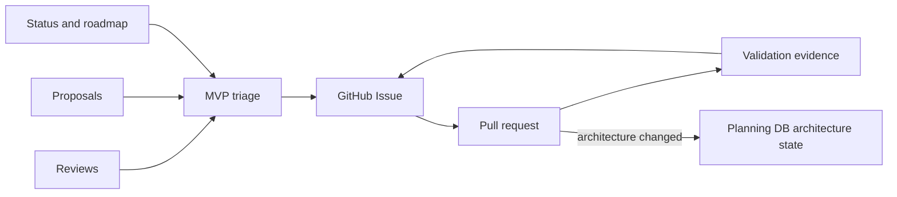

# MVP Execution Tracking Flow

Single flow for converting planning inputs into GitHub Issues, reviewed PRs,
and architecture evidence without a parallel local backlog.

## Canonical Links

- [GitHub MVP Issue Workflow](../../state/github-mvp-issue-workflow.md)
- [Planning Dashboard](../../state/planning-dashboard.md)
- [Roadmap By Domain](../roadmap-by-domain.md)
- [Roadmap Of Record](../index.md)
