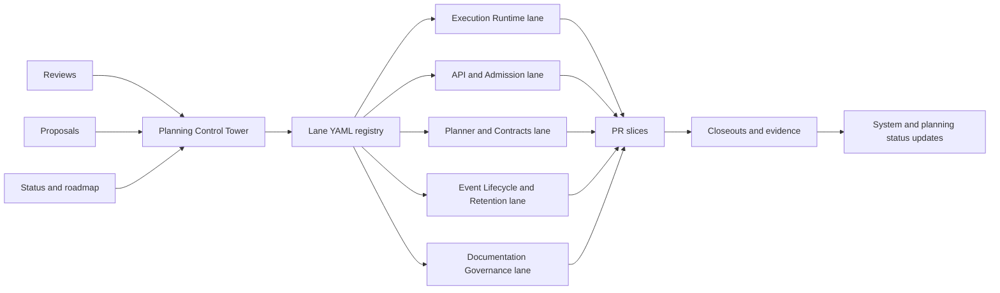

# Execution Tracking Flow

Single flow for converting planning inputs into execution tasks and roadmap
impact tracking.

## Canonical Links

- [Planning Control Tower](../../state/planning-control-tower.md)
- [Agent Lane A YAML](../../state/agent-lane-a.yaml)
- [Agent Lane B YAML](../../state/agent-lane-b.yaml)
- [Agent Lane C YAML](../../state/agent-lane-c.yaml)
- [Agent Lane D YAML](../../state/agent-lane-d.yaml)
- [Agent Lane E YAML](../../state/agent-lane-e.yaml)
- [Roadmap By Domain](../roadmap-by-domain.md)
- [Roadmap Of Record](../index.md)
