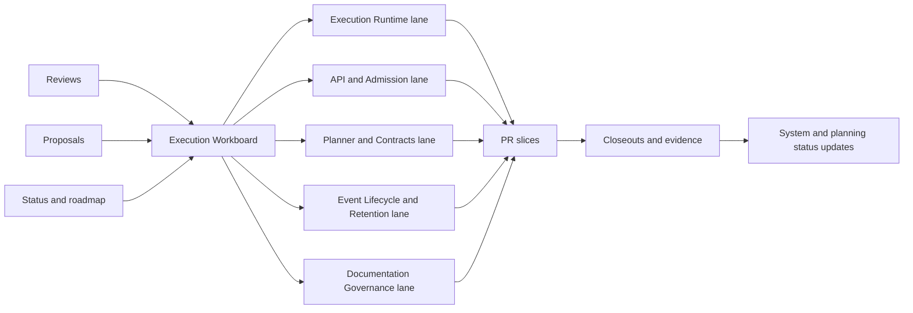

# Execution Tracking Flow

Single flow for converting planning inputs into execution tasks and roadmap
impact tracking.

## Canonical Links

- [Execution Workboard](../../state/execution-workboard.md)
- [Open Task Route](../../state/open-task-route.md)
- [Roadmap By Domain](../roadmap-by-domain.md)
- [Roadmap Of Record](../index.md)
