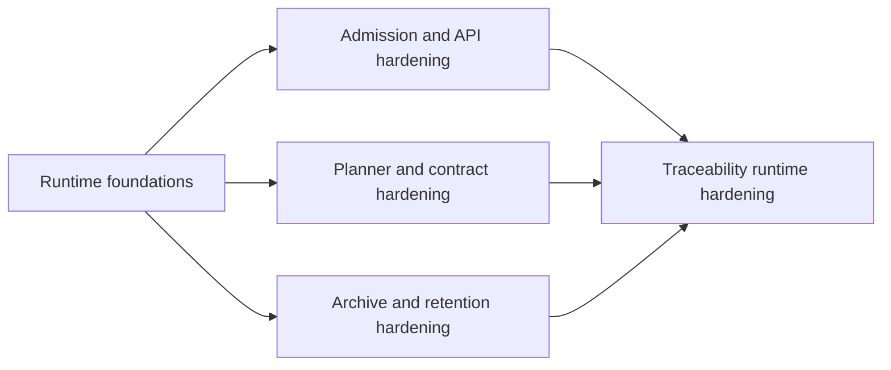

# Execution Dependency Graph

Dependency graph for the current execution-order assumptions that still shape
follow-up work.

## Canonical References

- [Execution Workboard](../../state/execution-workboard.md)
- [Roadmap By Domain](../roadmap-by-domain.md)
