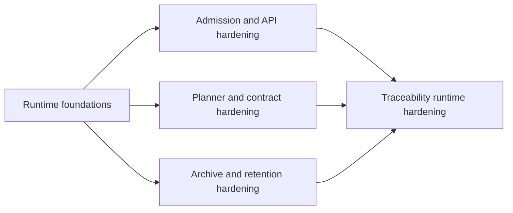

# Execution Dependency Graph

Dependency graph for the current execution-order assumptions that still shape
follow-up work.

## Canonical References

- [GitHub MVP Issue Workflow](../../state/github-mvp-issue-workflow.md)
- [Roadmap By Domain](../roadmap-by-domain.md)
