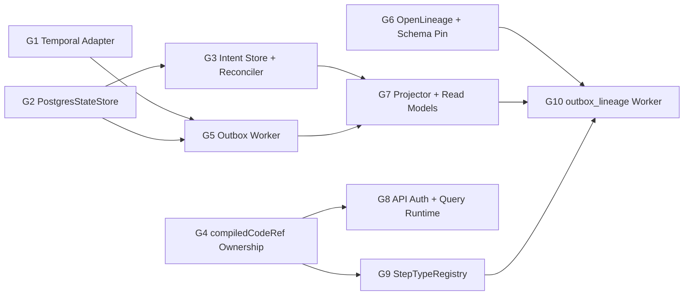

# Gap Execution Dependency Graph

Dependency graph for operational gap execution ordering.

## Canonical References

- [Gap Execution Plans](../../gaps/GAP_EXECUTION_PLANS.md)
- [Gap Execution Route](../../state/gap-execution-route.md)
