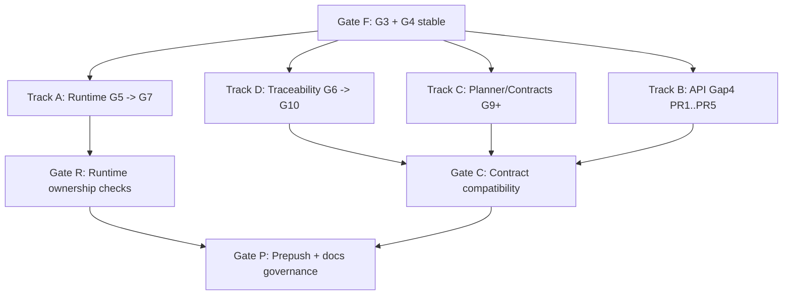

# Gap Execution Parallel Lanes

Parallel lane model with synchronization gates.

## Canonical References

- [Gap Execution Route](../../state/gap-execution-route.md)
- [Roadmap By Domain](../roadmap-by-domain.md)
