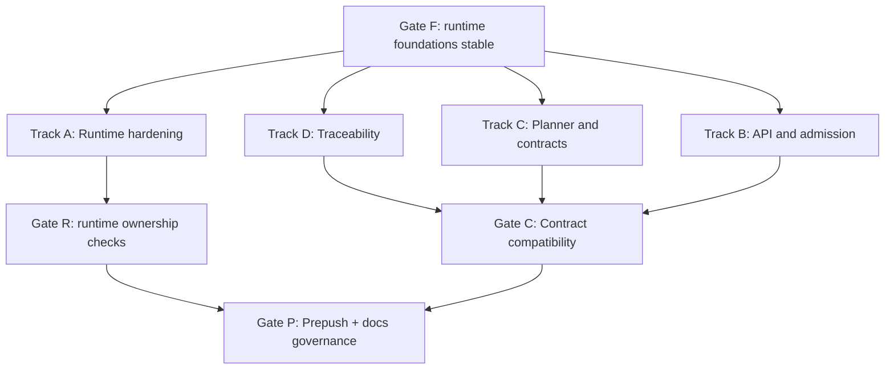

# Execution Parallel Lanes

Parallel lane model with synchronization gates.

## Canonical References

- [Planning Control Tower](../../state/planning-control-tower.md)
- [Roadmap By Domain](../roadmap-by-domain.md)
