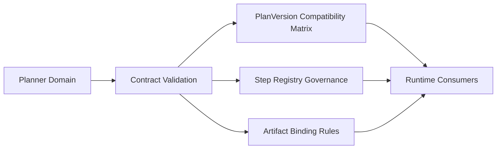

# Planner And Contracts Architecture Delta

Architecture delta view for planner stabilization and contract evolution.

## Missing / Residual Architecture Focus

- planVersion compatibility matrix hardening across runtime boundaries
- step-kind registry governance and policy vocabulary alignment
- artifact binding and canonicalization flow as executable contract

## References

- [Domain - Planner And Contracts](../../domains/planner-and-contracts.md)
- [Planner Target State Roadmap](../../proposals/planner-target-state-roadmap-20260320.md)
