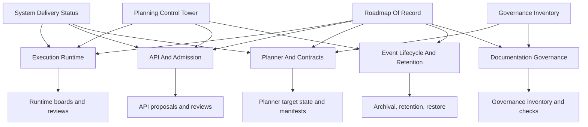

# Planning Domain Map

Cross-domain planning map showing canonical relationships between roadmap,
status, and delivery artifacts.

## Source Pages

- [Roadmap Of Record](../index.md)
- [Roadmap by Domain](../roadmap-by-domain.md)
- [Planning Domains](../../domains/index.md)
- [Planning State](../../state/index.md)
