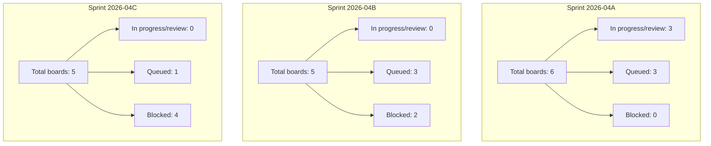

# Review Sprint Capacity By Sprint 2026-04

## Readout

- Sprint `2026-04A` carries current execution load.
- Sprint `2026-04B` is partially preloaded but blocked on board dependencies.
- Sprint `2026-04C` is mostly dependency-gated and should not be pulled forward
  until upstream gates close.
