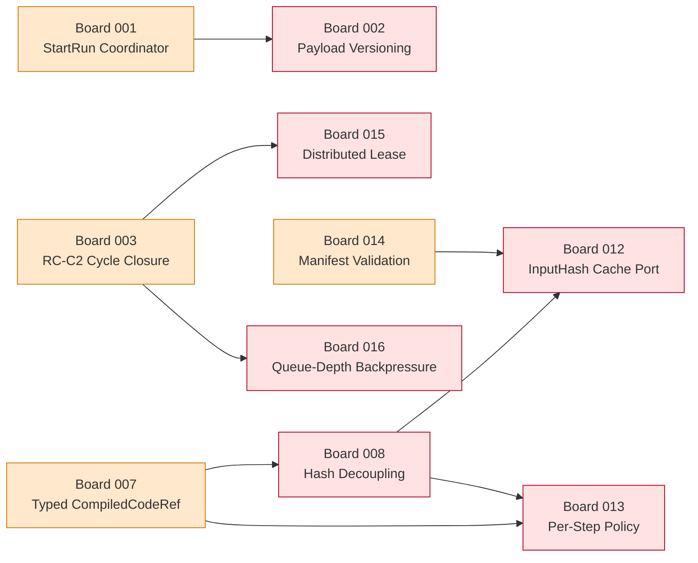

# Review Sprint Critical Path 2026-04

```mermaid
flowchart LR
  A003["Board 003<br/>RC-C2 Cycle Closure"]
  A001["Board 001<br/>StartRun Coordinator"]
  A002["Board 002<br/>Payload Versioning"]
  B007["Board 007<br/>Typed CompiledCodeRef"]
  B008["Board 008<br/>Hash Decoupling"]
  C014["Board 014<br/>Manifest Validation"]
  C012["Board 012<br/>InputHash Cache Port"]
  C013["Board 013<br/>Per-Step Policy"]
  C015["Board 015<br/>Distributed Lease"]
  C016["Board 016<br/>Queue-Depth Backpressure"]

  A001 --> A002
  B007 --> B008
  B008 --> C012
  C014 --> C012
  B007 --> C013
  B008 --> C013
  A003 --> C015
  A003 --> C016

  classDef gate fill:#ffe8cc,stroke:#cc7a00,stroke-width:1px;
  classDef blocked fill:#ffe3e3,stroke:#b00020,stroke-width:1px;
  class A003,A001,B007,C014 gate;
  class A002,B008,C012,C013,C015,C016 blocked;
```
