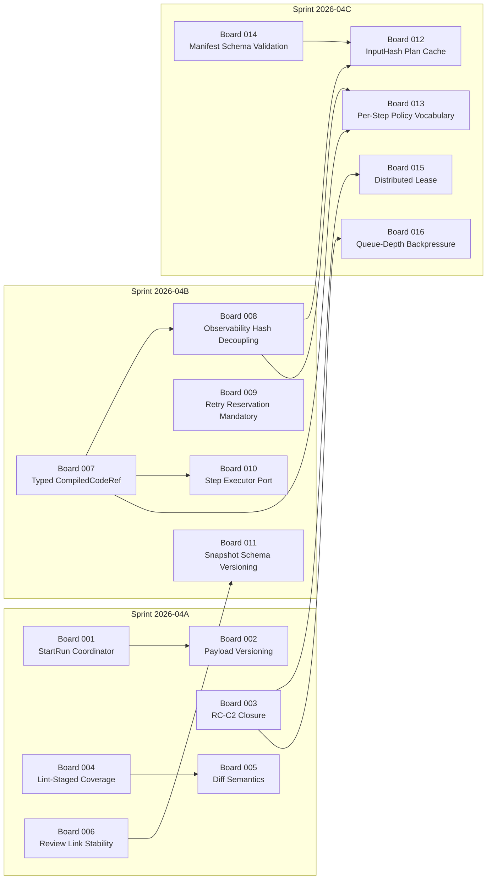

# Review Sprint Dependency Graph 2026-04

```mermaid
flowchart LR
  subgraph A[Sprint 2026-04A]
    A001["Board 001<br/>StartRun Coordinator"]
    A002["Board 002<br/>Payload Versioning"]
    A003["Board 003<br/>RC-C2 Closure"]
    A004["Board 004<br/>Lint-Staged Coverage"]
    A005["Board 005<br/>Diff Semantics"]
    A006["Board 006<br/>Review Link Stability"]
  end

  subgraph B[Sprint 2026-04B]
    B007["Board 007<br/>Typed CompiledCodeRef"]
    B008["Board 008<br/>Observability Hash Decoupling"]
    B009["Board 009<br/>Retry Reservation Mandatory"]
    B010["Board 010<br/>Step Executor Port"]
    B011["Board 011<br/>Snapshot Schema Versioning"]
  end

  subgraph C[Sprint 2026-04C]
    C012["Board 012<br/>InputHash Plan Cache"]
    C013["Board 013<br/>Per-Step Policy Vocabulary"]
    C014["Board 014<br/>Manifest Schema Validation"]
    C015["Board 015<br/>Distributed Lease"]
    C016["Board 016<br/>Queue-Depth Backpressure"]
  end

  A001 --> A002
  A004 --> A005
  A003 --> C015
  A003 --> C016

  B007 --> B008
  B007 --> B010
  B008 --> C012
  C014 --> C012
  B008 --> C013
  B007 --> C013

  A006 --> B011
```
