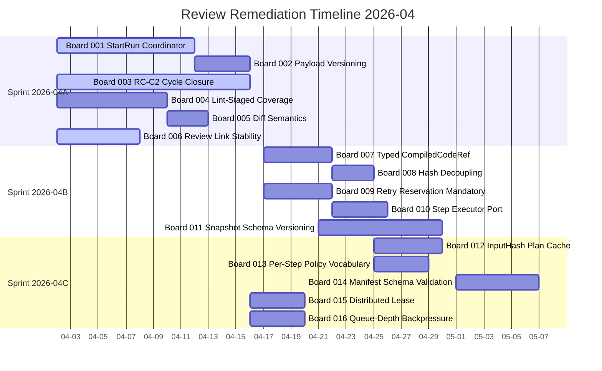

# Review Sprint Timeline 2026-04

```mermaid
gantt
  title Review Remediation Timeline 2026-04
  dateFormat  YYYY-MM-DD
  axisFormat  %m-%d

  section Sprint 2026-04A
  Board 001 StartRun Coordinator         :active, a1, 2026-04-02, 10d
  Board 002 Payload Versioning           :a2, after a1, 4d
  Board 003 RC-C2 Cycle Closure          :active, a3, 2026-04-02, 14d
  Board 004 Lint-Staged Coverage         :a4, 2026-04-02, 8d
  Board 005 Diff Semantics               :a5, after a4, 3d
  Board 006 Review Link Stability        :active, a6, 2026-04-02, 6d

  section Sprint 2026-04B
  Board 007 Typed CompiledCodeRef        :b1, 2026-04-17, 5d
  Board 008 Hash Decoupling              :b2, after b1, 3d
  Board 009 Retry Reservation Mandatory   :b3, 2026-04-17, 5d
  Board 010 Step Executor Port           :b4, after b1, 4d
  Board 011 Snapshot Schema Versioning   :b5, 2026-04-21, 9d

  section Sprint 2026-04C
  Board 012 InputHash Plan Cache         :c1, after b2, 5d
  Board 013 Per-Step Policy Vocabulary   :c2, after b2, 4d
  Board 014 Manifest Schema Validation   :c3, 2026-05-01, 6d
  Board 015 Distributed Lease            :c4, after a3, 4d
  Board 016 Queue-Depth Backpressure     :c5, after a3, 4d
```
