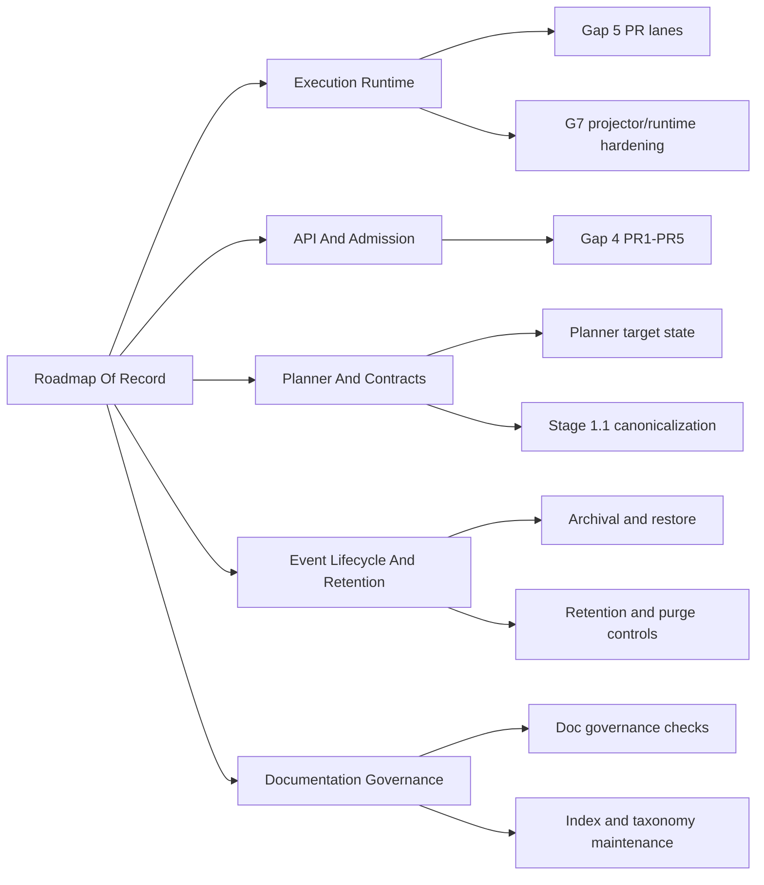

# Roadmap By Domain

Domain-oriented roadmap overlay for the canonical roadmap of record.

This file complements, but does not replace, [Roadmap Of Record](index.md).

## Domain Lanes

## Sequencing By Lane

- `Execution Runtime`
  Current sources: [Gap 5 Executive Roadmap](gap-5-executive-delivery-roadmap-20260319.md),
  [G5 Tracker](../gaps/G5-AI-EXECUTION-TRACKER.md)
  Near-term target: close residual runtime and hardening slices with
  evidence-backed closeouts.
- `API and Admission`
  Current sources: [Gap 4 PR Set](../proposals/gap4-backpressure-admission-design-20260319.md)
  Near-term target: deliver admission/backpressure sequence with rollout
  observability.
- `Planner and Contracts`
  Current sources: [Planner Target State Roadmap](../proposals/planner-target-state-roadmap-20260320.md),
  [Planner Assessment](../status/planner-current-state-assessment-20260320.md)
  Near-term target: stage compatibility, policy vocabulary, and contract
  evolution hardening.
- `Event Lifecycle and Retention`
  Current sources: [Gap 5 Lifecycle Design](../proposals/gap-5-event-lifecycle-and-archival-design-20260319.md),
  [Gap Execution Plans](../gaps/GAP_EXECUTION_PLANS.md)
  Near-term target: retention, archival, restore, and purge controls aligned
  with ADR-backed policy.
- `Documentation Governance`
  Current sources: [Governance Inventory](../status/governance-document-rule-inventory.md),
  [Docs Proposal Set](../proposals/repository-governance-proposal-set-20260317.md)
  Near-term target: keep planning map coherent and reduce navigation friction
  by domain.

## Related Diagrams

- [Execution Workboard](../state/execution-workboard.md)
- [Planning Domain Map](diagrams/planning-domain-map.md)
- [Gap Execution Dependency Graph](diagrams/gap-execution-dependency-graph.md)
- [Gap Execution Parallel Lanes](diagrams/gap-execution-parallel-lanes.md)
- [Execution Runtime Architecture Delta](diagrams/execution-runtime-architecture-delta.md)
- [API and Admission Architecture Delta](diagrams/api-admission-architecture-delta.md)
- [Planner and Contracts Architecture Delta](diagrams/planner-contracts-architecture-delta.md)
- [Event Lifecycle and Retention Architecture Delta](diagrams/event-lifecycle-retention-architecture-delta.md)
- [Documentation Governance Architecture Delta](diagrams/documentation-governance-architecture-delta.md)
- [Gap Execution Route](../state/gap-execution-route.md)
- [Execution Model Index](../execution-model/index.md)
