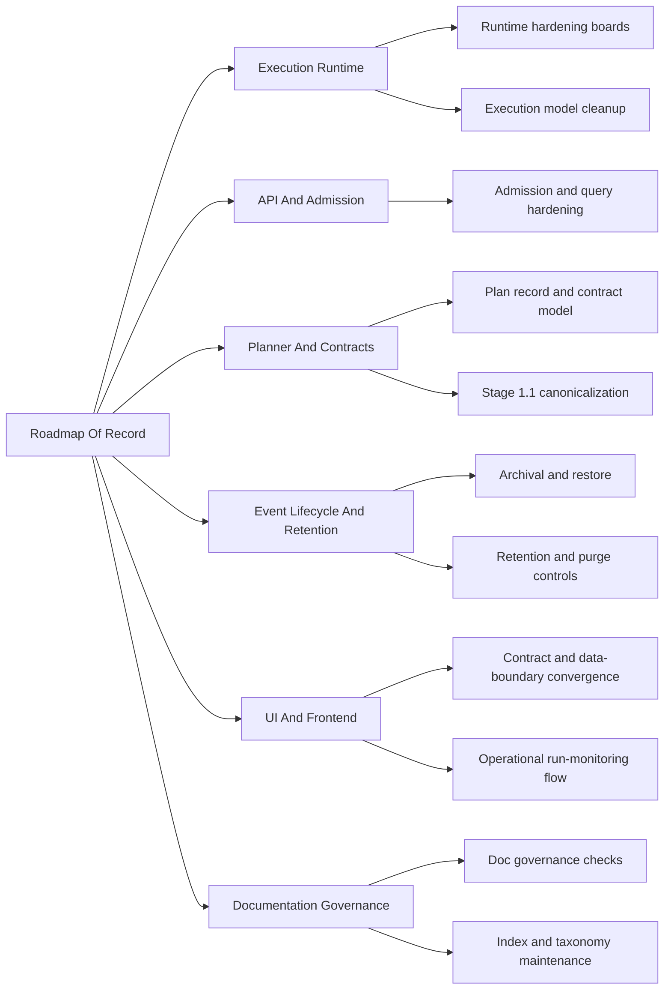

# Roadmap By Domain

Domain-oriented roadmap overlay for the canonical roadmap of record.

This file complements, but does not replace, [Roadmap Of Record](index.md).

## Domain Lanes

## Sequencing By Lane

- `Execution Runtime`
  Current sources: [Execution Runtime domain view](../domains/execution-runtime.md),
  [20260407 Engine boundary current/target review](../reviews/architecture-and-governance/20260407-engine-boundary-current-target-and-migration-review.md),
  [Engine Roadmap](../../architecture/engine/roadmap/engine-phases.md),
  [WorkflowEngine hexagonal derivation plan 2026-04-03](../proposals/mandatory/runtime-and-contracts/workflow-engine-hexagonal-derivation-plan-20260403.md),
  [Transformation Flow Delivery Plan 2026-04-05](../proposals/mandatory/runtime-and-contracts/transformation-flow-delivery-plan-20260405.md)
  Near-term target: close the remaining `WE-HX` hardening waves while opening
  `TF-C2` for the PostgreSQL executor path and caller-visible runtime evidence,
  while keeping Conductor cleanup scoped as truthfulness debt (`AR-A8`) rather
  than a second-provider phase.
- `API and Admission`
  Current sources: [API and Admission domain view](../domains/api-and-admission.md),
  [Transformation Flow Architecture And Contracts 2026-04-05](../proposals/mandatory/runtime-and-contracts/transformation-flow-architecture-and-contracts-20260405.md),
  [Transformation Flow Delivery Plan 2026-04-05](../proposals/mandatory/runtime-and-contracts/transformation-flow-delivery-plan-20260405.md),
  [Closeout: TF-C1-B preview profile contract](../closeouts/20260408-tf-c1-b-preview-profile-contract-closeout.md)
  Near-term target: keep preview-persist truthful on the protected route while
  converging callers onto explicit preview profiles, provenance rules, and the
  real persisted `PlanRef` path.
- `Planner and Contracts`
  Current sources: [Planner and Contracts domain view](../domains/planner-and-contracts.md),
  [Transformation Flow Product Decisions 2026-04-05](../proposals/mandatory/runtime-and-contracts/transformation-flow-product-decisions-20260405.md),
  [Transformation Flow Architecture And Contracts 2026-04-05](../proposals/mandatory/runtime-and-contracts/transformation-flow-architecture-and-contracts-20260405.md)
  Near-term target: freeze the first `DesignGraphDraft`, `GitArtifactRef`, and
  compiler mapping so downstream API, runtime, and UI work stop depending on
  local assumptions.
- `Event Lifecycle and Retention`
  Current sources: [Event Lifecycle and Retention domain view](../domains/event-lifecycle-and-retention.md),
  [20260330 MVP-D1 residual risk baseline review](../reviews/event-lifecycle-and-retention/20260330-mvp-d1-residual-risk-baseline-review.md),
  [Transformation Flow Delivery Plan 2026-04-05](../proposals/mandatory/runtime-and-contracts/transformation-flow-delivery-plan-20260405.md)
  Near-term target: keep the shipped retention baseline explicit while adding a
  repeatable Docker PostgreSQL reset/cleanup lifecycle for transformation proof
  runs.
- `UI and Frontend`
  Current sources: [web component](../../architecture/components/web/index.md),
  [Read subsystem](../../architecture/subsystems/read/index.md),
  [Frontend subsystem architecture](../../architecture/frontend/index.md),
  [UI / Visualization Domain](../../architecture/domain-ui.md),
  [Documentation and UX implementation guide](../../architecture/frontend/ux-implementation-guide.md),
  [Transformation Flow Delivery Plan 2026-04-05](../proposals/mandatory/runtime-and-contracts/transformation-flow-delivery-plan-20260405.md)
  Near-term target: keep Lane E aligned around explicit transformation
  authoring, persisted preview-to-run handoff, and snapshot-owned result
  surfaces while runtime evidence work catches up.
- `Documentation Governance`
  Current sources: [Governance Inventory](../status/governance-document-rule-inventory.md),
  [Doc-driven framework and tooling plan 2026-04-04](../proposals/mandatory/governance-and-docs/doc-driven-framework-and-tooling-plan-20260404.md),
  [Documentation maintenance guide](../../guides/documentation-maintenance-guide-20260407.md),
  [Documentation information architecture current vs target 2026-04-07](../status/documentation-information-architecture-current-vs-target-20260407.md)
  Near-term target: keep archives, lane registries, roadmaps, and generated
  boards synchronized with mainline truth, and reduce `docs:doctor` noise so it
  signals semantic drift instead of missing metadata.

## Related Diagrams

- [Planning Control Tower](../state/planning-control-tower.md)
- [Review Sprint Critical Path 2026-04](diagrams/review-sprint-critical-path-2026-04.md)
- [Planning Domain Map](diagrams/planning-domain-map.md)
- [Execution Runtime Architecture Delta](diagrams/execution-runtime-architecture-delta.md)
- [Engine Roadmap](../../architecture/engine/roadmap/engine-phases.md)
- [API and Admission Architecture Delta](diagrams/api-admission-architecture-delta.md)
- [Planner and Contracts Architecture Delta](diagrams/planner-contracts-architecture-delta.md)
- [Event Lifecycle and Retention Architecture Delta](diagrams/event-lifecycle-retention-architecture-delta.md)
- [Documentation Governance Architecture Delta](diagrams/documentation-governance-architecture-delta.md)
- [Execution Model Index](../execution-model/index.md)
