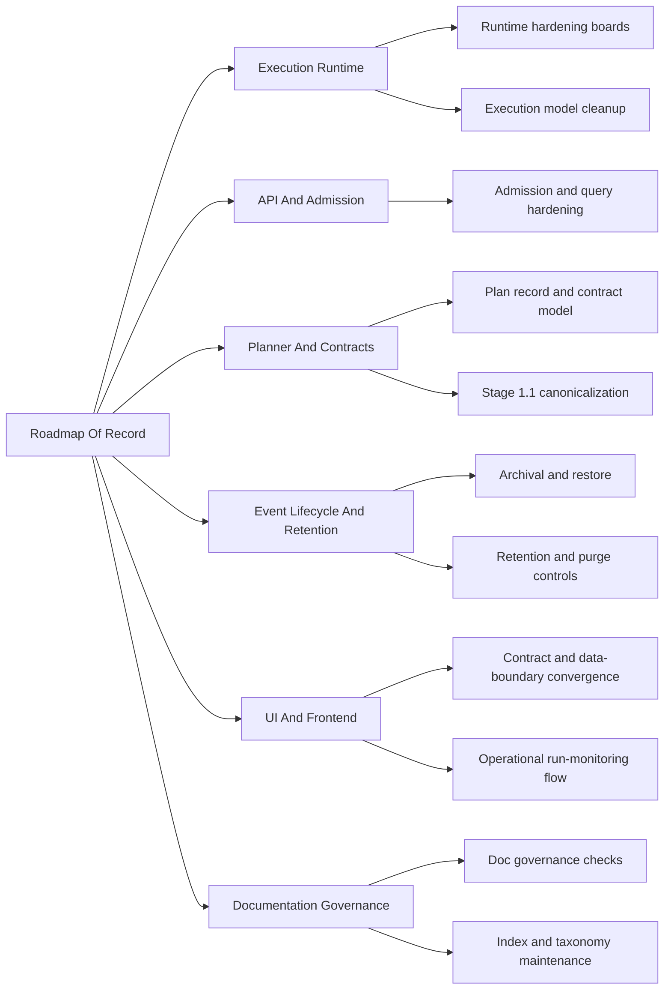

# Roadmap By Domain

Domain-oriented roadmap overlay for the canonical roadmap of record.

This file complements, but does not replace, [Roadmap Of Record](./index.md).
Read it with [Strategic Product Roadmap](strategic-product-roadmap.md) when the
question is not just sequence, but why the current domains matter to product
direction.

## Domain Lanes

## Sequencing By Lane

- `Execution Runtime`
  Current sources: [Execution Runtime domain view](../domains/execution-runtime.md),
  [20260407 Engine boundary current/target review](../reviews/architecture-and-governance/20260407-engine-boundary-current-target-and-migration-review.md),
  [Engine Roadmap](../../architecture/components/engine/roadmap/engine-phases.md),
  [WorkflowEngine hexagonal derivation plan 2026-04-03](../proposals/mandatory/runtime-and-contracts/workflow-engine-hexagonal-derivation-plan-20260403.md),
  [Transformation Flow Delivery Plan 2026-04-05](../proposals/mandatory/runtime-and-contracts/transformation-flow-delivery-plan-20260405.md),
  [Runtime hardening, shared-kernel, and operations roadmap 2026-04-10](../proposals/mandatory/runtime-and-contracts/runtime-hardening-shared-kernel-and-operations-roadmap-20260410.md)
  Near-term target: keep the landed `TF-C2` PostgreSQL runtime vertical stable,
  keep the accepted `TF-C3` plugin-backed DBT runtime path aligned with its
  runbook and canary evidence, and close the remaining `WE-HX` hardening waves,
  while the broader
  contract-pack reset and
  shared-kernel ownership cleanup continue under the Planner and Contracts
  lane, the delivery/runtime harness extraction (`AR-A7`) now continues from a
  partially landed delivery split rather than a blank starting point, the
  lineage-runtime decomposition follow-up (`AR-B5`) keeps worker parity moving
  without blurring ownership, and Conductor cleanup stays scoped as truthfulness
  debt (`AR-A8`) rather than a second-provider phase, while the first explicit
  scale hardening cut on workflow payload shape is now closed through
  `AR-D-PLAN-POINTER` with PlanRef capacity, continuation safety, DBT package
  extraction, and semantic-fitness evidence. Remaining runtime scale work now
  routes through retention, worker-scaling, and broader open scale tasks instead
  of being hidden under the PlanRef payload line.
- `API and Admission`
  Current sources: [API and Admission domain view](../domains/api-and-admission.md),
  [Transformation Flow Architecture And Contracts 2026-04-05](../proposals/mandatory/runtime-and-contracts/transformation-flow-architecture-and-contracts-20260405.md),
  [Transformation Flow Delivery Plan 2026-04-05](../proposals/mandatory/runtime-and-contracts/transformation-flow-delivery-plan-20260405.md),
  [Closeout: TF-C3 production plugin host composition](../closeouts/20260414-tf-c3-production-plugin-host-composition-closeout.md),
  [Closeout: TF-C3 dbt plugin runtime projection slice](../closeouts/20260414-tf-c3-dbt-plugin-runtime-projection-closeout.md),
  [Closeout: TF-C3 runExecutionContext resolver slice](../closeouts/20260414-tf-c3-run-execution-context-resolver-closeout.md),
  [Closeout: TF-C1 preview-persist convergence](../closeouts/20260414-tf-c1-preview-persist-convergence-closeout.md),
  [Closeout: TF-C1-B preview profile contract](../closeouts/20260408-tf-c1-b-preview-profile-contract-closeout.md)
  Near-term target: keep the now-closed preview-persist boundary truthful as
  the fixed protected ingress, build on the landed `runExecutionContext`
  artifact wiring, the standalone `apps/temporal-worker` composition root, the
  adapter-owned DBT CLI host, and the accepted DBT-enabled canary evidence under
  `TF-C3`, without reopening caller-profile or `PlanRef` drift or pushing DBT
  semantics into the kernel.
- `Planner and Contracts`
  Current sources: [Planner and Contracts domain view](../domains/planner-and-contracts.md),
  [Transformation Flow Product Decisions 2026-04-05](../proposals/mandatory/runtime-and-contracts/transformation-flow-product-decisions-20260405.md),
  [Transformation Flow Architecture And Contracts 2026-04-05](../proposals/mandatory/runtime-and-contracts/transformation-flow-architecture-and-contracts-20260405.md),
  [20260417 DVT artifacts review](../reviews/architecture-and-governance/20260417-dvt-artifacts-review.md),
  [20260419 Plan-route boundary remediation review](../reviews/architecture-and-governance/20260419-plan-route-boundary-remediation-review.md),
  [20260410 Contract pack and read boundary reset Fowler review](../reviews/architecture-and-governance/20260410-contract-pack-and-read-boundary-reset-fowler-review.md),
  [20260411 AR-A12-B status model split Fowler review](../reviews/architecture-and-governance/20260411-ar-a12-b-status-model-split-fowler-review.md),
  [Contract pack and read boundary reset plan 2026-04-10](../proposals/mandatory/runtime-and-contracts/contract-pack-and-read-boundary-reset-plan-20260410.md),
  [AR-A12-B status model split plan 2026-04-11](../proposals/mandatory/runtime-and-contracts/ar-a12-b-status-model-split-plan-20260411.md),
  [TF-A1-C SRP and extensibility hardening plan 2026-04-14](../proposals/mandatory/runtime-and-contracts/tf-a1-c-srp-and-extensibility-hardening-plan-20260414.md),
  [Runtime hardening, shared-kernel, and operations roadmap 2026-04-10](../proposals/mandatory/runtime-and-contracts/runtime-hardening-shared-kernel-and-operations-roadmap-20260410.md)
  Near-term target: complete #2600 by removing the remaining SQL-first runtime
  handlers after the preview/contract hard cut. VTX2 Substrait remains the sole
  DVT authoring authority, while the shared generic preview and stored-plan
  rails retain planner and execution sovereignty.
- `Event Lifecycle and Retention`
  Current sources: [Event Lifecycle and Retention domain view](../domains/event-lifecycle-and-retention.md),
  [20260330 MVP-D1 residual risk baseline review](../reviews/event-lifecycle-and-retention/20260330-mvp-d1-residual-risk-baseline-review.md),
  [Transformation Flow Delivery Plan 2026-04-05](../proposals/mandatory/runtime-and-contracts/transformation-flow-delivery-plan-20260405.md)
  Near-term target: keep the shipped retention baseline explicit now that the
  repeatable Docker PostgreSQL reset/cleanup lifecycle is canonical, and shift
  the remaining operational follow-through to default-retention enforcement and
  health alerts under `AR-D8`.
- `UI and Frontend`
  Current sources: [web component](../../architecture/components/web/index.md),
  [Read subsystem](../../architecture/system/subsystems/read/index.md),
  [Frontend subsystem architecture](../../architecture/components/web/index.md),
  [UI / Visualization Domain](../../architecture/domain-ui.md),
  [20260417 DVT artifacts review](../reviews/architecture-and-governance/20260417-dvt-artifacts-review.md),
  [20260425 Canvas graph strategy Fowler hard QA review](../reviews/architecture-and-governance/20260425-canvas-graph-strategy-fowler-hard-qa-review.md),
  [Internal Alpha Product Route Plan 2026-05-05](../proposals/mandatory/frontend-and-ux/internal-alpha-product-route-plan-20260505.md),
  [Documentation and UX implementation guide](../../architecture/components/web/ux-implementation-guide.md),
  [Transformation Flow Delivery Plan 2026-04-05](../proposals/mandatory/runtime-and-contracts/transformation-flow-delivery-plan-20260405.md)
  Near-term target: keep the first SQL-first operator loop stable now that
  authoring, persisted preview-to-run handoff, and snapshot-owned result
  surfaces are live, while the remaining Lane E work shifts to parent
  acceptance consolidation, the `TF-E2-L` graph-strategy ownership remediation,
  the `F-27` internal alpha route gate, and broader workbench and plugin
  professionalization.
- `Documentation Governance`
  Current sources: [Governance Inventory](../status/governance-document-rule-inventory.md),
  [Doc-driven framework and tooling plan 2026-04-04](../proposals/mandatory/governance-and-docs/doc-driven-framework-and-tooling-plan-20260404.md),
  [Documentation maintenance guide](../../guides/documentation-maintenance-guide-20260407.md),
  [Documentation information architecture current vs target 2026-04-07](../status/documentation-information-architecture-current-vs-target-20260407.md)
  Near-term target: keep archives, lane registries, roadmaps, and generated
  boards synchronized with mainline truth, and reduce `docs:doctor` noise so it
  signals semantic drift instead of missing metadata.

## Related Diagrams

- [Strategic Product Roadmap](strategic-product-roadmap.md)
- [Planning Control Tower](../state/planning-control-tower.md)
- [Review Sprint Critical Path 2026-04](./diagrams/review-sprint-critical-path-2026-04.md)
- [Planning Domain Map](./diagrams/planning-domain-map.md)
- [Execution Runtime Architecture Delta](./diagrams/execution-runtime-architecture-delta.md)
- [Engine Roadmap](../../architecture/components/engine/roadmap/engine-phases.md)
- [API and Admission Architecture Delta](./diagrams/api-admission-architecture-delta.md)
- [Planner and Contracts Architecture Delta](./diagrams/planner-contracts-architecture-delta.md)
- [Event Lifecycle and Retention Architecture Delta](./diagrams/event-lifecycle-retention-architecture-delta.md)
- [Documentation Governance Architecture Delta](./diagrams/documentation-governance-architecture-delta.md)
- [Execution Model Index](../execution-model/index.md)
