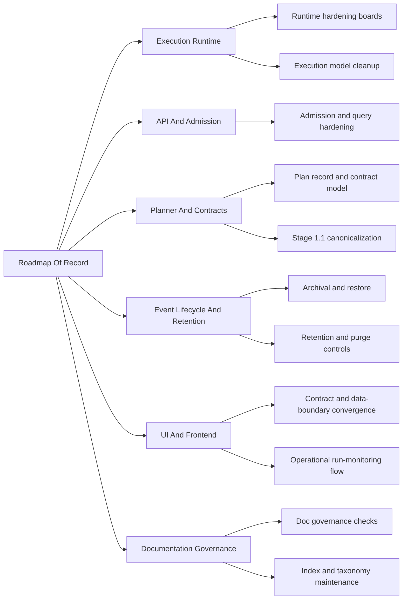

---
title: Roadmap By Domain
status: Active
owner: Product / Architecture / Docs
last_reviewed: 2026-04-05
planning_type: proposal
---

# Roadmap By Domain

Domain-oriented roadmap overlay for the canonical roadmap of record.

This file complements, but does not replace, [Roadmap Of Record](index.md).

## Domain Lanes

## Sequencing By Lane

- `Execution Runtime`
  Current sources: [Execution Runtime domain view](../domains/execution-runtime.md),
  [Review Remediation Roadmap 2026-04-02](review-remediation-roadmap-20260402.md),
  [Transformation Flow Delivery Plan 2026-04-05](../proposals/mandatory/runtime-and-contracts/transformation-flow-delivery-plan-20260405.md)
  Near-term target: close residual runtime and hardening slices with
  evidence-backed closeouts while opening the SQL-first execution seam required
  by the transformation vertical.
- `API and Admission`
  Current sources: [API and Admission domain view](../domains/api-and-admission.md),
  [RC-C1 HTTP Error Envelope Normalization Plan](../proposals/superseded/runtime-and-contracts/rc-c1-http-error-envelope-normalization-plan-20260331.md)
  Near-term target: deliver admission/backpressure sequence with rollout
  observability.
- `Planner and Contracts`
  Current sources: [Planner and Contracts domain view](../domains/planner-and-contracts.md),
  [Planner Assessment](../status/planner-current-state-assessment-20260320.md),
  [Transformation Flow Architecture And Contracts 2026-04-05](../proposals/mandatory/runtime-and-contracts/transformation-flow-architecture-and-contracts-20260405.md)
  Near-term target: stage compatibility, policy vocabulary, and contract
  evolution hardening plus the first design-graph-to-plan compiler boundary for
  the SQL-first transformation slice.
- `Event Lifecycle and Retention`
  Current sources: [Event Lifecycle and Retention domain view](../domains/event-lifecycle-and-retention.md),
  [Review Remediation Roadmap 2026-04-02](review-remediation-roadmap-20260402.md)
  Near-term target: retention, archival, restore, and purge controls aligned
  with ADR-backed policy, including repeatable reset and cleanup discipline for
  the Docker PostgreSQL proof environment.
- `UI and Frontend`
  Current sources: [Frontend Architecture](../../architecture/frontend/index.md),
  [UI / Visualization Domain](../../architecture/domain-ui.md),
  [Frontend Roadmap - Prototype To Operational UI](../proposals/nice-to-have/frontend-and-ux/frontend-roadmap-20260219.md),
  [Transformation Flow Proposal Set](../proposals/mandatory/runtime-and-contracts/plan-creation-interface-route-proposal-20260405.md)
  Near-term target: converge Lane E on contract truth, mock-versus-api
  boundaries, state and query cleanup, and a real Design -> Plan -> Run ->
  Result path for the first transformation vertical.
- `Documentation Governance`
  Current sources: [Governance Inventory](../status/governance-document-rule-inventory.md),
  [Architecture Documentation Reconciliation Plan 2026-04-02](../proposals/mandatory/governance-and-docs/architecture-doc-reconciliation-plan-20260402.md)
  Near-term target: keep the planning map coherent and reduce navigation
  friction by domain.

## Related Diagrams

- [Planning Control Tower](../state/planning-control-tower.md)
- [Review Sprint Critical Path 2026-04](diagrams/review-sprint-critical-path-2026-04.md)
- [Planning Domain Map](diagrams/planning-domain-map.md)
- [Execution Runtime Architecture Delta](diagrams/execution-runtime-architecture-delta.md)
- [API and Admission Architecture Delta](diagrams/api-admission-architecture-delta.md)
- [Planner and Contracts Architecture Delta](diagrams/planner-contracts-architecture-delta.md)
- [Event Lifecycle and Retention Architecture Delta](diagrams/event-lifecycle-retention-architecture-delta.md)
- [Documentation Governance Architecture Delta](diagrams/documentation-governance-architecture-delta.md)
- [Execution Model Index](../execution-model/index.md)
