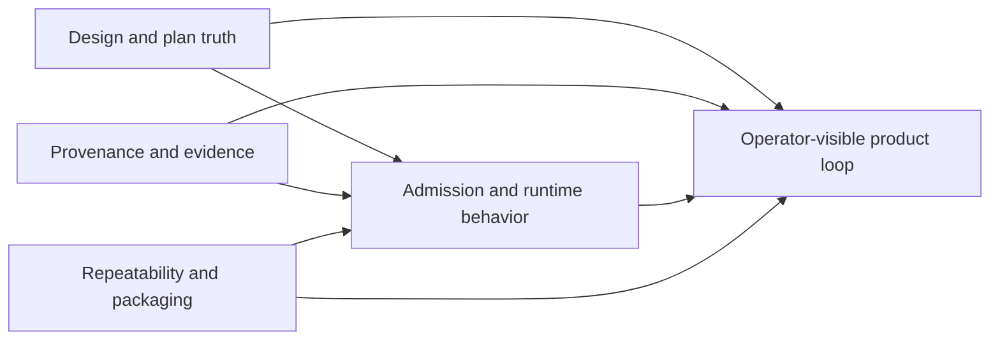
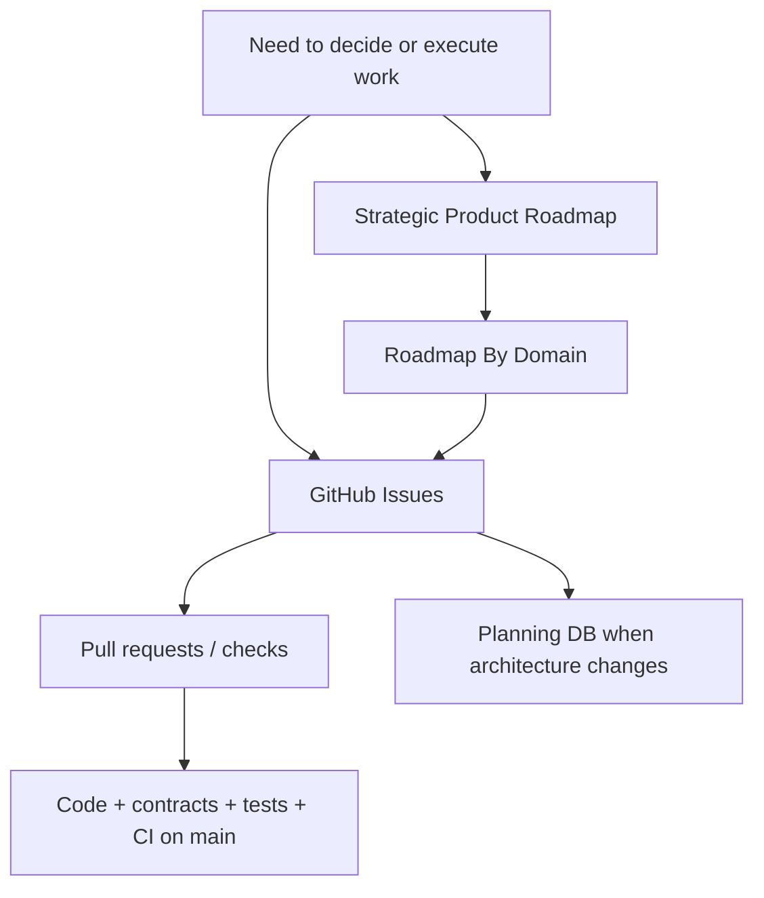
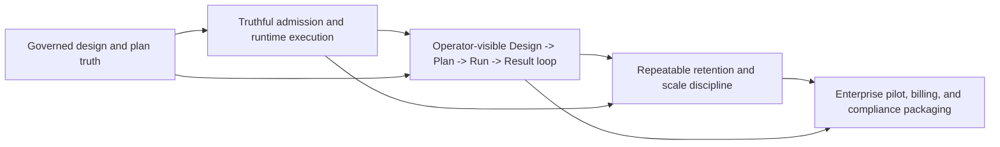

# Strategic Product Roadmap

This is the stable strategic product direction for DVT+.

Use it to answer:

- why the current product work exists;
- which capability ladder the system is climbing;
- which strategic bets are already absorbed into mainline;
- which gaps still decide product readiness.

It is not the execution queue and it does not own task status.

For execution and evidence use:

- [GitHub Issues](https://github.com/dunay2/dvt/issues) for what is active now;
- [Roadmap By Domain](roadmap-by-domain.md) for durable cross-domain sequencing;
- [System Delivery Status](../../architecture/system-delivery-status.md) for what
  is already true in code;
- Planning DB for architecture, component ownership, relations, command/query
  rails, and feature mechanization.

## Strategic Posture Now

The dated roadmap from `2026-03-24` is no longer a reliable active control
surface. A large part of that wave is already merged. Current planning must be
read from the live GitHub backlog, current code/status evidence, this roadmap,
and the architecture authority in Planning DB.

The current strategic center of gravity is:

1. close the governed transformation vertical end to end;
2. make the proof environment repeatable and operationally bounded;
3. turn the platform from technically credible into enterprise-usable and
   commercially packageable.

## Strategic Workstreams

The historic A-E lanes are no longer task registries. Their useful strategic
meaning survives only as workstreams:

- design and plan truth;
- provenance and evidence;
- admission and runtime behavior;
- repeatability and packaging;
- operator-visible product loop.

Task identity, ownership, blockers, and acceptance for concrete slices live in
GitHub Issues, not in lane YAML or roadmap documents.

## Planning Surface Map

## Capability Ladder

## Strategic Pillars

| Pillar                                   | Why it matters                                                                                     | Primary durable surfaces                                   | Current posture |
| ---------------------------------------- | -------------------------------------------------------------------------------------------------- | ---------------------------------------------------------- | --------------- |
| Governed design and plan truth           | Preview and execution must share stable graph, plan, and provenance semantics.                     | Planner/contracts domain, Planning DB, Roadmap By Domain   | In progress     |
| Truthful admission and runtime execution | Only executable plans may cross protected runtime boundaries and evidence must remain trustworthy. | API/admission + execution-runtime domains, contracts/tests | In progress     |
| Operator product loop                    | Product value requires a governed `Design -> Plan -> Run -> Result` loop.                          | Web/product domains + current GitHub issues                | In progress     |
| Retention, repeatability, and scale      | Proof environments and retained data must be repeatable, bounded, and diagnosable.                 | Event lifecycle/retention domain + runbooks/evidence       | Partial         |
| Enterprise packaging                     | Enterprise value requires pilot readiness, billing, compliance, and commercial packaging.          | Product roadmap + governing issues                         | Queued          |

## What Is Already Absorbed Into Mainline

Historical roadmap items that are already delivered must not remain open merely
because an old roadmap or review mentions them. Verify current truth through code,
contracts, tests, CI, and System Delivery Status before planning replacement work.

## Decision Rules

- `What should we fund next?` -> this page plus current product evidence.
- `What domain blocks the next move?` -> [Roadmap By Domain](roadmap-by-domain.md).
- `What is active now?` -> [GitHub Issues](https://github.com/dunay2/dvt/issues).
- `Who owns the next executable slice?` -> the governing GitHub issue.
- `What architecture/rail owns this behavior?` -> Planning DB and its canonical
  evidence paths.
- `Is this already true in code?` -> code/contracts/tests/CI plus
  [System Delivery Status](../../architecture/system-delivery-status.md).

## Historical Snapshot

The original dated snapshot is preserved for history only:

- [Strategic Product Roadmap 2026-03-24](../archive/proposals/strategic-product-roadmap-20260324.md)

That dated file is not an active decision surface.
