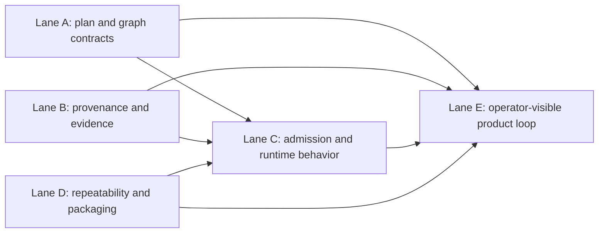
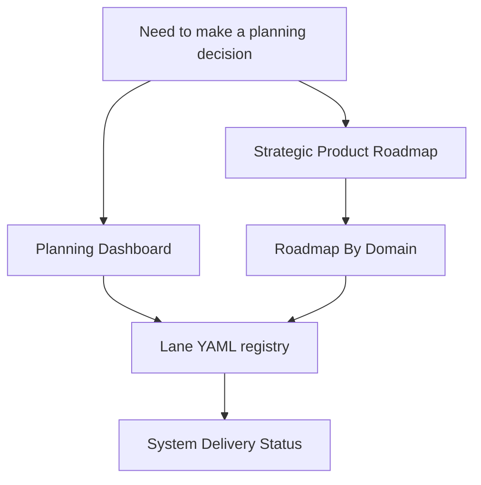
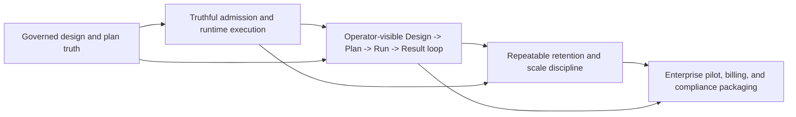

# Strategic Product Roadmap

This is the stable strategic product direction for DVT+.

Use it to answer these questions:

- why the active lanes exist;
- which capability ladder the system is climbing;
- which platform bets are already absorbed into mainline;
- which strategic gaps still decide product readiness.

It is not the execution queue.

For that, use:

- [Planning Dashboard](../state/planning-dashboard.md) for what is active now;
- [Roadmap By Domain](roadmap-by-domain.md) for cross-domain sequencing;
- `agent-lane-*.yaml` for task ownership and blockers;
- [System Delivery Status](../../architecture/system-delivery-status.md) for what is already true in code.

## Strategic Posture Now

The dated roadmap from `2026-03-24` is no longer a reliable active control
surface. A large part of that wave is already merged: retention baseline,
operation-level RBAC, read-your-writes contract, manifest-ref production path,
and multiple runtime hardening slices are already closed.

The current strategic center of gravity has moved.

What matters now is:

1. close the governed transformation vertical end to end;
2. make the proof environment repeatable and operationally bounded;
3. turn the platform from technically credible into enterprise-usable and
   commercially packageable.

## Why The Active Lanes Exist

The active lanes are not parallel wish lists. They are the execution shape of
the strategic problem:

- Lane A closes plan, graph, and state-store contracts so the product has a
  governed design and execution model.
- Lane B closes provenance, lineage, and evidence semantics so operators can
  trust what happened.
- Lane C turns those contracts into protected admission and runtime behavior.
- Lane D makes the environment repeatable, bounded, and commercially usable.
- Lane E turns the governed backend surfaces into an operator-visible product
  loop.

## Planning Surface Map

## Capability Ladder

## Strategic Pillars

<!-- markdownlint-disable MD060 -->

| Pillar                                   | Why it matters                                                                                                            | Active execution surfaces                                                                                                                           | Current posture | Current blockers                                                                                                                                                                                          |
| ---------------------------------------- | ------------------------------------------------------------------------------------------------------------------------- | --------------------------------------------------------------------------------------------------------------------------------------------------- | --------------- | --------------------------------------------------------------------------------------------------------------------------------------------------------------------------------------------------------- |
| Governed design and plan truth           | Without stable graph, plan, and provenance contracts, preview and execution flows lie to the operator.                    | [Planner and Contracts domain](../domains/planner-and-contracts.md), [Roadmap By Domain](roadmap-by-domain.md), `S08`, `RC-G1`, `TF-A1`, `TF-B1`    | In progress     | The first SQL-first contract and provenance pack is now closed; remaining blockers are shared-kernel ownership migration under `RC-G1` and plan-record hardening under `S08`.                             |
| Truthful admission and runtime execution | The system must only admit executable plans and expose runtime evidence at the protected boundary.                        | [API and Admission domain](../domains/api-and-admission.md), [Execution Runtime domain](../domains/execution-runtime.md), `TF-C2`, `TF-C3`, `WE-HX` | In progress     | The preview-persist boundary and first PostgreSQL runtime vertical are now accepted; remaining blockers are runtime-boundary hardening under `WE-HX` and phase-2 dbt executor expansion under `TF-C3`.    |
| Operator product loop                    | The product is only usable when `Design -> Plan -> Run -> Result` works on governed contracts and backend-owned evidence. | [UI / Frontend lane in Roadmap By Domain](roadmap-by-domain.md), `TF-E1`, `F-24`, `F-25`, [Planning Dashboard](../state/planning-dashboard.md)      | In progress     | The first SQL-first operator loop is now live in Lane E; remaining blockers are parent closeout consolidation plus broader frontend professionalization and the phase-2 dbt-mode extension under `TF-C3`. |
| Retention, repeatability, and scale      | Proof environments and retained data must be repeatable, bounded, and diagnosable before scale work is worth funding.     | [Event Lifecycle and Retention domain](../domains/event-lifecycle-and-retention.md), `TF-D1`, `AR-D8`, Lane D                                       | Partial         | Repeatable Docker PostgreSQL reset discipline and mandatory default-retention alerts are still open.                                                                                                      |
| Enterprise packaging                     | Enterprise value requires a usable pilot path, then billing, compliance, and commercial packaging.                        | Lane D GTM tasks, `cost attribution model`, `first enterprise pilot`, `billing integration`, `compliance documentation pack`                        | Queued          | Current blockers are transformation-vertical closure, repeatable operations, and finance-grade attribution.                                                                                               |

<!-- markdownlint-enable MD060 -->

## What Is Already Absorbed Into Mainline

These are no longer open strategic unknowns even if they appeared that way in the
March snapshot:

- `run event log retention + TTL` is closed in Lane D.
- `RBAC at operation level` is closed in Lane C.
- `read-your-writes contract` is closed in Lane C.
- `manifestRef production path` is closed in Lane C.
- baseline planner/runtime hardening from the March review wave has largely been
  redistributed into current status, lane YAML, and closeouts.

That changes how decisions should be made now: do not plan from the old gap list;
plan from the active transformation, runtime-evidence, and repeatability
surfaces.

## Decision Rules

- If the question is `what should we fund next?`, read this page first.
- If the question is `what domain is blocking the next move?`, go to
  [Roadmap By Domain](roadmap-by-domain.md).
- If the question is `what is actually active now?`, go to
  [Planning Dashboard](../state/planning-dashboard.md).
- If the question is `who owns the next executable slice?`, open the relevant
  `agent-lane-*.yaml` file.
- If the question is `is this already true in code?`, verify in
  [System Delivery Status](../../architecture/system-delivery-status.md).

## Historical Snapshot

The original dated snapshot is preserved for history only:

- [Strategic Product Roadmap 2026-03-24](../archive/proposals/strategic-product-roadmap-20260324.md)

That dated file is not an active decision surface anymore.
