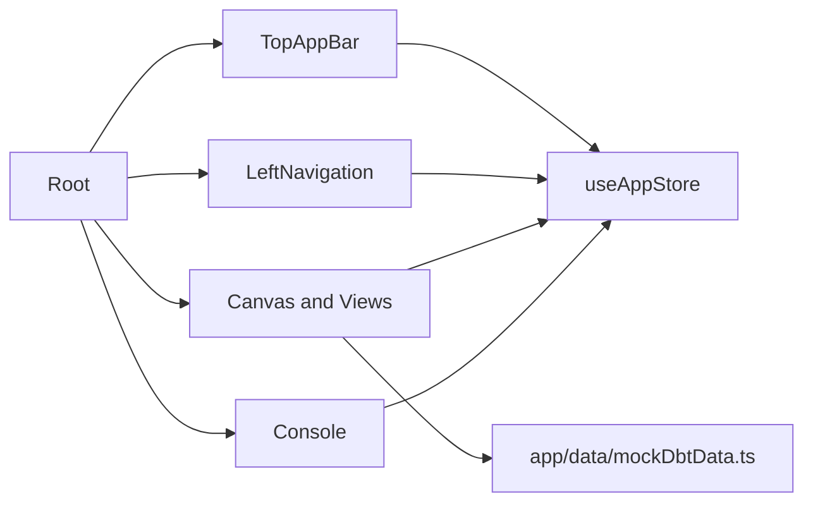
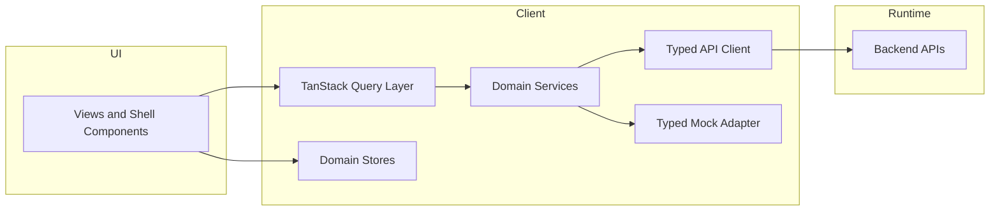
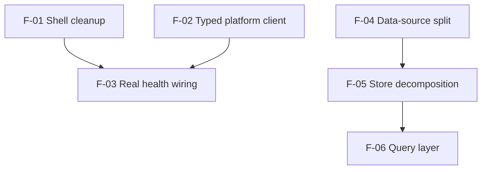
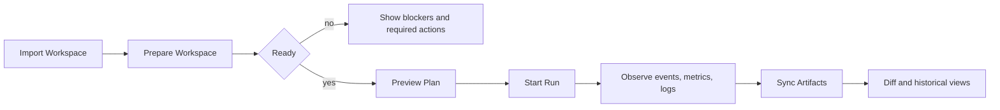

# Lane E Shell Baseline And Target Guide

This document is the working guide for Lane E shell evolution.
It defines:

1. Current state (as-is)
2. Target state (to-be)
3. Rationale (`why`, `for what`, `how`)
4. Component decomposition and impact scope
5. Advantages and disadvantages

Primary lane references:

- [Agent Lane E YAML](agent-lane-e.yaml)

## Scope

- Shell layer in `apps/web`: navigation, top bar, workspace container, and shell-level state.
- Migration sequence for `F-01` through `F-06`.

Out of scope:

- Backend contract design details beyond frontend integration boundaries.
- Full Plan -> Run runtime flow (`F-08+`).

## Delivery In 5 Chapters (Requested Order)

### Chapter 1 - Be Able To Create A dbt

Goal:

1. User can select nodes and policies and obtain an immutable plan preview.

Definition of done:

1. Plan preview contract exists and is typed.
2. Plan can be created from canvas selection.
3. Preview shows validation errors before run start.

Primary capabilities:

1. `plan.preview`
2. `node.adapt`

### Chapter 2 - Be Able To Execute It

Goal:

1. User can execute an approved plan and observe the lifecycle in real time.

Definition of done:

1. Run starts only from approved immutable plan.
2. Run states and events are visible in Runs and Console.
3. Permission and error states (`401/403/409/5xx`) are actionable.

Primary capabilities:

1. `run.start`
2. `run.observe`
3. `artifact.sync`

### Chapter 3 - Be Able To Import It

Goal:

1. User can import an existing dbt project/plan state and audit before/after changes.

Definition of done:

1. Import from artifacts/repo populates explorer and graph.
2. Imported state is normalized to canonical nodes.
3. Delta and snapshot history is queryable and Git-linkable when available.

Primary capabilities:

1. `workspace.import`
2. `node.adapt`
3. `artifact.sync`

### Chapter 4 - Be Able To Import The Model From Database

Goal:

1. User can import model structure directly from a database catalog and convert it into canonical
   DVT nodes.

Definition of done:

1. Database introspection imports schemas, tables, views, and basic lineage hints.
2. Imported database objects are mapped to canonical node kinds and relations.
3. Import flow produces an auditable snapshot and a normalization report.
4. Import can run in read-only mode (no DDL execution required).

Primary capabilities:

1. `workspace.import` (catalog mode)
2. `workspace.prepare`
3. `node.adapt`
4. `artifact.sync`

### Chapter 5 - General Operating Model Of This Guide

Goal:

1. Keep one clear, shared operating model across all chapters (create, execute, import from
   project, import from database), with explicit ownership and traceability.

Definition of done:

1. Every chapter maps to canonical capabilities and plugin ownership.
2. End-to-end lifecycle is auditable: import/prepare/plan/run/observe/snapshot.
3. Change control and compatibility rules are applied consistently in all chapters.
4. UX behavior remains capability-driven and permission-gated.

Primary capabilities:

1. `workspace.prepare`
2. `workspace.import`
3. `plan.preview`
4. `run.observe`
5. `artifact.sync`

## Current State (As-Is)

### Current Shell Composition

| Component                          | Current responsibility                                                                       | Location                                         |
| ---------------------------------- | -------------------------------------------------------------------------------------------- | ------------------------------------------------ |
| `Root`                             | Mounts top bar, left navigation, resizable workspace, and console drawer                     | `apps/web/src/app/Root.tsx`                      |
| `TopAppBar`                        | Mixes primary context (tenant/project/env/status) and secondary controls (panels/grid/focus) | `apps/web/src/app/components/TopAppBar.tsx`      |
| `LeftNavigation`                   | Icon-only navigation with tooltips and route links                                           | `apps/web/src/app/components/LeftNavigation.tsx` |
| `useAppStore`                      | Single global Zustand store for shell, graph, run, status, and session concerns              | `apps/web/src/app/stores/appStore.ts`            |
| Views (`Canvas`, `RunsView`, etc.) | Consume state plus direct mock datasets                                                      | `apps/web/src/app/views/*`                       |

### Current Data And Dependency Shape

- Store boundary is broad (`useAppStore` owns many domains).
- Several views import mock data directly from `app/data`.
- Top bar currently carries high control density that competes with vertical workspace.

### Current Risks

1. UI noise in the top bar reduces scan speed and canvas prominence.
2. Direct view-to-mock imports make API migration harder (`F-04` blocker).
3. Global store coupling increases regression risk when changing one domain.

## Target State (To-Be)

### UX Target

1. Keep navigation icon-only with tooltips, no persistent sidebar labels or headers.
2. Move secondary top-bar controls into one contextual menu.
3. Leave only primary operational context visible in top bar.
4. Recover visible vertical space for canvas/work area.

### Architecture Target

1. `Views -> Services -> API Client` (no direct fetch in views).
2. Explicit `VITE_DATA_SOURCE=mock|api` boundary (`F-04`).
3. Domain stores by responsibility (`shell/session/graph/run/status`) (`F-05`).
4. Query orchestration through TanStack Query (`F-06`).

## Rationale

### Why

- Lane E objective requires moving from prototype shell to operational UI.
- Shell clarity is prerequisite for reliable health/status visibility and run operations.
- Data-layer separation is required before contract-driven API integration scales.

### For What

- Reduce operator cognitive load.
- Improve maintainability by isolating domain responsibilities.
- Enable mock/api dual mode without rewriting views.

### How

1. Clean shell first (`F-01`) to stabilize UX surface.
2. Add typed API client for health endpoints (`F-02`).
3. Bind health state to shell status UI (`F-03`).
4. Introduce data source flag and service boundary (`F-04`).
5. Split store by domain responsibilities (`F-05`).
6. Standardize remote data flow with query patterns (`F-06`).

## Component Decomposition Plan

| Current component           | Decomposes into                                                       | Why                                                    | Affects                                                         |
| --------------------------- | --------------------------------------------------------------------- | ------------------------------------------------------ | --------------------------------------------------------------- |
| `TopAppBar`                 | `PrimaryTopBar` + `ShellContextMenu`                                  | Reduce persistent noise and isolate secondary controls | Shell layout, keyboard navigation, focus mode and panel toggles |
| `useAppStore`               | `shellStore`, `sessionStore`, `graphStore`, `runStore`, `statusStore` | Domain isolation and safer changes                     | All shell/view selectors and actions                            |
| View direct mock imports    | `services/*` + typed adapters                                         | Remove direct data coupling from views                 | Canvas, Runs, Diff, Plugins, Admin                              |
| Health status display logic | `platform-client` + health query/service                              | Real backend signal in top bar/banner                  | Status chips, offline/degraded behavior                         |

## Impact Analysis

### Directly Affected Areas

- `apps/web/src/app/Root.tsx`
- `apps/web/src/app/components/TopAppBar.tsx`
- `apps/web/src/app/components/LeftNavigation.tsx`
- `apps/web/src/app/stores/appStore.ts` (and future store split files)
- `apps/web/src/app/views/*` that currently import mock data directly
- `apps/web/src/app/data/*` (consumer migration, not removal by default)

### Cross-Lane Coordination Impact

- Lane A/C/D sync is required when frontend contracts are bound to real endpoints.
- Feature-flag policy must gate Level-C views (`Lineage`, `Cost`, `Plugins`, `Admin`).

## Advantages And Disadvantages

### Advantages

1. Cleaner operator shell and more usable workspace.
2. Lower regression surface via domain-specific state ownership.
3. Predictable path for mock-to-api migration.
4. Better testability by isolating service and query boundaries.

### Disadvantages

1. Short-term refactor overhead across many files.
2. Temporary complexity while mock and API paths coexist.
3. Increased number of modules that require naming and ownership discipline.

## Decision Guardrails

1. No direct mock reads from views once `F-04` is applied.
2. No direct fetch from components.
3. No `any` in new frontend contracts.
4. Empty/loading/error/success states remain mandatory for user-facing features.
5. Do not enable Level-C views without approved feature flag.

## Operational Interface Definition (IID-v1)

This section defines a single integration interface for multiple execution tools.
It is outcome-agnostic and stable at shell and API boundary level.

### What The Interface Contains

| Interface capability | Purpose                                                               | Affects                                      |
| -------------------- | --------------------------------------------------------------------- | -------------------------------------------- |
| `workspace.import`   | Import project metadata and dependency graph from tool artifacts/APIs | Node catalog, lineage canvas, explorer panel |
| `workspace.prepare`  | Validate environment, credentials, profiles, and compile readiness    | Readiness banner, blockers, permissions UI   |
| `plan.preview`       | Build immutable execution plan before run                             | Plan modal, impact panel, cost hints         |
| `run.start`          | Start execution from approved plan                                    | Run lifecycle UI, shell status, navigation   |
| `run.observe`        | Stream status/events/metrics/logs                                     | Console, run timeline, metrics widgets       |
| `artifact.sync`      | Pull immutable outputs (manifest, run results, catalog, lineage)      | Diff, artifacts view, historical state       |
| `node.adapt`         | Map tool-native entities to DVT node model                            | Node rendering, badges, contextual actions   |

### Canonical Node Model For Tool Adapters

| Canonical node kind | dbt mapping                 | dagster mapping           | Other orchestrators       |
| ------------------- | --------------------------- | ------------------------- | ------------------------- |
| `SOURCE`            | dbt source                  | asset source/input        | external dataset/input    |
| `MODEL`             | model (stg, dim, fct, etc.) | software-defined asset/op | transform task/job step   |
| `TEST`              | generic/singular test       | asset check/op validation | quality check task        |
| `EXPOSURE`          | exposure                    | downstream consumer asset | dashboard/report consumer |
| `RUN_CONTROL`       | run/selection/filter action | job invocation            | pipeline trigger step     |

Adapter rule:

1. Tool-native metadata stays in `node.config`.
2. Canonical node kind and run status stay in shared UI contracts.
3. New tool support must extend mappings without breaking existing node kinds.

### Tool Compatibility Contract

| Concern        | dbt                                                 | dagster                              | Adapter requirement                                  |
| -------------- | --------------------------------------------------- | ------------------------------------ | ---------------------------------------------------- |
| Import source  | `manifest.json`, `catalog.json`, `run_results.json` | GraphQL/API metadata and asset graph | Normalize into shared `workspace.import` response    |
| Execution unit | model/test selection                                | job/asset selection                  | Convert selection to canonical plan steps            |
| Status model   | success/failed/skipped/warn/running                 | success/failed/canceled/started      | Map to canonical status tokens                       |
| Logs/events    | run events + stdout                                 | event log stream                     | Emit ordered timeline events with severity           |
| Artifacts      | immutable dbt artifacts                             | materialization/event snapshots      | Persist immutable snapshots for Diff/Artifacts views |

### Import -> Prepare -> Execute Lifecycle

### Project Preparation Contract

`workspace.prepare` MUST validate:

1. Tool profile and target environment are defined.
2. Runtime credentials are available and scoped.
3. Required adapters/dependencies are present.
4. Permission model allows plan and run actions.
5. Baseline compile/sanity check passes.

If any check fails, UI stays read-only for run controls and exposes actionable blockers.

### How Changes Are Managed

| Change type                    | Example                              | Required action                                           |
| ------------------------------ | ------------------------------------ | --------------------------------------------------------- |
| Non-breaking UI extension      | New optional node metadata field     | Add optional typed field and update adapter mapping       |
| Non-breaking contract addition | New optional metric in `run.observe` | Version minor, update docs and view-model mapper          |
| Breaking contract change       | Rename/remove required status field  | ADR or explicit approval, version major, migration path   |
| Tool-specific feature          | Dagster-only materialization detail  | Keep in `node.config.tool`, do not pollute canonical keys |

Change control rule:

1. Update typed contracts first.
2. Update adapters second.
3. Update views third.
4. Validate both `mock` and `api` data source modes before merge.

### Suggested Next Execution Slices

1. Define TypeScript contracts for `workspace.import`, `workspace.prepare`, `plan.preview`, `run.start`, and `run.observe`.
2. Implement tool adapter mapping tables (`dbt`, `dagster`) behind `services/platform`.
3. Wire preparation blockers into top banner and run controls.
4. Replace view-local assumptions with canonical node/status contracts.
5. Add adapter conformance tests for status mapping and node normalization.

## Requested Capability Pack (dbt + Plugin Execution)

This package captures the required operational capabilities to move from prototype to a valid
execution product.

### Functional Capabilities Required

| Capability                       | What it must do                                                                 | Primary UI surface                |
| -------------------------------- | ------------------------------------------------------------------------------- | --------------------------------- |
| Create dbt plan                  | Build a canonical run plan from selected dbt nodes and policies                 | Canvas + Plan Preview             |
| Import dbt plan/project          | Import dbt project metadata and existing graph from artifacts/repo              | Explorer + Canvas                 |
| Import model from database       | Introspect database catalog metadata and normalize to canonical nodes/relations | Import wizard + Explorer + Canvas |
| Execute dbt plan                 | Start and monitor a run from immutable plan                                     | Run controls + Runs view          |
| Prepare dbt-equivalent execution | Materialize required runtime prep as tasks/procedures with deterministic checks | Prepare workspace flow            |
| Analyze execution outcome        | Compare previous vs current state and expose impact/breaking deltas             | Diff + Artifacts + Console        |

### Plugin-First Operating Model

| Plugin              | Responsibility                                                                    | Must expose                                           |
| ------------------- | --------------------------------------------------------------------------------- | ----------------------------------------------------- |
| `dbt-explorer`      | Source/model/test/exposure navigation and audit operations                        | Node palette, import/export, state diff actions       |
| `dbt-runner`        | Plan creation and dbt-compatible execution lifecycle                              | `plan.preview`, `run.start`, `run.observe` adapters   |
| `snowflake-runtime` | Prepare and execute Snowflake tasks/procedures or emit DDL for repo-managed apply | Prepare actions, execution mode selector, audit trail |
| `git-delta`         | Track project change deltas with snapshots and message history                    | Change timeline, snapshot compare, commit linkage     |

Plugin boundary rule:

1. Shell never hardcodes tool behavior.
2. Tool behavior arrives through plugin capabilities and typed contracts.
3. UI renders capability-driven controls based on enabled plugins and permissions.

### Import / Export And Audit Requirements

`dbt-explorer` MUST support:

1. Import project from local/repo artifact set (`manifest`, `catalog`, `run_results` when present).
2. Export normalized project state for backup or handoff.
3. Display current vs previous state (`what existed` vs `what exists now`) with node-level diffs.
4. Provide contextual operations from node actions, not global noisy controls.

### Snowflake Execution Modes

`snowflake-runtime` MUST support two modes:

1. Direct mode: DVT prepares and executes tasks/procedures directly.
2. Repository DDL mode: DVT generates deterministic DDL into repo for external apply workflow.

Both modes MUST emit the same canonical run/event/audit contracts.

### Delta And Snapshot Governance

For each imported or executed project state:

1. Persist change delta summary and detailed node-level delta.
2. Persist immutable snapshots with timestamp, actor, and source reference.
3. Link deltas to Git refs/commits when available.
4. Expose timeline messages/events for operator audit and replay support.

### Definition Of Done For This Capability Pack

1. dbt plan can be created, previewed, approved, and executed from UI.
2. dbt project can be imported/exported through plugin actions.
3. Model import from database catalog can normalize structures into canonical nodes.
4. Snowflake plugin can run in direct mode or DDL-to-repo mode.
5. Deltas and snapshots are queryable and visible in Diff/Artifacts timelines.
6. All plugin actions are permission-gated and capability-driven.

## QA Acceptance Checklist (F-12 To F-16)

This checklist is the minimum quality bar for each delivery slice.

### F-12 Plugin Capability Contracts

| Gate                  | Acceptance criteria                                                                                                                                                     | Failure signal                                                                    |
| --------------------- | ----------------------------------------------------------------------------------------------------------------------------------------------------------------------- | --------------------------------------------------------------------------------- |
| Contract completeness | All required capabilities exist in typed interfaces: `workspace.import`, `workspace.prepare`, `plan.preview`, `run.start`, `run.observe`, `artifact.sync`, `node.adapt` | Any plugin action requires tool-specific UI branching outside capability registry |
| Version discipline    | Capability contract version and compatibility notes are documented                                                                                                      | New plugin breaks an existing capability consumer                                 |
| Adapter isolation     | Tool-native fields remain in plugin metadata, not in shared core keys                                                                                                   | Shared domain types start containing dbt/dagster/snowflake-only keys              |

### F-13 dbt Explorer Plugin

| Gate               | Acceptance criteria                                                  | Failure signal                                                      |
| ------------------ | -------------------------------------------------------------------- | ------------------------------------------------------------------- |
| Explorer ownership | Source/model/test/exposure navigation is provided by plugin contract | Shell or generic view hardcodes dbt-only explorer logic             |
| Import/export      | Import and export actions work through plugin capability handlers    | Import/export bypasses plugin boundary or writes unmanaged state    |
| Contextual actions | Node operations are available from contextual menus with permissions | Global toolbar actions duplicate node actions and increase UI noise |

### F-14 dbt Plan Lifecycle (Create, Import, Execute)

| Gate             | Acceptance criteria                                                   | Failure signal                                      |
| ---------------- | --------------------------------------------------------------------- | --------------------------------------------------- |
| Plan integrity   | Plan preview is immutable and run starts from approved plan reference | Run starts from mutable in-memory selection only    |
| Error handling   | `401/403/409/5xx` states are explicit and actionable                  | Generic failures without clear recovery path        |
| Event continuity | Run lifecycle events are visible in Runs/Console consistently         | Run starts but event stream is partial or unordered |

### F-15 Snowflake Runtime Plugin

| Gate                 | Acceptance criteria                                                                | Failure signal                                                   |
| -------------------- | ---------------------------------------------------------------------------------- | ---------------------------------------------------------------- |
| Dual mode parity     | Direct mode and DDL-to-repo mode emit the same canonical run/event/audit contracts | Different status semantics or audit fields by mode               |
| Preparation checks   | `workspace.prepare` blocks run until credentials/profile/runtime checks pass       | Run controls enabled while preparation blockers exist            |
| Deterministic output | DDL output is reproducible for same input state and config                         | Same state generates different DDL without version/config change |

### F-16 Delta, Snapshot, And Git Audit

| Gate                | Acceptance criteria                                              | Failure signal                                           |
| ------------------- | ---------------------------------------------------------------- | -------------------------------------------------------- |
| Immutable snapshots | Each transition stores immutable snapshot with actor/time/source | Historical state is overwritten in place                 |
| Delta traceability  | Node-level before/after deltas are queryable per transition      | Diff view cannot explain what changed and why            |
| Git linkage         | Snapshot and delta records link to commit/ref when available     | Project history exists with no commit correlation fields |

### Cross-Slice QA Exit Criteria

1. Capability conformance tests pass for each enabled plugin.
2. Mock and API modes both pass contract-level behavior checks.
3. Permission gates are enforced for all plugin actions.
4. Diff/Artifacts timelines are reproducible from stored snapshots and events.
5. Validation baseline passes before merge: markdown lint and `verify:prepush`.

## Acceptance Checkpoints For This Guide

1. Current and target states are explicit and traceable to real files.
2. Decomposition path and dependency order are documented.
3. Impact scope is explicit (components, stores, views, and lanes).
4. Tradeoffs are explicit (advantages/disadvantages).
5. Mermaid diagrams provide shared visual reference for implementation slices.
