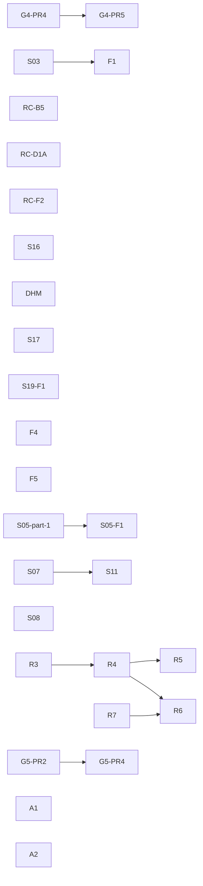

# Open Task Route

Fast execution route for selecting the next task without scanning all planning
surfaces.

Authoritative task source remains:
[Execution Workboard](execution-workboard.md).

## Current Open Snapshot

- `in_progress`: 0
- `review`: 1
- `queued`: 29
- `blocked`: 1
- `done`: tracked in closeouts and evidence (not listed here)

## Actionable Now (Strictly Unblocked)

Pick from this list when you want immediate execution with no hard dependency
block in the workboard.

| Priority | Task ID  | Why now                                                                         | Next action                                                            |
| -------- | -------- | ------------------------------------------------------------------------------- | ---------------------------------------------------------------------- |
| `P0`     | `G4-PR4` | Unblocked after `G4-PR3` closure; keeps Gap 4 momentum and unlocks PR5.         | Start operability rollout, metrics, and runbook closure.               |
| `P1`     | `S03`    | `S02` is closed; start-run extraction is now unblocked again.                   | Execute `StartRunCoordinator` extraction.                              |
| `P1`     | `S05-F1` | `S05-part-1` is in review; payload-content schema enforcement remains open.     | Add per-eventType payload-content schema validation at write boundary. |
| `P1`     | `S07`    | No blockers; unlocks `S11`.                                                     | Normalize lineage job naming + sink shape.                             |
| `P1`     | `S08`    | `S09` is now closed (PR #595); plan storage ownership is unblocked.             | Start `PostgresPlanStore` ownership slice.                             |
| `P1`     | `S16`    | `RC-A4` is merged; runtime planVersion validation is now unblocked.             | Wire policy into `validateStartRunPreconditions`.                      |
| `P1`     | `RC-F2`  | CI relevance policy drift is still open and has no blockers.                    | Externalize patterns and add path-matcher tests.                       |
| `P2`     | `RC-B5`  | Lineage retry path currently exhausts too quickly under outage.                 | Add scheduled retry (`next_attempt_at`) with exponential backoff.      |
| `P2`     | `S19-F1` | Stale snapshot query still uses correlated polling pattern at high concurrency. | Replace correlated stale-snapshot selector with scalable strategy.     |
| `P2`     | `RC-D1A` | `RC-D1` is closed; compatibility and watchdog integration still need closure.   | Add `/healthz` compatibility policy and watchdog integration tests.    |
| `P2`     | `DHM`    | Modularization backlog reduces helper sprawl and clarifies current seams.       | Start with `WS5`, then follow the dependency order in the proposal.    |
| `P2`     | `F4`     | DDD finding still open and currently only documented.                           | Freeze `WorkflowSnapshot` role and versioning rule.                    |
| `P2`     | `F5`     | DDD boundary finding still open.                                                | Move/remove engine-side provider selection env handling.               |
| `P2`     | `S17`    | Multi-worker safety depends on claim path semantics today.                      | Harden outbox contract/runtime to require claim/lease semantics.       |
| `P2`     | `A1`     | Review-validated gap with no current owner slice.                               | Define realtime run-status delivery contract.                          |
| `P2`     | `A2`     | Per-process limiter does not hold in horizontal deployments.                    | Design distributed tenant rate-limiter rollout.                        |
| `P2`     | `R7`     | Unblocks `R6` dependency gate currently marked external.                        | Close DSL/interpreter governance decision.                             |

## Blocked Or Gated Next

| Task ID  | State   | Dependency gate                               |
| -------- | ------- | --------------------------------------------- |
| `G4-PR5` | Queued  | waits for `G4-PR4`                            |
| `F1`     | Queued  | C2 final wiring depends on `S03`              |
| `S11`    | Blocked | waits for `S07`                               |
| `R4`     | Queued  | waits for `R3`                                |
| `R5`     | Queued  | waits for `R4`                                |
| `R6`     | Queued  | waits for `R4` and `R7`                       |
| `G5-PR2` | Queued  | pending archival prerequisites in lane        |
| `G5-PR4` | Queued  | depends on archival base and policy decisions |

## Dependency Route (Open Tasks)

## Parallel Start Pack

If you want maximum parallelism now without violating gates, start these lanes:

1. `API lane`: start `G4-PR4` now that `G4-PR3` is done.
2. `State-store lane`: `S03` then `F1`.
3. `Version lane`: `S16`.
4. `Traceability lane`: `S07` + `RC-B5`.
5. `Planner lane`: `S08` (unblocked after `S09` closure).
6. `Ops lane`: `RC-D1A`.
7. `Governance lane`: `F4` + `F5` + `A1` + `A2` + `R7`.
8. `Architecture lane`: `DHM` (start with `WS5`).
9. `Event Lifecycle lane`: prepare `G5-PR2` prerequisites, then execute restore/deferred delete flow.
10. `CI / Infrastructure lane`: execute `RC-F2` (single policy source for adapter-postgres relevance + matcher tests).

## Usage Rule

Before starting a task:

1. verify task row in [Execution Workboard](execution-workboard.md);
2. verify dependency in this route;
3. update both docs when status changes.
